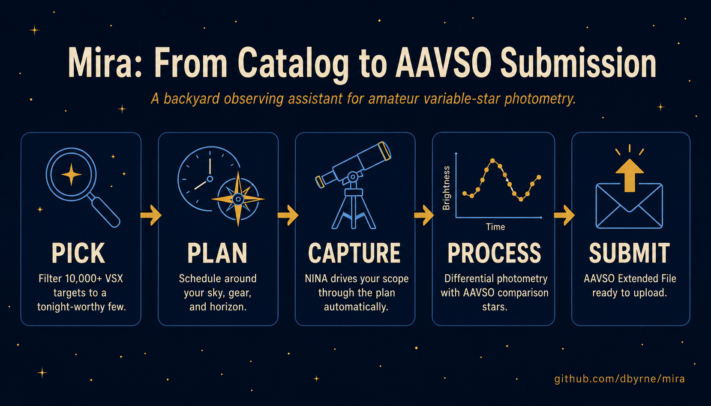
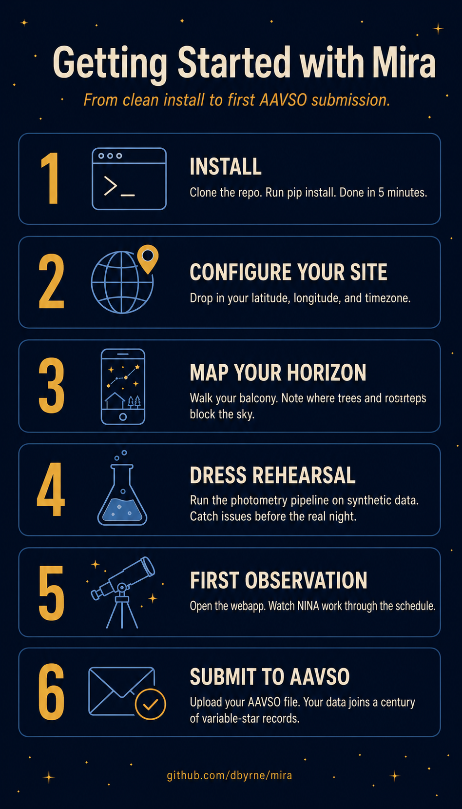
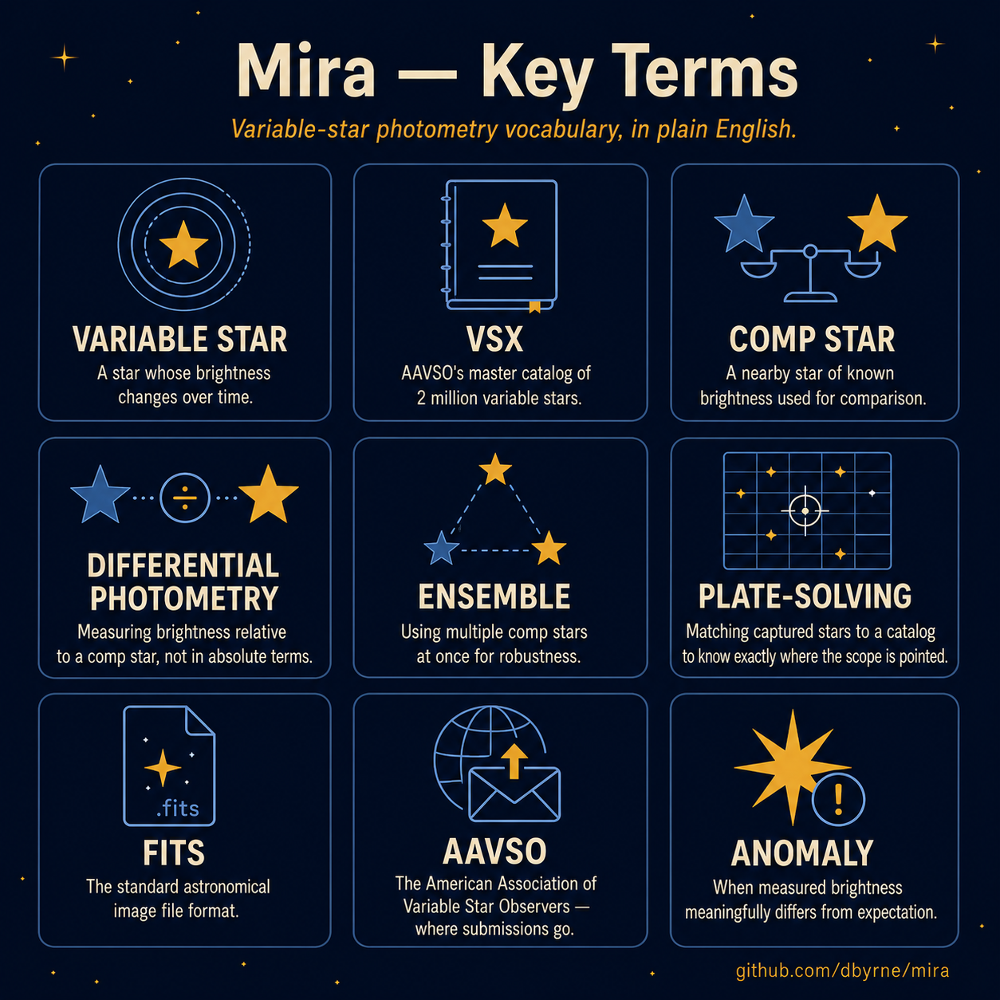

# Mira

> **A backyard observing assistant for amateur variable-star photometry.**
> It picks targets worth a closer look, schedules the night around your
> sky and your gear, runs photometry on what your scope captures, and
> tells you whether what you saw matches expectations.



It's the difference between staring at a catalog of 10,000 variable stars
wondering which one to point your scope at, and getting a phone-readable
schedule that says: *"22:00 — RR Lyrae, 60 frames at 15 seconds, comp
stars 70 / 79 / 86, expected magnitude 7.2."*

---

## Who this is for

You have:

- A smart telescope (the project is tuned for the **ZWO Seestar S30 Pro**,
  but works with any scope that produces plate-solved FITS files)
- A passing interest in variable stars and a desire to contribute real
  observations to the **[AAVSO][aavso]**
- Comfort installing a Python program

You don't need to:

- Know what differential photometry is — the system handles it
- Hand-pick comparison stars — they're auto-fetched from AAVSO VSP
- Format AAVSO submission files — the system writes them
- Already understand the [VSX catalog][vsx] — you'll learn as you go

If you've never observed a variable star before, **you can still use
this** — start with the [Getting Started guide](docs/getting_started.md).

[aavso]: https://www.aavso.org/
[vsx]: https://www.aavso.org/vsx/

---

## What you'll get

After a clear night with Mira you have:

| Output | What it is |
|---|---|
| `session_schedule.html` | A phone-readable plan for the night, with a timeline and per-target cards (catalog info, AAVSO charts, your expected exposure plan) |
| `nina_targets.csv` | Drop-in import for **NINA Target Scheduler** — your scope follows the schedule automatically |
| `aavso_<TARGET>.txt` | An [AAVSO Extended File Format][aavso-ext] submission file you can upload at [webobs/file][webobs] |
| Light-curve plots | Tonight's measurements overlaid on AAVSO recent observations and your own prior nights |
| Anomaly callouts | A quantitative check: "your median is 0.4 mag fainter than expected — flag for follow-up" |

[aavso-ext]: https://www.aavso.org/aavso-extended-file-format
[webobs]: https://www.aavso.org/webobs/file

---

## Setup at a glance



The full walkthrough — including the Stellarium AR procedure for
mapping your horizon and the dress-rehearsal command — lives in
**[Getting Started](docs/getting_started.md)**.

---

## Quick start

```powershell
# Install (Python 3.11+)
python -m pip install -e .

# Generate a queue of candidates worth observing
mira run --config config/jersey_city.yaml

# Plan a session for tonight
mira tonight --config config/s30_pro_jc.yaml --hours 4

# Or open the webapp on your phone (Tailscale-friendly)
mira webapp
```

Outputs go to `output/<config>/`. Open `output/<config>/tonight/session_schedule.html`
in a browser — that's the primary phone-readable artifact.

For a full walkthrough of your first night, read
**[Getting Started](docs/getting_started.md)**.

---

## The vocabulary, at a glance



Full definitions and mental models — *how the scheduler thinks, what
"anomaly" actually means here* — live in **[Concepts](docs/concepts.md)**.

---

## Documentation

| Doc | What it covers |
|---|---|
| **[Getting Started](docs/getting_started.md)** | Install → configure your site → capture horizon → first observation → submit to AAVSO. Soup to nuts. |
| **[Concepts](docs/concepts.md)** | Glossary and mental models: what's a comp star, how the scheduler thinks, what "anomaly" means here. Read this if any term in the quick start was unfamiliar. |
| **[Horizon profile](docs/horizon_profile.md)** | How to map your local horizon (trees, your house, the railing) so the scheduler doesn't send you to targets behind a tree. |
| **[Photometry pipeline](docs/photometry.md)** | What happens after you press "Run photometry" — aperture math, comp resolution, anomaly thresholds. |
| **[NINA setup](docs/nina_setup.md)** | Configuring NINA + the Advanced API plugin so the webapp can monitor your sequence. |
| **[Troubleshooting](docs/troubleshooting.md)** | What to do when VSX fails, comp stars vanish, plate-solving breaks, etc. |
| **[Contributing](CONTRIBUTING.md)** | Tests, lint, typecheck, branch conventions. |
| **[Architecture](docs/architecture.md)** | Module map, storage layout, and implementation invariants. Read this if you're modifying code, not just running it. |

---

## How the system thinks

```mermaid
flowchart TB
    subgraph Pick["Pick (mira run)"]
        VSX[VSX catalog<br/>via VizieR] --> Candidates
        Filters[Site filters<br/>altitude, magnitude<br/>amplitude, |b|] --> Candidates
        Candidates[Scored<br/>candidates]
        Candidates --> AAVSO[AAVSO recent<br/>coverage]
        Candidates --> SIMBAD[SIMBAD<br/>cross-IDs]
        Candidates --> Gaia[Gaia DR3<br/>color, RUWE]
        Candidates --> ZTF[ZTF light curves<br/>optional]
    end

    subgraph Plan["Plan (mira tonight)"]
        Greedy[Greedy scheduler<br/>+ urgency bonus] --> Schedule
        Horizon[Horizon profile<br/>per azimuth] --> Greedy
        Window[Tonight's window<br/>now → +N hours] --> Greedy
        Schedule[Session schedule<br/>+ NINA CSV<br/>+ packets]
    end

    subgraph Capture["Capture (NINA)"]
        NINA[NINA Target<br/>Scheduler] --> FITS[FITS frames<br/>plate-solved]
    end

    subgraph Process["Process (mira submit)"]
        FITS --> Photometry[Aperture<br/>photometry]
        VSP[AAVSO VSP<br/>comp stars] --> Photometry
        Photometry --> Aavso[AAVSO file]
        Photometry --> Plots[Light curves<br/>+ phase fold]
        Photometry --> Anomaly[Anomaly<br/>assessment]
    end

    Pick --> Plan
    Plan --> Capture
    Capture --> Process
```

---

## Project status

This is a single-developer project, refined over many sessions of iterative
work. ~330 tests, mypy- and ruff-clean. No commercial sponsorship — built
for personal use first, generalized second. PRs and issues welcome at
[the GitHub repo][repo].

[repo]: https://github.com/dbyrne/mira
