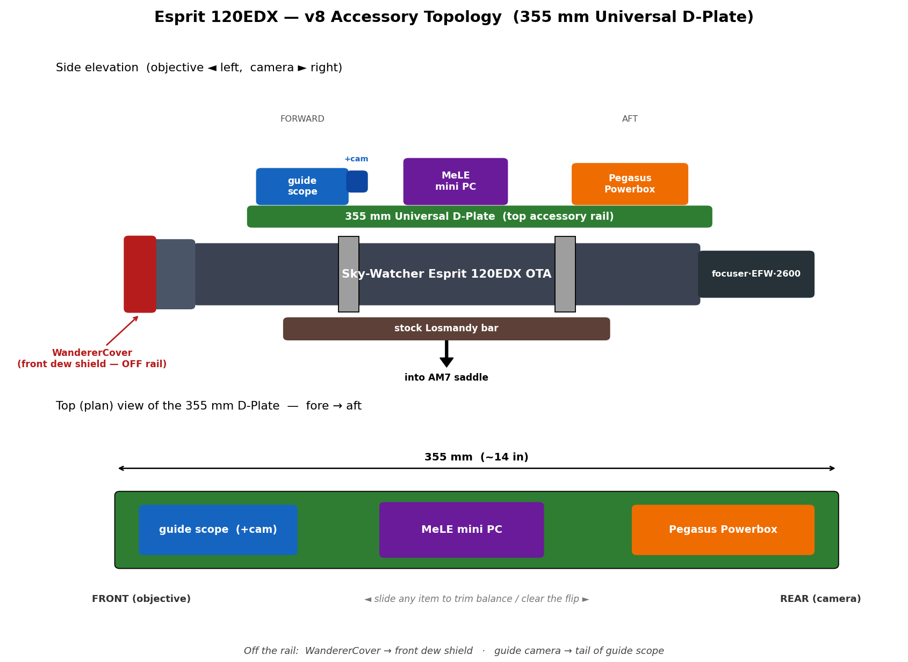

**ASTROPHOTOGRAPHY RIG PLAN — v8**

Sky-Watcher Esprit 120EDX + ZWO AM7 + Daystar Quark

*Mono SHO Deep Sky · Solar H-alpha · Backyard + Travel Configuration*

## Changelog

**v8 (2026-06-04)** — Adds the **Sky-Watcher 355mm Universal D-Plate** as the
top accessory rail, and a new **Physical Layout and Accessory Topology** section
proposing the full fore/aft arrangement. This closes the v7 BOM gap: v7 told you
to mount the MeLE + Powerbox "via the BuckeyeStargazer brackets" but never
budgeted a rail for those brackets to attach to. The 355mm D-plate is that rail —
long enough to carry guide scope + MeLE + Powerbox in a single fore→aft line with
balance room to spare. Cost delta: **+$65** (the D-plate); every Phase-2-and-later
cumulative total rises by the same $65.

**v7** — superseded the Quattro 200P / EQ6-R Pro / AM5N / ASIAIR plans; locked the
Esprit 120EDX + AM7 + Apertura Anchor + NINA-on-mini-PC architecture.

# Executive Summary

This document describes the second deliberate astrophotography rig for backyard imaging from Jersey City (Bortle 8), with a secondary capability for travel to dark sites and a tertiary capability for solar H-alpha imaging. The rig is built around the Sky-Watcher Esprit 120EDX f/7 ED triplet refractor, paired with a ZWO AM7 strain wave mount on the Apertura Anchor pier, and a ZWO mono SHO imaging train. A Daystar Quark Chromosphere unlocks solar imaging from the same OTA with minimal additional gear.

The rig complements an existing ZWO Seestar S30 Pro (which handles casual wide-field capture) by providing a deliberate, plug-and-play instrument capable of long integration sessions on emission nebulae. The Esprit 120EDX was chosen over a Quattro 200P f/4 Newtonian after extensive analysis comparing operational character, practical imaging ceiling, travel friendliness, and the strategic addition of solar imaging as a use case the Newtonian cannot support.

The complete rig including solar capability totals approximately $15,057 in mandatory components (v8: +$65 for the 355mm D-Plate top rail), plus tax and optional quality-of-life additions. The system is built in phases, with each phase delivering standalone capability and the option to pause at any point.

**Decisions locked:** Sky-Watcher Esprit 120EDX as the optical tube assembly. ZWO AM7 strain wave mount on the Apertura Anchor pier as the mount foundation, replacing the originally-planned EQ6-R Pro and the briefly-considered AM5N selection — chosen for sufficient payload margin (the Esprit 120EDX's actual 30 lb total imaging payload operates the AM7 at a comfortable 68% utilization without counterweights, vs the AM5N's 91% utilization that would have required adding counterweights to operate comfortably). Mini PC running NINA as the imaging control plane (rather than ZWO ASIAIR Plus), enabling integration with custom CLI tooling, ASCOM-standard device support, and a non-vendor-locked architecture. This document supersedes the prior Quattro 200P, EQ6-R Pro, AM5N, and ASIAIR-based planning.

# Final Rig at a Glance

| **Component** | **Selection** | **Cost** |
| --- | --- | --- |
| Mount | ZWO AM7 strain wave (head only) + Apertura Anchor pier | $3,699 |
| OTA | Sky-Watcher Esprit 120EDX (120mm, 840mm FL, f/7) | $3,295 |
| Field corrector | Esprit 120EDX matched flattener (44mm IC) | $320 |
| Main camera | ZWO ASI2600MM Pro (APS-C mono cooled) | $2,000 |
| Filter wheel | ZWO EFW 7×36mm | $299 |
| Narrowband filters | Antlia 3nm Pro Ha + OIII + SII (36mm) | $900 |
| Imaging controller | Mini PC (Beelink SER5 or equiv) running NINA + ASCOM | $350 |
| Power & USB hub | Pegasus Astro Pocket Powerbox Advance | $429 |
| Electronic focuser | Pegasus Astro FocusCube 3 with Universal L-Bracket (FC3-UNIV bundle) | $260 |
| Guide system | ZWO 30F5 guide scope + ZWO ASI220MM Mini guide camera | $398 |
| Solar etalon | Daystar Quark Chromosphere (DSZ4C) | $1,295 |
| Solar UV/IR cut | Daystar 2" UV/IR cut filter | $100 |
| Solar camera | ZWO ASI174MM Mini (global shutter mono) | $599 |
| Atmospheric Dispersion Corrector | ZWO ADC (for low-altitude solar) | $199 |
| Sun finder | Tele Vue Sol-Searcher | $70 |
| Accessories | Power adapters, dew straps, cables, Bahtinov, T2 adapters, misc | $420 |
| Accessory rail | Sky-Watcher 355mm Universal D-Plate (Losmandy-style top rail) | $65 |
| Flat panel + dust cover | WandererCover V4-EC 190mm (motorized, dew heater) | $369 |
| **Total mandatory** | **DSO + Solar combined rig** | **$15,057** |

Cumulative through each buying phase (excluding sales tax):

| **Phase** | **Adds** | **Cumulative** |
| --- | --- | --- |
| Phase 1 — Mount foundation | AM7 head + Apertura Anchor + power adapter | $3,739 |
| Phase 2 — Core DSO with Ha | OTA + flattener + camera + EFW + Ha + mini PC + Powerbox + FocusCube + guide + flat panel + **355mm D-plate** + accessories | $12,141 |
| Phase 3 — Complete SHO | Add OIII + SII filters | $12,741 |
| Phase 4 — Solar capability (Tier 2) | Quark + UV/IR + ASI174MM + ADC + Sol-Searcher + adapters | $15,054 |
| Phase 5 — Quality of life (optional) | LRGB, battery, rotator, PixInsight, ADC for DSO | +$1,500 |

NJ sales tax (6.625%) adds approximately $998 on the total, bringing the realistic delivered cost to about $16,055 for full DSO + solar capability.

# Why This Configuration Won

The original framing of this project assumed a single-domain rig optimized for mono SHO emission nebula imaging from a Bortle 8 backyard. Under that constraint set, the Quattro 200P f/4 Newtonian was the right answer — maximum aperture per dollar, fast focal ratio that suits narrowband, and a focal length (800mm) that differentiates well from the S30 Pro's 150mm.

As the analysis deepened, the constraint set expanded:

- Galaxy imaging interest — but galaxies are broadband targets that narrowband can't rescue from Bortle 8, making the Quattro's aperture advantage only accessible at dark sites
- Dark-site travel willingness — but transporting an f/4 Newtonian requires post-trip collimation verification and tilt re-tuning, eroding the actual imaging hours available per trip
- Solar imaging curiosity — which the Quattro physically cannot support, since the Daystar Quark requires an f/4–f/8 refractor
- Consistency preference — Newtonian f/4 imaging requires a 3–6 month learning curve on collimation and tilt before sessions become reliable; a refractor is plug-and-play from night one

Each constraint individually shifts the analysis toward a refractor. Together they make the Esprit 120EDX the structurally superior choice despite costing $2,100 more than the Quattro 200P OTA.

## The four reasons the Esprit 120EDX wins

### 1. Solar imaging unlocks an entire imaging domain

The Daystar Quark Chromosphere is a Fabry-Perot etalon plus 4.3× telecentric Barlow in a single eyepiece-format device. It requires an f/4–f/8 refractor (so f/7 is ideal) and works best with 80–150mm aperture (the Esprit 120EDX is exactly in this range). The Quattro 200P at f/4 is technically within range but operationally wrong: the parabolic mirror, fast focal ratio, and 200mm aperture combine poorly with the Quark's optical requirements.

Solar imaging from the Esprit 120EDX + Quark produces effective 3,600mm focal length at f/30, sufficient to resolve filaments, prominences, active regions, and chromospheric texture. Sessions are short (30 minutes during a lunch break, no cooldown, no polar alignment for solar tracking) and weather-independent in a way DSO imaging isn't — clear daytime skies are far more common than clear moonless nights.

Solar imaging effectively doubles the imaging year. The Quattro forecloses this entirely.

### 2. Operational consistency, not raw performance

On the practical ceiling for Bortle 8 narrowband emission imaging — your stated primary use case — the Quattro and Esprit produce equivalent final image quality given sufficient integration time. The Quattro reaches that quality in roughly 3× fewer hours (f/4 vs f/7 on extended objects), but those hours are unreliable: collimation drifts, focuser slip threatens, tilt accumulates with each disassembly, mirror cools through autofocus drift for the first 45 minutes.

The Esprit produces ~95% of its peak performance on ~95% of nights. Over a season, the average yield-per-night likely exceeds the Quattro's despite the lower theoretical speed. The rig is built around the imaging you actually do, not the imaging you theoretically could do.

### 3. Travel-friendly opens dark-site work

A dark-site trip to Cherry Springs (Bortle 2, 4-hour drive) with the Quattro means 4.5 hours of setup-and-collimation before first light at 9 PM. With the Esprit, it means 1.5 hours of setup and you eat dinner instead of fighting tilt screws. Over a typical 5-trip year, the Esprit delivers an additional 5–7 hours of imaging time per season for the same trip cost.

The Esprit's hard case (included), 17 lb OTA weight, and 28-inch tube length make it actually transportable in a sedan. The Quattro's 33-inch steel tube and 22 lbs of optical mass require deliberate transport planning that adds friction to every dark-site trip.

### 4. Star quality is qualitatively different

Refractor stars are a distinct aesthetic. No diffraction spikes (the Newtonian's spider produces unavoidable spikes from bright stars), perfectly round to the corners with no coma residual, better color saturation, no haloing around bright stars. For images where stars are part of the composition — which is most images — the Esprit produces something the Quattro physically cannot match, regardless of how well-collimated.

## What was given up

The Esprit 120EDX gives up real things relative to the Quattro 200P:

- 44% less light-collecting area (120mm vs 200mm aperture) — fainter stars and background galaxies pull less detail; the Quattro retains a ~0.6 magnitude depth advantage on point sources that integration time can't fully recover
- 3× slower per pixel on extended emission — Esprit needs 3× the hours to match Quattro SNR on Cygnus complex
- Galaxy season aperture-hunger — the Esprit produces decent but not exceptional galaxy images even at dark sites; the Quattro's aperture matters more here
- $2,100 higher OTA cost (and $3,740 higher imaging package cost when corrector is included)

These are real concessions. The decision logic accepts them in exchange for: solar capability the Quattro cannot provide, operational reliability the Quattro cannot match, travel friendliness that makes the dark-site galaxy advantage of the Quattro mostly hypothetical anyway, and refractor star quality that's structurally unavailable from any Newtonian.

## Control plane architecture: NINA over ASIAIR

The imaging control plane is the mini PC running NINA, not the ZWO ASIAIR Plus. This decision was made for four reasons:

- Integration with custom CLI tooling — NINA exposes a documented TCP API for external scripting; the ASIAIR has no supported integration surface for non-ZWO software
- ASCOM standard support — any astronomy device with an ASCOM driver works in NINA (Sky-Watcher mounts, ZWO cameras, Pegasus accessories, Player One cameras, future upgrades); ASIAIR locks the device list to ZWO-supported gear
- Advanced sequencing capabilities — NINA's Advanced Sequencer supports conditional triggers, automated meridian flips, sub validation rules, target rotation across the night, custom plugin extensions; ASIAIR's autorun is comparatively limited
- Vendor independence — every future equipment upgrade (mount, cameras, accessories) becomes easier in the open ASCOM ecosystem than in ZWO's walled garden

The cost: ~$470 more than an ASIAIR-based control plane ($350 mini PC + $429 Powerbox + $40 adapter vs $350 ASIAIR), plus the one-time complexity of setting up Windows + NINA + ASCOM drivers. For a software-builder profile with custom CLI tooling, the architectural payoff is immediate and compounds over years.

Pegasus Astro's Pocket Powerbox Advance replaces the ASIAIR's power distribution role with substantially more capability: 4× 12V outputs with per-port current and voltage monitoring, 4× USB 3.0 hub, dew heater controllers with automatic temperature/humidity-based rules, environmental sensors, and full ASCOM/INDI driver support. The Pegasus FocusCube 3 replaces the ZWO EAF with temperature compensation, absolute positioning, USB-C single-cable power+data, and Wi-Fi enabled remote control. Bracket compatibility is resolved by purchasing the FC3-UNIV bundle (FocusCube 3 + Universal L-Bracket), which Pegasus has explicitly tested against the Sky-Watcher Esprit 80/100/120/150 focusers — no separate bracket sourcing needed.

## Mount architecture: AM7 strain wave + Apertura Anchor pier

The mount foundation is the ZWO AM7 strain wave mount mounted on the Apertura Anchor pier. This selection emerged from a deliberate process that briefly went through three candidates before settling: the originally-planned Sky-Watcher EQ6-R Pro (rejected as a counterweighted worm-gear mount with high setup time and weight), the ZWO AM5N (initially selected, then re-evaluated after a more careful payload analysis), and finally the AM7 (chosen as the correctly-sized strain wave mount for this rig).

**Why AM7 rather than AM5N:** The deciding factor was a payload-vs-capacity analysis. The Esprit 120EDX OTA is 22 lbs by itself (verified from Sky-Watcher specifications) — not the 13 lbs initially estimated. Adding the full imaging train (flattener, camera, EFW with 7 filters, focuser, Powerbox, mini PC, brackets, guide system, cables, and dew straps) brings total imaging payload to approximately 30 lbs. Geometric factors (the Esprit's long tube, top-mounted accessories raising the center of mass, and electronics extending 8-10 inches behind the focuser) push worst-case torque on the mount drives toward 29 N·m. The AM5N's specifications are 33 lb counterweight-free payload and 30 N·m maximum drive torque — which makes the rig operable at 91% of payload spec and 97% of torque spec. ZWO's spec is met, but operating at the upper edge of capacity for years invites unnecessary tracking precision degradation and reduced wind margin. The AM5N could be made operationally comfortable by adding a counterweight bar and 11-lb counterweight (~$120-140 total), but this re-introduces the per-session balancing complexity that strain wave was chosen to eliminate. The AM7's 44 lb counterweight-free spec puts this same 30 lb payload at 68% utilization — the comfortable middle of the rated range, with no counterweight required and meaningful headroom for future upgrades (Esprit 150EDX at ~36 lbs sits well within AM7's counterweight-free spec).

The AM7 + Apertura Anchor combination wins on five dimensions:

- Correctly-sized strain wave capacity — the AM7 handles the Esprit 120EDX's 30 lb actual imaging payload at 68% counterweight-free utilization, vs the AM5N's 91% utilization. This is the difference between operating in the comfortable middle of spec and the upper edge.
- No counterweight balancing required — the strain wave architecture's whole value proposition (fast setup, no balancing dance) is preserved. AM5N would have required adding a counterweight to operate comfortably, undermining the operational simplicity that motivated the strain wave choice.
- Superior pier clearance via the Apertura Anchor — the 4" pier tube extending 19" past the leg joints provides essential clearance for the Esprit's long imaging train (flattener + filter wheel + camera + FocusCube assembly is ~18 inches deep)
- Better balcony geometry — the AM7 + Anchor positions the OTA at ~49–59 inches off the ground at maximum leg extension, well above typical 36–42" balcony railings
- Future-proofed for likely upgrades — if a future Esprit 150EDX upgrade happens, the AM7 absorbs the additional ~6 lbs of OTA weight comfortably (~75% utilization). The AM5N would have required a counterweight to handle the 150EDX upgrade. The AM7 also gives meaningful headroom for adding a piggyback OTA or larger accessories without revisiting the mount.

The trade-offs accepted in this decision:

- Meridian flip still required — strain wave mounts use traditional German equatorial geometry; the iOptron CEM line would have eliminated flips, but iOptron's manufacturing quality consistency was judged inferior to ZWO's, and ZWO's NINA ecosystem support is more mature; the meridian flip overhead (~85 minutes per year across ~30 sessions) was judged smaller than the cumulative setup-time savings of strain wave (~6 hours per year)
- Cost: $2,999 (head only) for AM7 vs $2,199 for AM5N — the $800 premium buys correct sizing for the actual payload rather than spec-edge operation, plus future-proofing for likely OTA upgrades. The alternative of AM5N + counterweight saved ~$680 but added per-session setup complexity and capped future upgrade headroom
- Heavier mount head — 17 lbs for AM7 vs 12 lbs for AM5N. For permanent balcony installation, this is acceptable; for travel imaging, the heavier head is a real cost. The Apertura Anchor and AM7 are both suitable for occasional travel but not as travel-friendly as the AM5N + TC40 tripod combination would have been.
- Less established than AM5N — the AM5N has more community deployment time and forum knowledge. The AM7 is newer and smaller market share, though it shares ZWO's strain wave architecture and ASCOM driver ecosystem with the AM5N. Periodic error spec is identical (±10 arcseconds peak-to-peak).

The Apertura Anchor specifically was chosen over the ZWO TC40 tripod + PE200 extension because the Anchor's 19" pier clearance is over twice what the TC40+PE200 provides (~8"). The TC40 is the right choice for ultralight travel (5 lbs vs 17.5 lbs); for permanent balcony or backyard deployment, the Anchor's stability and clearance benefits outweigh its weight penalty. Both options use the same AM7 head and are interchangeable if you ever want to optimize for different scenarios.

## Guide system architecture: ZWO 30F5 + ASI220MM Mini (guide scope, not OAG)

Guiding is handled by a separate small guide scope mounted parallel to the main OTA, rather than an off-axis guider (OAG) integrated into the imaging train. This decision was driven by four factors specific to this rig:

- Focal length is in guide scope territory — OAGs become necessary or strongly beneficial above ~1000-1200mm focal length, where differential flexure between guide scope and main OTA becomes problematic. At the Esprit's 840mm focal length, flexure is small enough that a rigidly-mounted guide scope works without measurable differential drift over typical session lengths.
- Narrowband-heavy imaging plan makes OAG guide-star availability problematic — an OAG's guide camera looks through the same filter as the main camera. With 3nm narrowband filters in the imaging train, the OAG would block 99%+ of available guide stars, requiring complex workarounds (filter-swap routines, autofocus offsets). A separate guide scope sees unfiltered starlight regardless of which filter is in the main train, making guide star acquisition reliable for every target.
- Simpler initial setup and ongoing operation — guide scope drops into the Esprit's accessory rail with thumbscrew tightening. OAG requires careful focus offset matching between main camera and guide camera, plus prism rotation tuning. For first-light efficiency, the guide scope architecture wins clearly.
- Cost savings of ~$150-450 — a quality OAG ($250-500) plus the same guide camera ($249) plus required spacers and adapters totals $549-849. The 30F5 + ASI220MM Mini combination is $398 — meaningfully cheaper for a use case where OAG's advantages don't materialize.

**Why ZWO 30F5 specifically:** Among the candidate guide scopes (30mm, 50mm, 60mm classes), the 30F5 is correctly sized for this rig. Modern guide cameras like the ASI220MM Mini are sensitive enough (92% QE, 0.6e read noise) that a 30mm aperture finds plenty of guide stars in 1-2 second exposures. The 30F5's 0.4 lb weight and short tube length minimize lever arm flexure relative to the main scope. Pixel scale (6.9"/pixel with the 4μm ASI220MM Mini) gives ~0.7" effective guide precision via PHD2's sub-pixel centroiding, which is well below the 2-3" seeing floor of Bortle 8 Jersey City. A 60mm guide scope would give slightly better matched pixel scale but at 4x the weight; the precision improvement (0.3" vs 0.7") is below the seeing floor anyway and wouldn't show up in final images.

**Why ASI220MM Mini specifically:** Built around the Sony SC2210 sensor — the same sensor ZWO uses as the integrated guide chip in their flagship ASI2600MM Duo, which signals their internal endorsement as the right modern guide sensor. 1920×1080 mono, 4μm pixels, 92% peak QE, 0.6e read noise. ST-4 and USB-C ports. Native ZWO ASCOM driver support means it integrates cleanly with the rest of the rig's ZWO ecosystem. The earlier candidate (Player One Saturn-M SQR) was rejected when verified pricing showed $749 vs the $299 originally cited — the Saturn-M SQR is actually a planetary/lucky imaging camera, dramatically overspecified for guide-camera duty.

The guide system architecture is something to reconsider in two specific upgrade scenarios:

- Upgrade to a longer focal length OTA (1500mm+) — at that point the 30F5's differential flexure margin shrinks, and an OAG becomes worth its complexity overhead. The 30F5 + ASI220MM Mini would still work as guiding for the Esprit 120 or as a finder for a future telescope.
- Sub-arcsecond seeing site imaging — at a true dark site with <1" FWHM seeing, the precision advantage of a larger guide scope (or OAG) becomes potentially visible in final images. For typical 2-3" Jersey City seeing, the 30F5 is correctly sized.

## Calibration architecture: WandererCover V4-EC motorized flat panel

Flat-field calibration is handled by a motorized panel that doubles as a dust cover, mounted on the Esprit's dew shield. This decision was driven by three factors:

- Narrowband imaging demands repeatable, bright flat sources — sky flats work for LRGB but struggle through 3nm Antlia filters (very long exposures during brief twilight windows, with sky drift during the sequence). A dedicated LED panel with adjustable brightness produces consistent, short-exposure flats per filter even at 3nm bandwidth, which is critical for an SHO-heavy imaging plan.
- End-of-session automation preserves the NINA-centric workflow — the WandererCover's ASCOM driver lets NINA run the entire flat sequence automatically as part of the session end-of-night routine. The cover closes itself, the panel illuminates at the calibrated brightness per filter, NINA cycles through filters taking the configured flat count, then reopens the cover. Walk away during teardown; the system handles calibration.
- Doubles as a permanent dust cap — for the permanent balcony installation, the closed cover serves as a dust and dew shield between sessions, eliminating the need for a separate lens cap and reducing dew accumulation on the front objective overnight.

**Why WandererCover specifically:** Three motorized panel candidates were evaluated: Pegasus FlatMaster Neo 120 (rejected — silicone flange tops out at 166mm internal diameter, won't fit the Esprit's 174.6mm / 6.875" dew shield), Alnitak Flip-Flat #19051 6"-7-5/8" (technically fits but illumination diameter at 170mm is slightly smaller than the dew shield OD, and no built-in dew heater, no position encoder, older EL-panel + USB-only software stack), and the WandererCover V4-EC 190mm (correctly sized with margin: 190mm luminous diameter > 174.6mm dew shield OD per WandererAstro's sizing rule that luminous diameter must equal or exceed dew shield diameter). The WandererCover also adds built-in dew heater on the panel surface (critical for humid Jersey City conditions where condensation can transfer moisture to the closed objective), position encoder for accurate open/close feedback, cold-weather rating to -20°C, 255-level dimming, and modern ASCOM driver. It is also ~$150 cheaper than the Alnitak. The trade-off accepted: WandererAstro is a newer Chinese manufacturer (less ubiquitous than Alnitak's 15+ years of deployment), but the products have established a strong reputation in recent years and Agena Astro stocks them domestically (no import logistics).

The 190mm size was specifically selected to match the Esprit 120EDX's measured dew shield OD of 6.875" (174.6mm) with the WandererAstro sizing rule margin. Smaller WandererCover V4-EC sizes (80, 100, 120, 150, 170mm) would not have provided full illumination across the dew shield opening; larger sizes (200mm+) would have added unnecessary weight and footprint. The 190mm is the correct match.

# Physical Layout and Accessory Topology

*(Added v8, built around the Sky-Watcher 355mm Universal D-Plate.)*

This section resolves how the rig's accessories physically attach — the gap v7 left open. The governing decision: a **single long top accessory rail** (the 355mm D-Plate) carries everything that rides above the OTA, the OTA's factory dovetail stays as the bottom mount interface, and two items deliberately stay *off* the rail.

## The two mounting interfaces

- **Bottom — mount interface (unchanged):** the Esprit's factory Losmandy dovetail bolts under the tube rings and drops into the AM7's dual Vixen/Losmandy saddle. This is the OTA-to-mount connection; nothing accessory-related lives here.
- **Top — accessory rail (new):** the **Sky-Watcher 355mm Universal D-Plate** bolts across the tops of both tube rings. At 355mm (~14") it overhangs the ~200–250mm ring span fore and aft, giving mounting real estate in front of the front ring and behind the rear ring — exactly where fore/aft balance trim and component separation want to happen. A shorter bar would force the three top items to crowd; 355mm is what makes the single-rail topology work.

## What rides where

| Item | Location | Why |
| --- | --- | --- |
| ZWO 30F5 guide scope (+ ASI220MM Mini on its tail) | Top D-plate, **forward** | Wants a clear forward sky view away from the focuser/camera bulk; light (0.4 lb), so far-forward placement costs little in balance |
| MeLE mini PC | Top D-plate, **mid/forward** | Heaviest electronics box — kept near the rings so its mass sits low and central over the saddle |
| Pegasus Pocket Powerbox Advance | Top D-plate, **aft** | Sits by the focuser/camera end where most leads terminate (camera, focuser, dew heater, EFW) → shortest cable runs |
| WandererCover V4-EC | **Front dew shield** — NOT the rail | A motorized cap over the 174.6mm objective; it belongs at the front of the OTA and never competes for rail space |
| Guide camera (ASI220MM Mini) | **Tail of the guide scope** — NOT the rail | Threads into the guide scope's focuser; rides the guide scope |

So only **three** items actually compete for rail space — guide scope, MeLE, Powerbox — and a 355mm rail lines them up fore→aft with separation to spare. (The MeLE in this build is the fanless MeLE Quieter-class mini PC, not the Beelink the v7 BOM names as a generic stand-in.)

## Topology diagrams



*Rendered diagram above (generator: `docs/diagrams/rig_v8_layout.py`); ASCII fallback below for raw-text viewing.*

```
SIDE VIEW   (objective left, camera right)

           guide scope+cam     MeLE          Powerbox
               (fwd)         (mid/fwd)         (aft)
                 |              |               |
          ╔══════╪══════════════╪═══════════════╪══════╗   355mm D-plate (top rail)
          ║      v              v               v      ║
 [Cover]= ║   Esprit 120EDX OTA   (ring1)   (ring2)    ║ =[focuser][EFW][ASI2600MM]
          ╚════════════════════════════════════════════╝
          ───────────────── stock Losmandy bar ─────────────►  into AM7 saddle

 [Cover] = WandererCover on the front dew shield (off-rail)
```

```
TOP (PLAN) VIEW of the 355mm D-plate, fore → aft

 FRONT (objective)                                            REAR (camera)
 |<-------------------------- 355 mm -------------------------->|
 ┌─────────────────────────────────────────────────────────────┐
 │  [ guide scope ]      [   MeLE PC   ]          [  Powerbox  ] │
 │      (fwd)               (mid/fwd)                 (aft)      │
 └─────────────────────────────────────────────────────────────┘
        ^── slide any item to trim balance / clear the flip ──^
```

## How the D-plate carries the gear (and the Buckeye-clamp check)

The Universal D-Plate is a Losmandy-D-profile dovetail bar with a top face full of slots/tapped holes. There are two valid ways to attach the three items, depending on what your BuckeyeStargazer adapters actually are:

1. **Dovetail-up + clamps:** orient the D-plate Losmandy-profile-up and grip it with **Losmandy clamps**. *Check first:* the Buckeye "rail adapters" you already bought must be **Losmandy-D clamps** — a **Vixen** clamp will NOT grip a D-profile bar.
2. **Flat-up + bolt-on:** orient the plate flat-face-up and **bolt** the MeLE/Powerbox trays directly through the plate's universal slots (1/4-20 / M6). This sidesteps the profile question entirely and is the more rigid mount for the electronics; many Buckeye mini-PC / Powerbox trays are bolt-down rather than clamp-on.

**Recommendation:** bolt-on (#2) for the MeLE + Powerbox (rigid, no clamp-profile risk), and a quick-release clamp (or a short Losmandy/Vixen segment) for the guide scope so it can come off fast — the guide scope **must be removed or capped for solar work** (see Solar Safety). **Confirm the profile of the Buckeye parts already in hand before finalizing;** if they turn out to be Vixen clamps, the bolt-on path still works for the electronics and you'd only need a Losmandy clamp (or a Vixen segment screwed to the plate) for the guide scope.

## Clearances to verify before first light

- **Meridian-flip swing:** on the GEM strain-wave AM7, the tallest top-rail items (Powerbox, MeLE) sweep the largest arc near the pier. Confirm no contact with the Apertura Anchor / pier at the flip and at low-altitude pointing.
- **Focuser drawtube travel:** the aft Powerbox must not foul the focuser / EFW / camera as the drawtube extends through focus.
- **Camera cooler exhaust:** keep the MeLE's warm-air vents from blowing across the ASI2600MM's radiator (the v7 rationale for splitting mini-PC-forward / electronics-aft) — bolt-on placement lets you orient the vents away from the camera.
- **Dew shield + cover arc:** nothing on the rail should overhang the dew shield; the WandererCover needs clear travel to open/close at the front.
- **Cable management:** with the Powerbox aft, the camera/focuser/EFW/dew-heater leads reach it on the shortest runs; route the single 12V feed and the USB uplink to the MeLE along the rail, dressed to the Powerbox's strain-relief, so nothing dangles into the flip arc.

## Balance and payload impact

The 355mm D-plate adds ~0.7–1.3 lb. Total imaging payload moves from ~30 lb to ~31 lb — still ~70% of the AM7's 44 lb counterweight-free spec, comfortably inside the rated middle. Strain-wave drives hold position without counterweight balancing, so the rail's added top-side mass **does not require rebalancing for tracking**; it only raises the center of mass slightly, marginally affecting wind/vibration sensitivity (negligible on the Anchor pier). Use the rail's length to slide items until the assembled OTA sits roughly neutral in the saddle for easy handling and a tidy flip.

# Three Areas of Care for Refractor Imaging

The Esprit 120EDX has dramatically fewer maintenance and tuning concerns than the f/4 Newtonian it replaces. No collimation, no tilt calibration, no focuser slip risk, no mirror cooldown. Three areas still warrant attention:

## 1. Back-focus precision

The Esprit 120EDX flattener requires precise 55mm back-focus from the flattener's M48 output to the camera sensor. This is non-negotiable for proper field flatness across the APS-C sensor of the ASI2600MM Pro. Unlike the f/4 Newtonian's tolerances (where a 1mm error produces 1mm of coma), the Esprit at f/7 is more forgiving (a 1mm error is approximately equivalent to 0.5mm at f/4 in resulting aberration). Still, get it right.

Calculate the stack: flattener output → spacer → filter wheel (typically 21mm thickness) → camera sensor distance (17.5mm for the ASI2600MM Pro). Required spacer = 55mm - 21mm - 17.5mm = 16.5mm. This is standard and the flattener typically ships with adapters that work directly with ZWO components. Verify with the ZWO ASI2600MM Pro specification sheet before assembly.

If you suspect back-focus issues after first light, the symptom is corner star elongation in a radial pattern. The fix is iterative spacer adjustment (M48 spacers are sold in 1mm, 2mm, and 5mm increments).

## 2. Dew control on the front objective

Refractors are more susceptible to dew than Newtonians. The front objective lens points up and outward, directly exposed to radiating cold sky, and the glass itself acts as a thermal radiator. The Esprit's retractable dew shield helps but is not sufficient on humid Jersey City nights.

Mandatory: a dew heater strap on the OTA, positioned around the front of the dew shield closest to the objective. Power it from the ASIAIR's dew heater output or a dedicated controller. The Kendrick Dew Strap 4 (~$40) or ZWO Dew Heater Strap (~$50) wraps around the 120mm dew shield diameter.

Optional but recommended: a secondary heater strap on the focuser drawtube during humid summer nights. The drawtube is metal and conducts cold to the imaging train.

Failure mode: dew on the front lens looks like uniform image softness that worsens through the night. By the time you notice it visually, hours of integration may be compromised. Run the heater preemptively, not reactively.

## 3. Temperature equilibration

Refractor optics need to reach ambient temperature for best performance, but the equilibration is fast (~10–15 minutes) because there's no large mirror mass and the optical elements are small. Contrast with the Quattro 200P, which needs 30–45 minutes to cool the primary mirror.

Procedure: take the Esprit outside when you set up the mount (~10 minutes before you need to image), and by the time polar alignment and plate solving are complete, the OTA is equilibrated. No active fan, no temperature monitoring, no thermal autofocus runs needed during the first hour.

Autofocus drift through the night is much smaller than with the Newtonian. Plan one autofocus run per hour, or trigger autofocus on filter change, and that's sufficient.

# Complete Bill of Materials

## DSO imaging gear

| **Item** | **Specification** | **Recommended Vendor** | **Price** |
| --- | --- | --- | --- |
| Mount head | ZWO AM7 strain wave equatorial mount (head only), 44 lb payload without counterweight (75 lb with optional counterweight), 12V/5A power, USB-C and 12V outputs at saddle for cable management, Bluetooth and Wi-Fi connectivity, ASCOM driver via ZWO ASI Mount | High Point Scientific or Agena Astro | $2,999 |
| Mount pier | Apertura Anchor pier for strainwave mounts — 4" pier tube extending 19" past leg joints, 220 lb capacity, 17.5 lb total weight, AM7-compatible adapter plate | High Point Scientific | $700 |
| AC adapter (mount) | Apertura AC/DC adapter (12V/5A, 5.5×2.1mm) for AM7 | High Point Scientific | $40 |
| OTA | Sky-Watcher Esprit 120EDX, 120mm aperture, 840mm FL, f/7, FPL-53 triplet, MHTC coatings, Helinear focuser, includes rings/dovetail/hard case | Sky-Watcher USA direct or High Point | $3,295 |
| Field flattener | Sky-Watcher Esprit 120EDX dedicated flattener (S20218), 44mm image circle, 55mm back-focus | Telescopes.net or Sky-Watcher USA | $320 |
| Main camera | ZWO ASI2600MM Pro, 26MP APS-C, 3.76μm pixels, Sony IMX571 mono sensor, cooled | Agena Astro or High Point | $2,000 |
| Filter wheel | ZWO 7-position EFW for 36mm unmounted filters | Agena or B&H | $299 |
| Filter — Ha | Antlia 3nm Pro Ha 36mm unmounted | Agena Astro | $300 |
| Filter — OIII | Antlia 3nm Pro OIII 36mm unmounted | Agena Astro | $300 |
| Filter — SII | Antlia 3nm Pro SII 36mm unmounted | Agena Astro | $300 |
| Imaging controller PC | Mini PC such as Beelink SER5 Max (Ryzen 5, 16GB RAM, 512GB NVMe), Windows 11 Pro, running NINA + PHD2 + ASCOM Platform | Amazon or Beelink direct | $350 |
| Power & USB hub | Pegasus Astro Pocket Powerbox Advance — 4× 12V outputs with per-port monitoring, 4× USB 3.0, dew heater control, environmental sensors, ASCOM driver | High Point or Pegasus Astro direct | $429 |
| AC adapter (Powerbox) | Apertura 12V/5A AC adapter for Pegasus Powerbox (same SKU as mount adapter — buy two) | High Point Scientific | $40 |
| Electronic focuser | Pegasus Astro FocusCube 3 with Universal L-Bracket (SKU: FC3-UNIV) — temperature compensation, absolute positioning, USB-C single-cable power+data, Wi-Fi enabled, ASCOM-native, 6kg lift at zenith. Bundle includes L-bracket explicitly tested with Sky-Watcher Esprit 80/100/120/150, five motor couplers (4mm–8mm bore range), and mounting hardware. | Agena Astro or High Point Scientific | $260 |
| Guide scope | ZWO 30F5 mini guide scope (30mm aperture, 120mm focal length, f/4) | Agena | $149 |
| Guide camera | ZWO ASI220MM Mini — Sony SC2210 sensor, 1920×1080 mono, 4μm pixels, 92% peak QE, 0.6e read noise; the canonical modern guide camera. ST-4 and USB-C ports. | Agena Astro or High Point Scientific | $249 |
| Bahtinov mask | Farpoint or 3D-printed for 120mm aperture | Amazon or Etsy | $40 |
| Dew heater (objective) | Kendrick Dew Strap 4 or ZWO 120mm strap, controlled by Powerbox | Kendrick Astro or Agena | $50 |
| Dew heater (focuser) | Smaller secondary strap for drawtube, controlled by Powerbox | Kendrick or Amazon | $30 |
| Apertura finder shoe v2 | For mounting Sol-Searcher or accessory on accessory rail | High Point | $25 |
| Cables/USB hub/misc | USB 3.0 cables (locking preferred), power cables, mounting brackets | Various | $130 |
| Flat panel + dust cover | WandererAstro WandererCover V4-EC 190mm — motorized servo cover, EL flat panel with 255-level dimming, built-in dew heater, position encoder, cold-weather rated (-20°C). 190mm luminous diameter fully covers the Esprit's 175mm dew shield with margin. ASCOM-compatible via WandererEmpire driver, integrates with NINA for end-of-session automated flat sequences. Doubles as a permanent dust/dew cap when closed. | Agena Astro | $369 |
| Accessory rail (top) | Sky-Watcher 355mm Universal D-Plate — Losmandy-style (D-profile) dovetail bar, 355mm (~14") long, universal slot/hole pattern. Bolts across the tube-ring tops to serve as the single top accessory rail carrying the guide scope + MeLE + Powerbox. See **Physical Layout and Accessory Topology**. | High Point Scientific or Agena Astro | $65 (est.) |
| **DSO subtotal** |  |  | **$11,739** |

## Solar imaging gear (Phase 4 — Tier 2)

Phase 4 is presented as a "Tier 2" solar build that balances entry cost against meaningful image quality improvements over a base configuration. See the Solar Imaging Upgrade Path section for higher-tier options that can be added later if solar becomes a serious ongoing commitment.

| **Item** | **Specification** | **Recommended Vendor** | **Price** |
| --- | --- | --- | --- |
| Solar etalon | Daystar Quark Chromosphere (DSZ4C) — Fabry-Perot etalon plus 4.3× telecentric Barlow; tunes around 656.3nm Ha | Agena, High Point, or B&H | $1,295 |
| UV/IR cut filter | Daystar 2" UV/IR cut filter — mounts in front of the Quark to reject thermal load on 80–150mm refractors (mandatory for Esprit 120EDX without front ERF) | Daystar direct, Agena, or High Point | $100 |
| Sun finder | Tele Vue Sol-Searcher — projects a small sun image onto a screen for safe pointing without optical alignment | Tele Vue dealer or Agena | $70 |
| Solar camera | ZWO ASI174MM Mini — Sony IMX174 global shutter mono sensor, 5.86μm pixels, ~138 fps; the standard solar imaging camera with extensive community support and tutorials | Agena or B&H | $599 |
| Atmospheric Dispersion Corrector | ZWO ADC — counter-rotating prisms to correct atmospheric chromatic dispersion for low-altitude sun (essential for Jersey City where the sun rarely exceeds 70° altitude) | Agena | $199 |
| Adapters/accessories | T2 adapters, extensions, USB cables, Quark power adapter (Quark has internal heater requiring 5V USB), 2"-to-1.25" reducer | Agena or Amazon | $50 |
| **Solar Phase 4 subtotal** |  |  | **$2,313** |

## Optional quality-of-life (Phase 5)

| **Item** | **Why it's optional** | **Price** |
| --- | --- | --- |
| Antlia V-Pro LRGB 36mm set | For broadband imaging when narrowband isn't the right choice (galaxies, star clusters, traveling to dark sites) | $500 |
| Bluetti EB55 LiFePO4 battery (537Wh) | For backyard imaging without running an extension cord, and essential for dark-site travel | $400 |
| PixInsight license | More capable than free Siril for advanced processing; pays off after first year of accumulated data | $300 |
| Pegasus FocusCube 3 or rotator | Replace EAF with motorized rotation capability if you want to reframe at any angle without manual intervention | $400 |
| ASIAIR battery + accessory pack | Dedicated power for the ASIAIR Plus during long sessions away from outlets | $80 |

# Phased Buying Order

The rig is structured to be acquired in five phases. Each phase produces a working capability before the next is needed; no phase requires the next to be useful. Pause at any boundary and the gear still works as a coherent system.

## Phase 1 — Mount foundation (~$3,739)

Buy first because the mount is the most OTA-agnostic component. It survives every future upgrade and works with anything you'd realistically add to this rig. With just Phase 1, you can mount the existing S30 Pro on a substantially more stable platform than its built-in tracker — you'll see immediate improvement in S30 Pro tracking quality.

- ZWO AM7 strain wave mount (head only) — $2,999
- Apertura Anchor pier for strainwave mounts (includes AM7 adapter plate) — $700
- Apertura AC/DC adapter (12V/5A) for AM7 — $40

After Phase 1: the mount is set up on its pier, polar alignment routine is learned via NINA's Three Point Polar Alignment plugin (no optical polar finder needed), and the AM7's ASCOM driver is configured. You're ready to receive an OTA. Setup-to-imaging time per session drops to roughly 15–20 minutes after the initial calibration is dialed in.

**Why this combination:** The AM7 + Apertura Anchor pairs ZWO's larger strain wave mount with the best aftermarket pier specifically designed for strain wave mounts. The Anchor's 4" pier tube extends 19" past the leg joints — over twice the clearance of a standard tripod + PE200 extension — providing essential clearance for the Esprit 120EDX's long imaging train. The 220 lb pier capacity is well beyond your imaging needs, providing rock-solid stability even on a potentially vibration-prone balcony. The strain wave architecture eliminates counterweights entirely (the AM7 handles the Esprit's ~30 lb imaging payload at 68% of its counterweight-free capacity), dramatically simplifying setup and reducing the carry weight for nightly use.

## Phase 2 — Core DSO imaging train with Ha (~$8,402 added, cumulative $12,141)

This is the big purchase. The OTA, camera, filter wheel, mini PC, Pegasus Powerbox, FocusCube, guide system, and first narrowband filter all need to arrive at roughly the same time to produce a working imaging system. Buying these piecemeal across months delays first light unnecessarily.

- Sky-Watcher Esprit 120EDX OTA — $3,295
- Esprit 120EDX matched flattener — $320
- ZWO ASI2600MM Pro main camera — $2,000
- ZWO 7-position EFW filter wheel — $299
- Antlia 3nm Pro Ha 36mm filter — $300
- Mini PC (Beelink SER5 Max or equivalent, Windows 11 Pro) — $350
- Pegasus Astro Pocket Powerbox Advance — $429
- Apertura 12V/5A AC adapter (for Powerbox) — $40
- Pegasus Astro FocusCube 3 with Universal L-Bracket (FC3-UNIV bundle, includes Esprit-compatible bracket) — $260
- ZWO 30F5 mini guide scope — $149
- ZWO ASI220MM Mini guide camera — $249
- Apertura Premium Finder Shoe v2 — $25
- Bahtinov mask for 120mm objective — $40
- Dew heater straps (objective + drawtube) — $80
- WandererCover V4-EC 190mm (motorized flat panel + dust cover with built-in dew heater) — $369
- Sky-Watcher 355mm Universal D-Plate (top accessory rail for guide scope + MeLE + Powerbox) — $65
- Cables, locking USB 3 cables, mounting brackets, accessories — $130

After Phase 2: you have a complete deliberate imaging rig capable of mono Ha narrowband imaging on Cygnus, Cassiopeia, Cepheus, and Perseus emission targets. NINA runs on the mini PC; control happens via Remote Desktop or VNC from inside, or via the custom CLI tooling. The S30 Pro continues handling wide-field and casual capture.

Image plan for Phase 2 alone: target the Heart and Soul Nebula complex, Veil Nebula, Pelican, Crescent, Cocoon. All deliver excellent Ha-only imagery and prove out the rig before adding more filters.

## Phase 3 — Complete SHO ($600 added, cumulative $12,741)

Adding OIII and SII converts the rig from Ha-only to full SHO (Hubble palette) mono narrowband imaging. There's no functional dependency between Phase 2 and Phase 3 — wait until you've completed several Ha-only targets and feel ready to add the additional filter management complexity.

- Antlia 3nm Pro OIII 36mm filter — $300
- Antlia 3nm Pro SII 36mm filter — $300

After Phase 3: full SHO palette imaging unlocks. Targets like the Pillars of Creation (M16), Lobster Claw, Rosette, and the Tulip Nebula reveal much richer detail when all three filters are stacked in the Hubble palette.

## Phase 4 — Solar capability, Tier 2 ($2,313 added, cumulative $15,054)

Solar imaging is the second imaging domain this rig supports. Phase 4 can be acquired at any time — it's logically independent from the DSO phases. Many imagers buy Phase 4 before Phase 3 if they're particularly interested in active solar regions or upcoming eclipses. The current solar cycle (Cycle 25) is at or near peak through 2026–2027, so target-richness is high right now.

This Phase 4 spec is the "Tier 2" solar build: global-shutter camera + ADC + standard Quark Chromosphere. See the Solar Imaging Upgrade Path section for higher tiers (Quark Pro etalon, front-mounted ERF) that can be added incrementally.

- Daystar Quark Chromosphere (DSZ4C) — $1,295
- Daystar 2" UV/IR cut filter — $100
- ZWO ASI174MM Mini (global shutter mono) — $599
- ZWO ADC (Atmospheric Dispersion Corrector) — $199
- Tele Vue Sol-Searcher (or equivalent) — $70
- T2 adapters, 2" extensions, 2"-to-1.25" reducer, USB cables — $50

After Phase 4: solar imaging is operational. The same OTA, mount, mini PC, and Powerbox support both DSO at night and Ha solar during the day. The swap is camera + Quark assembly + UV/IR filter + ADC — the rest of the rig stays put. Sessions reconfigure in about 5 minutes between domains.

## Phase 5 — Quality of life (optional, ~$1,500+)

These items are deliberately optional. None are required for the rig to function. They address specific friction points that may or may not actually bother you:

- LRGB filter set (Antlia V-Pro 36mm) — only buy if you decide broadband imaging from dark sites or galaxy imaging matters to you (~$500)
- Bluetti EB55 portable battery — only buy if you start doing dark-site travel or want to image away from outlets (~$400). Pair with a 12V→19V step-up converter (~$20) to power the mini PC from battery.
- PixInsight license — only buy after you've worked through what Siril can do for free and find specific limitations (~$300)
- Pegasus Astro Falcon V2 rotator — for mosaicking or reframing targets at specific angles without manual intervention (~$650)
- ZWO ADC for low-altitude DSO (galaxies at moderate altitude with broadband filters) — separate from the solar ADC (~$199)

Resist the temptation to buy Phase 5 before knowing whether you'll actually use it. Most astrophotographers accumulate Phase 5 gear over years, not months.

# Initial Setup Workflow

This workflow assumes Phases 1 and 2 have arrived and you're setting up the rig for the first time. Allow a full Saturday afternoon for this — not because any individual step is hard, but because there's no urgency and rushing creates problems.

## Stage 1 — Mount and pier preparation (20 minutes)

1. Unpack the Apertura Anchor pier. Extend the three legs, lock each leg with the spring-loaded detent, and tighten the clamping levers. Position the adjustable feet on a level surface.
2. Unpack the ZWO AM7 head. The head weighs 17 lbs — manageable for single-handed lifting onto the Anchor's top pier plate (a two-handed lift is fine if preferred).
3. Bolt the AM7 to the Anchor's adapter plate using the included M6x1.0 screws. The AM7's mounting holes align with the Anchor's pier plate.
4. Set the AM7's latitude to approximately 40.7° for Jersey City. Coarse adjustment via the latitude bolt; fine adjustment after first polar alignment via NINA.
5. Connect the 12V/5A Apertura power adapter to the AM7's saddle DC port. Power on the mount.
6. Pair the AM7 with the mini PC via USB-B cable (Bluetooth and Wi-Fi are alternatives but USB is more reliable for long sessions). Verify the mount slews in all four directions using the ZWO ASI Mount app or NINA.

Note: No counterweights are needed for the Esprit 120EDX. Total imaging payload of ~30 lbs sits at 68% of the AM7's 44 lb counterweight-free capacity, with ~14 lbs of headroom. The strain wave drives provide the holding torque traditionally provided by counterweight balance. Future upgrade to the Esprit 150EDX (~36 lb payload) remains within counterweight-free spec at ~82% utilization.

## Stage 2 — OTA preparation (45 minutes)

1. Unpack the Esprit 120EDX from its hard case. Inspect the objective lens for shipping damage (extremely rare but worth checking).
2. Install the included tube rings onto the OTA. Do not overtighten — they should grip firmly but allow a slip if needed.
3. Attach the Losmandy D dovetail to the rings. Use the included Allen keys.
4. Thread the Esprit 120EDX flattener onto the focuser drawtube via the M68 thread. Hand-tight is sufficient.
5. Attach the ASI2600MM Pro + ZWO EFW + filter wheel assembly to the flattener's M48 output. Verify total back-focus equals 55mm. If unsure, use a digital caliper to measure flattener M48 surface to camera sensor (Mitutoyo or any precision caliper; ~$30).
6. Install the ZWO EAF on the focuser via the Sky-Watcher Esprit EAF bracket. Connect the cable to the focuser knob via the included coupler.
7. Bolt the **Sky-Watcher 355mm Universal D-Plate across the tops of both tube rings** — this is the single top accessory rail for everything that rides above the OTA. Center it so it overhangs the ring span roughly equally fore and aft. Then mount the ZWO 30F5 guide scope on it in the **forward** position; install the ASI220MM Mini at the guide scope's focuser end (the guide camera rides the guide scope, not the rail).
8. Mount the MeLE mini PC and Pegasus Powerbox on the **same 355mm top D-plate** via the BuckeyeStargazer brackets, in a fore→aft line behind the guide scope: **MeLE mid/forward** (heaviest box, kept near the rings to keep mass low over the saddle) and **Powerbox aft** (above the rear ring/focuser area where most of its cables terminate — shortest runs, and it keeps the camera cooler's exhaust path clear). Slide positions along the rail to trim fore/aft balance. See **Physical Layout and Accessory Topology** for the full arrangement, the Buckeye-clamp profile check, and the clearance list.

## Stage 3 — First polar alignment (20 minutes)

1. Place the rig outside at least 1 hour before sundown to begin temperature equilibration.
2. Use a phone-based magnetic compass to roughly orient the mount toward true north (magnetic + ~12° declination in Jersey City). The AM7 has azimuth adjustment knobs at the base for fine-tuning.
3. Rough-set the latitude to 40.7° using the AM7's latitude bolt. No optical polar finder is needed — the AM7 relies entirely on software-based polar alignment.
4. Use NINA's Three Point Polar Alignment plugin (or SharpCap Pro's polar alignment routine as an alternative) for precision alignment. The procedure: NINA plate-solves three points around the celestial pole and calculates the alignment error, then displays corrections to apply via the AM7's azimuth and latitude adjustment knobs. Iterate until the residual error is under 1 arcminute. Total time: 5–10 minutes for first session; 3–5 minutes for subsequent sessions once the procedure is learned.

## Stage 4 — Mini PC, NINA, and first plate solve (45 minutes)

1. The MeLE mini PC is already mounted on the 355mm top D-plate (Stage 2, step 8 — see Physical Layout and Accessory Topology). Connect it to: mount via USB, main camera via USB 3, EFW via USB 2, Pegasus Powerbox via USB 2, guide camera via USB 2, FocusCube via USB 2.
2. Connect power: the Pegasus Powerbox takes 12V input from the Apertura 5A adapter and distributes to camera, focuser, dew heaters, and (optionally via step-up converter) the mini PC.
3. Boot the mini PC. Establish Remote Desktop or VNC connection from a laptop or tablet inside.
4. Install or update: ASCOM Platform 7+, NINA (current stable build), PHD2, ASTAP plate solver with index files, ZWO ASCOM drivers (covers ASI Mount for AM7, ASI cameras, EFW filter wheel), Pegasus Astro Unity software with FocusCube and Powerbox drivers.
5. In NINA, configure equipment profile: mount (ZWO ASI Mount / AM7 via ASCOM), main camera (ZWO ASI2600MM Pro), filter wheel (ZWO EFW, slots labeled Ha/OIII/SII/L/R/G/B/empty), focuser (Pegasus FocusCube 3), guide camera (ZWO ASI220MM Mini), Powerbox (Pegasus Pocket Powerbox Advance).
6. Run NINA's plate solver setup with ASTAP. Initiate first plate solve on a known star (e.g., Polaris or a bright nearby star). First plate solve typically takes 5–10 seconds with ASTAP's local index files.
7. Verify the mount slews to plate-solved targets accurately (within 1 arcminute).

## Stage 5 — First autofocus via NINA (15 minutes)

1. Slew to a moderately bright star (magnitude 3–4) at high altitude.
2. Run NINA's Auto-Focus routine with the Ha filter selected. Step size 200, samples 7, exposure 3 seconds, contrast detection method (or HFR — try both and use what produces cleaner V-curves).
3. Verify HFR (Half Flux Radius) drops to 2.5–3.5 pixels at best focus. NINA logs the focuser position; save this as a reference in NINA's Auto-Focus history.
4. Enable temperature compensation on the FocusCube 3: NINA tracks temperature vs focuser position over a few sessions and learns the autofocus drift coefficient automatically.
5. Repeat with OIII and SII filters once acquired (Phase 3). Note: filter parfocality means the focus shift between filters is typically <30 focuser steps; NINA's filter offset table handles this automatically.

## Stage 6 — First guide calibration via PHD2 (15 minutes)

1. Open PHD2 (NINA can launch it as a subprocess). Connect to guide camera and mount.
2. With NINA plate-solved to a star near the celestial equator, initiate PHD2 guide calibration.
3. Calibration runs the mount through small movements in RA and Dec while measuring the guide camera's response. Allow 3–5 minutes.
4. Verify guide error settles to under 1.5 arcseconds RMS within 30 seconds of calibration completion. Save the calibration profile in PHD2 for reuse on future sessions.

## Stage 7 — First imaging session via NINA Sequencer (begin)

1. In NINA's Advanced Sequencer, build a sequence: slew to target, plate-solve and center, autofocus, configure Ha filter, exposure 300s × 60 frames, dither every 3 frames.
2. Slew to a Phase 2 target (Pelican, Crescent, or Heart Nebula are good starting points).
3. Verify framing via plate solve; adjust composition if desired.
4. Start the sequence. PHD2 begins guiding once the first sub starts.
5. Monitor first 2–3 subs for any obvious issues. Then close the laptop/tablet and let the rig run. NINA can be configured to send notifications via Discord, email, or other channels on session completion or guide failures.

Total setup-to-first-light time: approximately 3.5 hours for first session ever. Subsequent setup time drops dramatically (see Per-Session Workflow). The NINA setup is one-time; equipment profiles persist.

# Per-Session Workflow

Once the initial setup is complete and the rig is calibrated, subsequent imaging sessions are far simpler. Target setup-to-first-light time: 25 minutes from carrying the gear outside to acquiring the first light frame.

## Pre-session preparation (afternoon of imaging night)

1. Check weather: clear skies, transparency at least average, seeing 3" or better preferred
2. Check moon phase: for narrowband, the moon barely matters; you can image up to and including full moon nights
3. Identify target via Stellarium or Telescopius, taking into account the backyard horizon profile (see horizon file in Stellarium)
4. Charge ASIAIR battery if portable session planned; otherwise verify power cord routing

## Setup at sundown (15–20 minutes)

1. Carry the Apertura Anchor pier (17.5 lbs) to the backyard pad and deploy the legs (2 min); pre-positioning marks on the ground keep the polar alignment consistent across sessions
2. Carry the AM7 head (17 lbs) and attach to the Anchor's pier plate via the included M6 screws (or leave permanently mounted if storing under cover) (3 min)
3. Carry OTA + imaging train (still assembled from last session, mini PC and Powerbox mounted) and slide into the AM7's Losmandy/Vixen dual saddle (3 min)
4. Run power cables: AM7 to outlet 1 via Apertura adapter, Powerbox to outlet 2 via second Apertura adapter; mini PC powers via its own adapter or step-up converter from the Powerbox (3 min)
5. Boot mini PC, RDP/VNC in from inside, launch NINA — it auto-connects to all equipment via saved profile (2 min)
6. Polar align via NINA's Three Point Polar Alignment plugin or SharpCap Pro (3–5 min)
7. Plate solve to target, autofocus, PHD2 calibration if first session at this orientation (3 min)
8. Begin imaging via NINA Sequencer

Per-session setup time is roughly 15–20 minutes for the AM7 + Anchor configuration, compared to 25–40 minutes for a counterweighted GEM like the EQ6-R Pro. The weight savings (~36 lbs assembled vs ~75 lbs assembled) also reduces physical strain across the hundreds of sessions over the rig's lifetime.

## During imaging (passive)

1. Check NINA every 30–60 minutes via RDP/VNC to verify guide stability and frame acquisition
2. Trigger autofocus on filter change or every 1 hour, whichever comes first — NINA can be configured to do this automatically
3. Monitor dew status via the Pegasus Powerbox's environmental sensors; if any condensation risk appears (dew point within 3°C of OTA temp), the Powerbox's auto-dew rules will increase heater power
4. If using the custom CLI tooling layered on top, NINA exposes its state via TCP API for scripted overrides and monitoring

## Teardown (15 minutes) with automated flats

1. Stop sequence in NINA, park mount via the sequencer's End-of-Sequence trigger
2. Trigger the WandererCover end-of-session flat sequence: NINA closes the cover via ASCOM, cycles through all 7 filters (L, R, G, B, Ha, OIII, SII) at the calibrated brightness/exposure setting for each filter, captures the configured number of flats (typically 30-50 per filter), then reopens the cover. Fully automated, ~15-25 minutes wall clock time (depends on narrowband exposure lengths). You can walk away during this; the cover and panel are dust-protected throughout.
3. Power down via the Powerbox (or shut down the mini PC remotely first, then cut power) — note the WandererCover's dew heater stays available if the panel needs to dry overnight before cover-closed storage
4. Carry the OTA + imaging train (still assembled, mini PC still attached) back inside, or leave on the pier under the Telegizmos cover if you've added one
5. Carry mount back inside if storing indoors between sessions
6. NINA's session data is on the mini PC's NVMe SSD; sync over the network to a desktop machine for processing, or pull the SSD physically if preferred

### Flat library workflow

With the WandererCover, build a flat library by taking flats end-of-session. Flats stay valid until the imaging train is physically disturbed (camera removed, filter wheel rotated, focuser drawtube position changed significantly, new dust appears). For a stable permanent installation, a single flat library can serve for weeks or months. Triggers to re-shoot flats: visible dust artifacts in calibrated lights, any disassembly of the optical chain, change of orientation (rotator added later), or substantial focus position change from temperature drift across seasons.

NINA's flat wizard finds the right exposure time per filter at a target ADU (typically 30,000-40,000 ADU at 16-bit, which is ~50-65% saturation). The WandererCover's 255-level dimming lets each filter have its own brightness setting stored in the ASCOM driver — so the exposure times per filter stay relatively short (1-5 seconds for L/R/G/B, 2-3 seconds for narrowband at the WandererCover's higher brightness levels).

Don't forget bias/dark frames: shoot a master bias set (200 frames at the shortest possible exposure with the cover closed and panel off) once on setup, then refresh annually. Darks at typical sub-exposure lengths (300s, 600s, 900s) can be taken any night using the WandererCover in closed-cover-panel-off mode — no need to wait for actual dark sky.

Compared to the ASIAIR-based workflow: roughly the same per-session time, but with full NINA capabilities (advanced sequencing, conditional triggers, automated meridian flip, dithering control, sub validation, target rotation across the night) that the ASIAIR cannot match. The mini PC also serves as a local processing machine — flats calibration, basic stacking, and even some PixInsight work can happen on the rig PC between sessions.

# Solar Imaging Setup and Workflow

Solar imaging is fundamentally different from DSO. The targets are bright, the exposure times are milliseconds rather than minutes, the processing involves stacking thousands of frames from a video ("lucky imaging"), and the workflow is daytime. The same OTA and mount support both, but the imaging train is reconfigured for solar work.

## Solar imaging optical path

From front of OTA to camera:

1. Esprit 120EDX objective lens (no filtration in front — the Daystar Quark is the energy filter)
2. Esprit 120EDX dew shield extended (acts as a stray-light baffle in daytime; consider a DIY foam shield extension for additional baffling, see Solar Workflow below)
3. Focuser drawtube (no flattener — the Quark has its own optical correction)
4. 2" extension or adapter (provides the threaded interface for the UV/IR filter)
5. Daystar 2" UV/IR cut filter (mandatory for the 80–150mm aperture range to protect the etalon from infrared/UV thermal load)
6. 2"-to-1.25" reducer
7. Daystar Quark Chromosphere (Fabry-Perot etalon + 4.3× telecentric Barlow in one unit)
8. ZWO ADC (Atmospheric Dispersion Corrector) — positioned after the Quark, before the camera
9. ZWO ASI174MM Mini via T2 adapter

The Quark draws power via USB-C (the unit has an internal heater to tune the etalon temperature for the Ha line). Wait 8–10 minutes after powering the Quark before imaging — the internal heater needs to stabilize.

## Effective optical specs in solar mode

| **Parameter** | **Value** | **Notes** |
| --- | --- | --- |
| Effective focal length | 3,612mm | 120mm aperture × 4.3× Quark Barlow + native 840mm |
| Effective focal ratio | f/30 | Increased from f/7 by the Quark's 4.3× Barlow |
| Resolution (ASI174MM) | 0.33"/pixel | 5.86μm pixels at f/30; well-matched for typical daytime seeing |
| Sensor coverage | ~6.7 arcmin × 4.2 arcmin | ASI174MM's 11.3mm × 7.1mm sensor at this focal length |
| Sun disk coverage | ~21% of disk per frame | The sun is 32 arcminutes across; mosaicking captures full disk in ~6 panels |
| Frame rate | 138 fps at full resolution | Global shutter captures all pixels simultaneously — superior to rolling shutter for lucky imaging |

## Solar safety procedures

The most important rule of solar imaging: never look through the OTA or guide scope at the sun without proper filtration. Even a brief glance through unfiltered optics will cause permanent eye damage.

The Daystar Quark + UV/IR cut filter combination is safe for the imaging train (camera). But the guide scope on the OTA's top accessory rail has no filter and must never be looked through during daytime. Either remove the guide scope before solar imaging, or cap its objective with an opaque cap that cannot be accidentally removed.

Pointing the OTA at the sun: never use any visual aid that involves looking through optics. The AM7 has no optical polar finder (which would have been a hazard pointed sunward); however the guide scope, OTA itself, and any other optics on the rig must never be looked through during daytime. Use the Tele Vue Sol-Searcher or equivalent shadow-based pointing aid. The Sol-Searcher projects a small sun image onto a screen; when the image is centered on the crosshair, the OTA is pointed at the sun.

## Solar imaging workflow

### Pre-session (15 minutes)

1. Verify clear sky with no high-altitude clouds; even thin cirrus destroys Ha contrast
2. Set up mount and OTA as for DSO, but mount in alt-az or polar configuration as preferred (solar tracking works in both)
3. Remove or cap the guide scope (safety)
4. Configure solar imaging train: detach the DSO imaging train (flattener + main camera + EFW), install the solar train (2" UV/IR cut filter, 2"-to-1.25" reducer, Quark, ADC, ASI174MM Mini)
5. Power the Quark via USB-C and let it stabilize for 8–10 minutes
6. Optional but recommended: slide the DIY foam dew shield extension over the Esprit's dew shield for additional stray-light rejection

### Pointing and focus (10 minutes)

1. Use the Sol-Searcher to roughly point the OTA at the sun (~2° accuracy is fine for first acquisition)
2. Open SharpCap or FireCapture live view of the ASI174MM; the sun should appear as a bright orange disk
3. Fine-tune mount position to center the sun on the sensor
4. Adjust focus via the FocusCube 3 (NINA or the Pegasus Unity software) until the sun's limb appears sharp; chromospheric texture should become visible as you approach best focus
5. Tune the Quark's etalon temperature using the front knob: rotate slowly until prominences pop out at the limb or filaments appear darkest on disk — typically 1–2 ticks from center setting
6. Adjust the ADC prisms to correct atmospheric dispersion: counter-rotate the two prisms until the chromatic fringe on the solar limb disappears (this matters most when the sun is below 50° altitude)

### Capture (variable, typically 5–15 minutes per panel)

1. Configure SharpCap or FireCapture for video capture: 5–10 ms exposure, gain 100–200, 8-bit, ~138 fps (the ASI174MM's full-frame max)
2. Capture a 60-second video (~8,000 frames) — this is your stacking pool for lucky imaging
3. Move the mount to the next panel position if mosaicking the full disk (typically 5–6 panels to cover the 32 arcmin disk at this focal length)
4. Repeat for prominence captures at the limb if interested in those features

### Processing (1–2 hours per session, done later indoors)

1. Open the SER video in AutoStakkert!; select multi-point alignment with ~100 alignment points across the sun
2. Run a quality analysis on all frames; AutoStakkert! ranks frames by sharpness
3. Stack the top 10% of frames (~800 of 8,000); save as TIFF
4. Open the stacked TIFF in ImPPG (Image Post-Processing Gardens) for deconvolution and contrast enhancement
5. Final touches in PixInsight or Photoshop: color tint (orange/red is conventional for Ha solar), final crop, mosaic assembly if multiple panels were captured

## What you'll see

The Chromosphere Quark variant shows several features simultaneously, each requiring slightly different tuning:

- Sunspots — dark cores in active regions, surrounded by penumbral filaments; tunable to show high contrast
- Filaments — long dark snake-like ribbons across the solar disk; cold plasma suspended above the surface by magnetic fields
- Prominences — when filaments rotate to the solar limb they appear as bright loops extending outward into space; tune the Quark slightly off-band to enhance these
- Plage — bright cloud-like regions surrounding active areas, indicating concentrated magnetic field strength
- Chromospheric texture — the granular surface of the chromosphere itself, looking like a field of small bright cells
- Spicules — small bright spikes around the solar limb, jets of plasma rising from the chromosphere

Active solar regions (current cycle is at or near peak through 2026–2027) produce extraordinary detail. Quiet sun periods still show filaments and texture but fewer prominences. The solar cycle's 11-year period means you'll see significant variation in target richness across the rig's lifetime.

## Solar Imaging Upgrade Path

The Phase 4 configuration above ("Tier 2") is a deliberate starting point that balances entry cost against meaningful image quality. If solar imaging proves to be a significant ongoing interest after the first year, four upgrade axes are available:

### Tier 3 — Premium etalon (+$1,200)

Swap the standard Daystar Quark Chromosphere (~0.7Å bandpass) for the Daystar Quark Pro (~0.5Å bandpass, $2,495). The narrower bandpass produces significantly higher contrast on filaments, plage, and prominences. This is the single most impactful image quality upgrade in the solar imaging stack. The standard Quark holds resale value reasonably well, so the upgrade cost is offset by ~70% recovery from selling the standard unit. Net Tier 2 to Tier 3 cost: ~$800–900.

### Tier 4 — Front-mounted ERF (+$850–1,500)

Add a Baader D-ERF 135mm (~$850) or Daystar 135mm ERF (~$1,200–1,500) mounted to the front of the OTA. This rejects ~95% of thermal load at the aperture before it concentrates downstream. Benefits: 1+ hour sustained imaging without etalon thermal drift, no need for aperture reduction, full 120mm aperture stable at the etalon. The internal 2" UV/IR cut becomes redundant. This is an operational upgrade more than an image quality upgrade — it changes how long sessions can run and how relaxed you can be about thermal management.

### Tier 5 — Calcium-K wavelength (+$1,500)

Add a Lunt LS50C Ca-K module or equivalent for imaging the sun at 393nm (calcium ionization). Ca-K shows different solar features than Ha: bright plage clouds around active regions, prominences with different morphology, sharper sunspot definition. This is a separate optical chain (Ca-K filters operate at much higher frequencies than Ha) and effectively a second solar rig. Best added after at least a year of Ha imaging once you know Ca-K's appeal.

### Tier 6 — Dedicated solar telescope (+$4,500–12,000)

The eventual "end state" for serious solar imaging is a purpose-built telescope: a Lunt LS80MT (~$4,500) or Lunt LS100THa (~$8,000–12,000). These telescopes use internal pressure-tuned etalons and optical designs optimized specifically for solar from the ground up. Capable of double-stacking for even narrower bandpass (~0.5Å or below). Significantly outperforms a Quark-equipped general-purpose refractor for solar work. The Esprit 120EDX + Quark would continue to handle DSO, with the dedicated solar scope handling daytime imaging separately.

Recommended progression: stay at Tier 2 for at least one full solar imaging year before committing to higher tiers. The upgrade economics favor incremental commitment — each tier adds clear capability, and decisions are reversible via resale of the lower-tier components. Solar Cycle 25 will be in decline by 2028–2029, so the upgrade timing also pairs with target-richness considerations.

# Resources

## Forums and communities

- Cloudy Nights Refractor forum — primary community for Esprit/Esprit EDX users; search for "Esprit 120ED" and "Esprit 120EDX" for owner reports
- AstroBin — primary platform for browsing finished images by equipment; filter by Sky-Watcher Esprit 120EDX to see results from this exact rig
- r/astrophotography — broader community, less Esprit-specific but useful for general technique
- Cloudy Nights Solar Observing forum — primary community for Daystar Quark imaging; search for "Quark Chromosphere" for technique and processing threads
- SolarChat! forum — dedicated solar imaging community, more specialized than Cloudy Nights

## Reference images on AstroBin

- Search AstroBin for images tagged with Sky-Watcher Esprit 120ED (the predecessor to the EDX is well-documented) to see realistic expectations for image quality from this aperture and focal length
- Trevor Jones (AstroBackyard) has extensive content on similar refractor setups, useful for workflow and target selection
- Cuiv The Lazy Geek YouTube channel — practical refractor astrophotography reviews and tutorials

## Key technical references

- Sky-Watcher USA Esprit 120EDX product page — specifications, downloads, and warranty info
- Daystar Filters Quark documentation — required reading before solar imaging to understand etalon tuning and safety procedures
- ASIAIR Plus user guide and ZWO Wiki — for workflow questions specific to the controller
- Antlia Filters technical specifications — useful for understanding the 3nm Pro narrowband performance vs alternatives
- ZWO ASI2600MM Pro specifications page — for understanding read noise, gain settings, and exposure recommendations for narrowband

## Software stack

- NINA (free, current stable build) — primary imaging controller; advanced sequencer, plate solving, autofocus, integrated PHD2 launching
- ASCOM Platform 7+ (free) — Windows standard for astronomy device communication; required for NINA to talk to all equipment
- PHD2 (free) — standalone guiding application; NINA launches it as a subprocess
- ASTAP (free) plate solver with local index files — sub-10-second plate solves
- SharpCap Pro ($15/year) — for solar imaging acquisition (alternative: FireCapture, free); also has excellent polar alignment routine
- Pegasus Unity (free, included with Powerbox and FocusCube) — manages Powerbox dew rules, power scheduling, environmental data logging
- AutoStakkert! (free) — for solar lucky imaging stacking
- ImPPG (free) — for solar post-processing deconvolution
- Siril (free) — for DSO calibration, registration, integration; capable enough for most needs
- PixInsight ($300, Phase 5) — for advanced DSO processing when Siril hits limits
- Stellarium (free) — for target planning, with the custom Jersey City backyard horizon file already configured
- Custom CLI tooling (Mira CLI or similar) — layers on top of NINA's TCP API for scripted automation and rig orchestration

## Vendor priority list

Recommended vendors in order of preference for North American purchases:

1. Sky-Watcher USA direct (manufacturer; for Esprit, mount, and flattener)
2. High Point Scientific (full-service astronomy retailer; excellent customer service; carries Sky-Watcher, ZWO, Pegasus, and most other major brands)
3. Agena Astro (strong for ZWO and Antlia products; good optical QC on shipments)
4. Pegasus Astro direct (for FocusCube 3, Powerbox Advance, Falcon rotator — sometimes faster than US distributors)
5. B&H Photo (for ZWO cameras and accessories; good return policy)
6. Daystar Filters direct (for Quark and ERF products)
7. Amazon (for mini PC, USB cables, dew straps, generic accessories)

# Final Notes

## Two-instrument philosophy

This rig is the deliberate, long-session instrument. The existing ZWO Seestar S30 Pro remains the casual capture instrument. The two are explicitly different tools for different jobs:

- S30 Pro — wide-field 150mm focal length, OSC color sensor, 5-minute setup, used for casual capture during travel, on balcony, or with kids
- Esprit 120EDX rig — long focal length 840mm, mono sensor, dedicated setup, used for deliberate imaging sessions and solar imaging

Resist the temptation to consolidate. The S30 Pro covers wide-field, the Esprit covers everything else. Selling the S30 Pro to fund Esprit upgrades is a false economy — the S30 Pro's quick-setup character is genuinely different from anything the Esprit can do, and is what keeps you imaging during travel or when the deliberate setup feels like too much.

## When to deviate from this plan

The plan above represents the considered analysis as of May 2026. Several scenarios would justify revisiting:

- If the AM7's 44 lb counterweight-free payload feels cramped after Phase 2 (heavy accessory loadouts, dual-imaging trains, or upgrading to a much heavier OTA), the AM7 supports up to 75 lbs with the addition of a counterweight bar and counterweight (~$120 incremental). The Esprit 150EDX upgrade (~36 lb imaging payload) fits within the counterweight-free spec at ~82% utilization. For larger jumps beyond the 150EDX, the next strain wave step up is the ZWO AM10 — the Apertura Anchor pier transfers directly.
- If solar imaging proves more compelling than DSO over the first year, consider the Sky-Watcher Heliostar 100mm H-alpha dedicated solar telescope. The Quark approach is the right starting point; a dedicated solar scope is the right second step if solar becomes a primary use case.
- If after a season you find yourself wanting more aperture (chasing fainter targets, smaller galaxies), consider the Esprit 150EDX as the upgrade path. The 120EDX retains strong resale value, so the cost difference is moderate. The AM7 was specifically chosen to absorb this upgrade comfortably — the 150EDX's ~36 lb total imaging payload sits at ~82% of AM7 counterweight-free spec, still operationally fine.
- If you discover dark-site travel is your preferred mode beyond what's already supported, the AM7 + Anchor is travel-capable but not travel-optimized — the 17 lb mount head and the Anchor pier are both heavier than ideal for air travel. For occasional dark-site trips, a lighter alternative tripod like the TC40 (5 lbs) can be substituted for the Anchor while keeping the same AM7 head. For frequent air travel, the AM5N + TC40 would have been a better choice but at the cost of correct sizing for backyard imaging — the tradeoff resolved in favor of the backyard rig as the primary use case.

## What this document is not

This document is a buying plan and operational reference. It is not a substitute for hands-on experience, for the manuals shipped with each component, or for the collective wisdom of the Cloudy Nights and AstroBin communities. Expect to spend 6–12 months learning the rig's behavior before producing your best work. The Esprit's plug-and-play character shortens the operational learning curve dramatically vs the Quattro, but processing skill, target selection, and observational planning all still require deliberate practice.

## Imaging philosophy

The aim of this rig is not maximum image quality at any cost — it's a balance between operational simplicity, image quality, capability breadth (DSO + solar), and travel friendliness, weighted toward the kinds of imaging you'll actually do. The Quattro 200P would produce technically superior narrowband emission images per integration hour from a perfect site with no operational drag. The Esprit 120EDX produces consistently good images, supports an additional imaging domain, and stays out of your way when you want to focus on processing and target selection rather than equipment management.

Build what you'll use. Use what you build.
