# Esprit 80 ED — Emission Nebula Image Book (single-frame)

Single-frame framing previews for **emission nebulae** that suit the Esprit 80 ED + ASI2600MM Pro (**3.37°×2.25°** @ 1.94"/px, 400mm f/5, **Antlia 3nm SHO** — the Esprit 120's camera train on the second OTA) from Jersey City. This is the **in-between book**: it owns the medium-large complexes the 120 must mosaic (North America alone, Heart, Soul, California, Sh2-129, full IC 1396, Rosette-with-room) at **2× the S30's sampling** and with true 3-filter SHO instead of dual-band. Unlike the S30's fixed frame, the **camera rotates** (manually, at setup) — so E–W-elongated giants (California, the IC 405+410 pair, the Belt) lay their long axis along the frame. Suggested **PA** per target below; set at setup, confirm with a plate solve.

**Small targets (<25') are flagged** — those are 840mm features (Esprit 120 book). **Excluded as too low from JC:** Lagoon M8, Trifid M20, Eagle M16, Swan M17. **Excluded as overflow even here:** full Cygnus Loop, IC 1318 Sadr, Simeis 147, Heart+Soul pair, NGC 7000+Pelican combo — the round ~3° giants stay S30-crop or **2-panel mosaic** territory (the `output/trips/catskills_jun20/mosaic_veil.py` reproject+coadd pattern works for any of them). Box = green; DSS2 color (Ha reads brown here — through 3nm filters it's vivid SHO).

| Target | Common | Type | Size | Fit | Rotation | Palette | maxAlt(JC) | Peak |
|---|---|---|---|---|---|---|---|---|
| NGC 6888 | Crescent | WR bubble | 18'×12' | small | PA 060° (long axis) | SHO / HOO | 88° | Jul |
| Sh2-101 | Tulip | HII | 16'×9' | small | PA 135° (long axis) | SHO | 85° | Jul |
| NGC 6820 | Sh2-86 | HII | 40'×30' | fits | PA 000° (long axis) | SHO | 72° | Jul |
| M27 | Dumbbell | PN | 8'×6' | small | PA 030° (long axis) | HOO / SHO | 72° | Jul |
| Sh2-119 | Clamshell | HII | 90'×90' | fits | any (round) | Ha / HOO | 87° | Aug |
| NGC 7000 | North America | HII | 120'×100' | fits | any (round) | SHO | 86° | Aug |
| IC 5070 | Pelican | HII | 60'×50' | fits | any (round) | SHO | 86° | Aug |
| IC 5146 | Cocoon (+B168) | HII+refl | 12'×12' | small | any (round) | Ha / HOO | 83° | Aug |
| NGC 6992 | Eastern Veil | SNR | 60'×8' | fits | PA 200° (long axis) | HOO | 81° | Aug |
| NGC 6960 | Western Veil | SNR | 70'×8' | fits | PA 010° (long axis) | HOO | 80° | Aug |
| Sh2-132 | Lion | HII | 40'×30' | fits | PA 030° (long axis) | SHO | 75° | Aug |
| IC 1396 | Elephant's Trunk (full) | HII | 170'×140' | tight | any (round) | SHO | 73° | Aug |
| Sh2-129 | Flying Bat (+OU4 Squid) | HII | 150'×120' | fits | any (round) | HOO | 71° | Aug |
| NGC 7380 | Wizard | HII | 25'×20' | fits | any (round) | SHO | 73° | Sep |
| Sh2-157 | Lobster Claw (+Bubble) | HII | 90'×60' | fits | PA 040° (long axis) | SHO | 71° | Sep |
| NGC 7635 | Bubble (+M52) | HII | 22'×15' | small | PA 000° (long axis) | SHO | 70° | Sep |
| Sh2-155 | Cave | HII | 50'×30' | fits | PA 090° (long axis) | SHO | 68° | Sep |
| NGC 7822 | Ced 214 / Sh2-171 | HII | 90'×60' | fits | PA 090° (long axis) | SHO | 63° | Sep |
| NGC 281 | Pacman | HII | 35'×30' | fits | any (round) | SHO | 74° | Oct |
| IC 1805 | Heart | HII | 100'×90' | fits | any (round) | SHO | 69° | Oct |
| NGC 1499 | California | HII | 145'×40' | fits | PA 100° (long axis) | Ha / SHO | 86° | Nov |
| IC 1848 | Soul | HII | 60'×40' | fits | PA 090° (long axis) | SHO | 70° | Nov |
| IC 405 | Flaming Star | HII+refl | 37'×19' | fits | PA 030° (long axis) | Ha / HOO | 84° | Dec |
| IC 410 | Tadpoles | HII | 40'×30' | fits | PA 000° (long axis) | SHO | 83° | Dec |
| IC 443 | Jellyfish | SNR | 50'×40' | fits | any (round) | HOO | 72° | Dec |
| M1 | Crab | SNR | 6'×4' | small | PA 000° (long axis) | HOO | 71° | Dec |
| NGC 2174 | Monkey Head | HII | 40'×30' | fits | PA 000° (long axis) | SHO | 70° | Dec |
| NGC 2264 | Christmas Tree / Cone | HII | 40'×20' | fits | PA 000° (long axis) | SHO | 59° | Dec |
| NGC 2237 | Rosette | HII | 80'×70' | fits | any (round) | SHO | 54° | Dec |
| IC 434 | Belt: Flame+Horsehead | HII | 90'×60' | fits | PA 000° (long axis) | Ha / SHO | 47° | Dec |
| M42 | Orion Nebula (+Running Man) | HII | 90'×60' | fits | PA 000° (long axis) | HOO / SHO | 44° | Dec |
| Abell 21 | Medusa | PN | 10'×10' | small | any (round) | HOO | 63° | Jan |
| IC 2177 | Seagull | HII | 150'×50' | fits | PA 000° (long axis) | Ha / HOO | 39° | Jan |
| NGC 2359 | Thor's Helmet | WR bubble | 10'×8' | small | any (round) | HOO | 36° | Jan |

## NGC 6888 — Crescent  (Cyg)

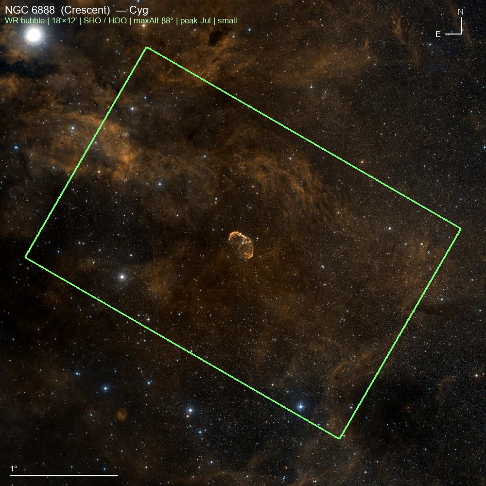

- **Coords (J2000):** 20h12m06s +38°21'  (303.027°, 38.355°) — *SIMBAD*
- **Type / size:** WR bubble, 18'×12'  → **small** in the Esprit 80 frame
- **Rotation:** PA 060° (long axis)
- **Palette:** SHO / HOO
- **JC observability:** max altitude 88°, peaks ~Jul
- **Note:** 840mm territory (existing data is from the 120)

## Sh2-101 — Tulip  (Cyg)

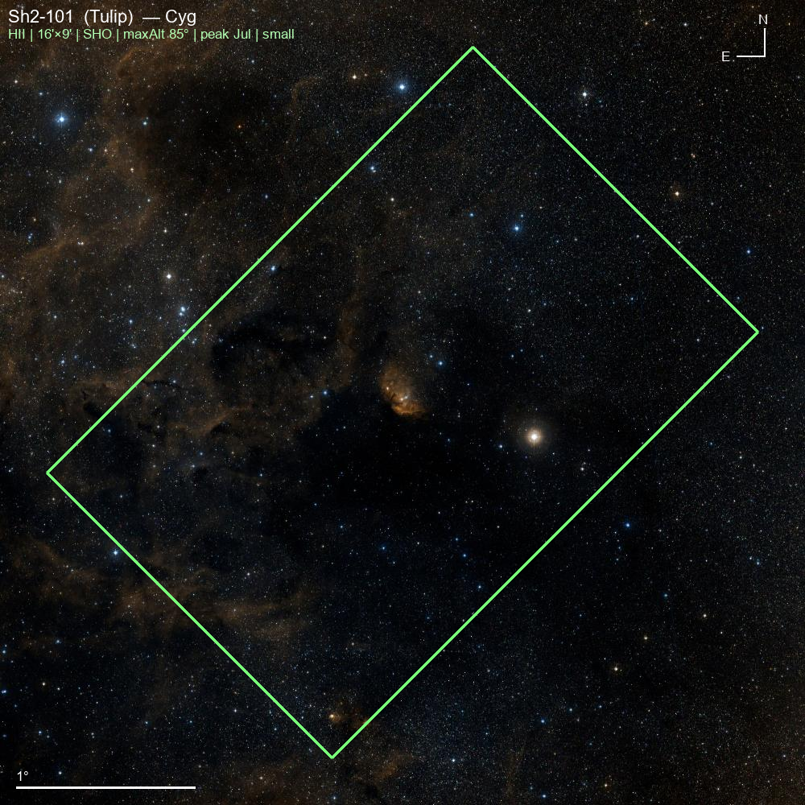

- **Coords (J2000):** 19h59m55s +35°16'  (299.979°, 35.277°) — *SIMBAD*
- **Type / size:** HII, 16'×9'  → **small** in the Esprit 80 frame
- **Rotation:** PA 135° (long axis)
- **Palette:** SHO
- **JC observability:** max altitude 85°, peaks ~Jul
- **Note:** 840mm territory; ok as a Cyg X-1 wide-context frame

## NGC 6820 — Sh2-86  (Vul)

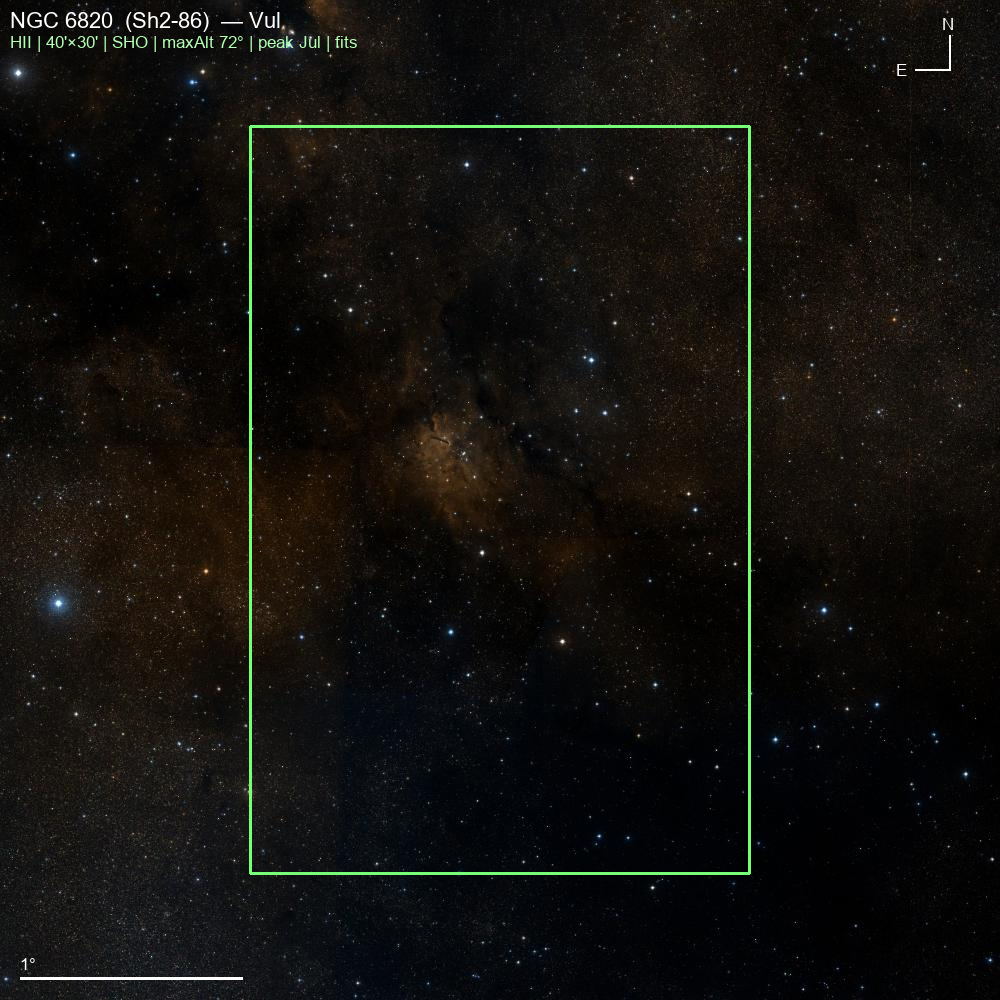

- **Coords (J2000):** 19h42m27s +23°05'  (295.616°, 23.087°) — *SIMBAD*
- **Type / size:** HII, 40'×30'  → **fits** in the Esprit 80 frame
- **Rotation:** PA 000° (long axis)
- **Palette:** SHO
- **JC observability:** max altitude 72°, peaks ~Jul
- **Note:** pillar + NGC6823 cluster

## M27 — Dumbbell  (Vul)

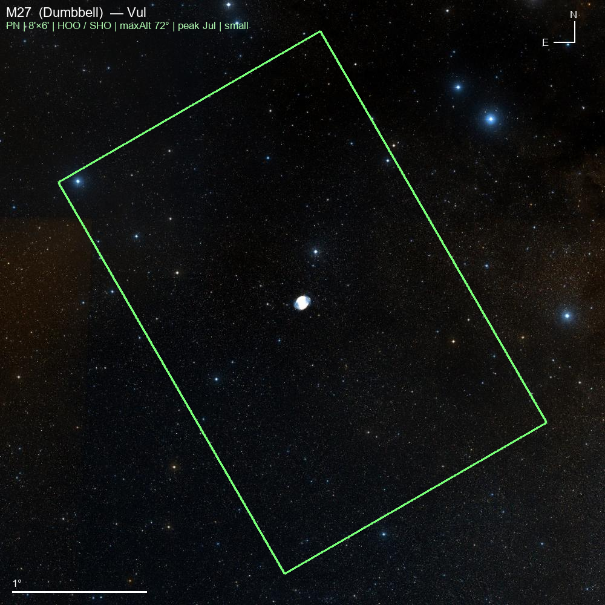

- **Coords (J2000):** 19h59m36s +22°43'  (299.902°, 22.721°) — *SIMBAD*
- **Type / size:** PN, 8'×6'  → **small** in the Esprit 80 frame
- **Rotation:** PA 030° (long axis)
- **Palette:** HOO / SHO
- **JC observability:** max altitude 72°, peaks ~Jul
- **Note:** 840mm/long-FL territory

## Sh2-119 — Clamshell  (Cyg)

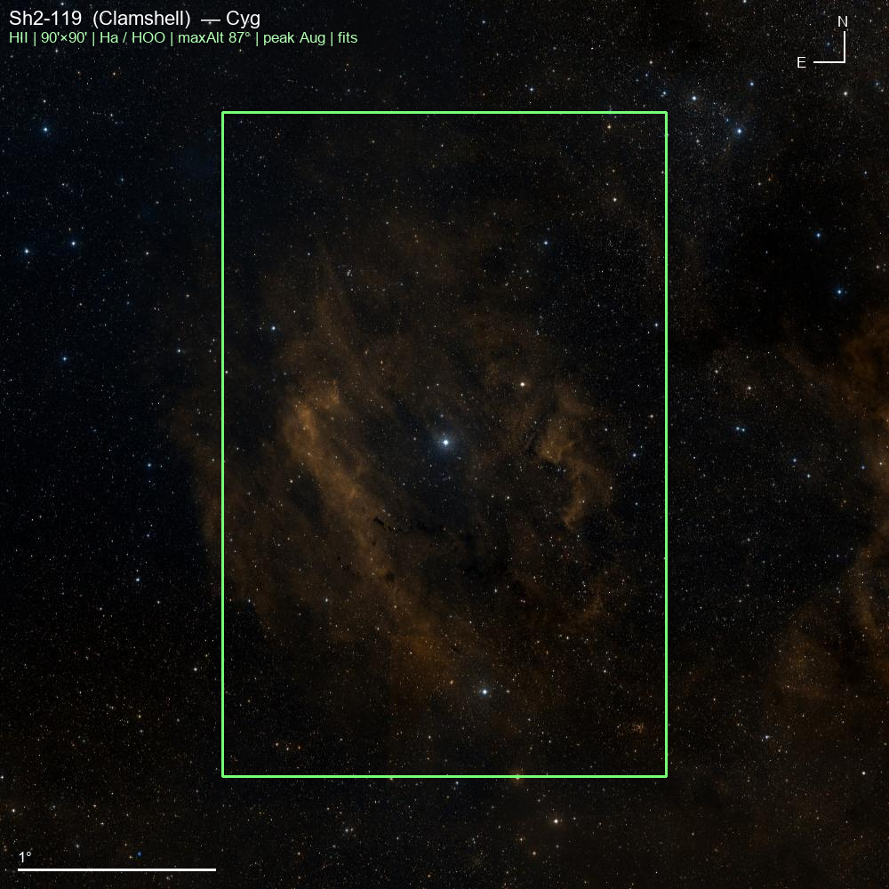

- **Coords (J2000):** 21h18m30s +43°56'  (319.625°, 43.933°) — *SIMBAD*
- **Type / size:** HII, 90'×90'  → **fits** in the Esprit 80 frame
- **Rotation:** any (round)
- **Palette:** Ha / HOO
- **JC observability:** max altitude 87°, peaks ~Aug
- **Note:** whole shell + 68 Cyg, with field

## NGC 7000 — North America  (Cyg)

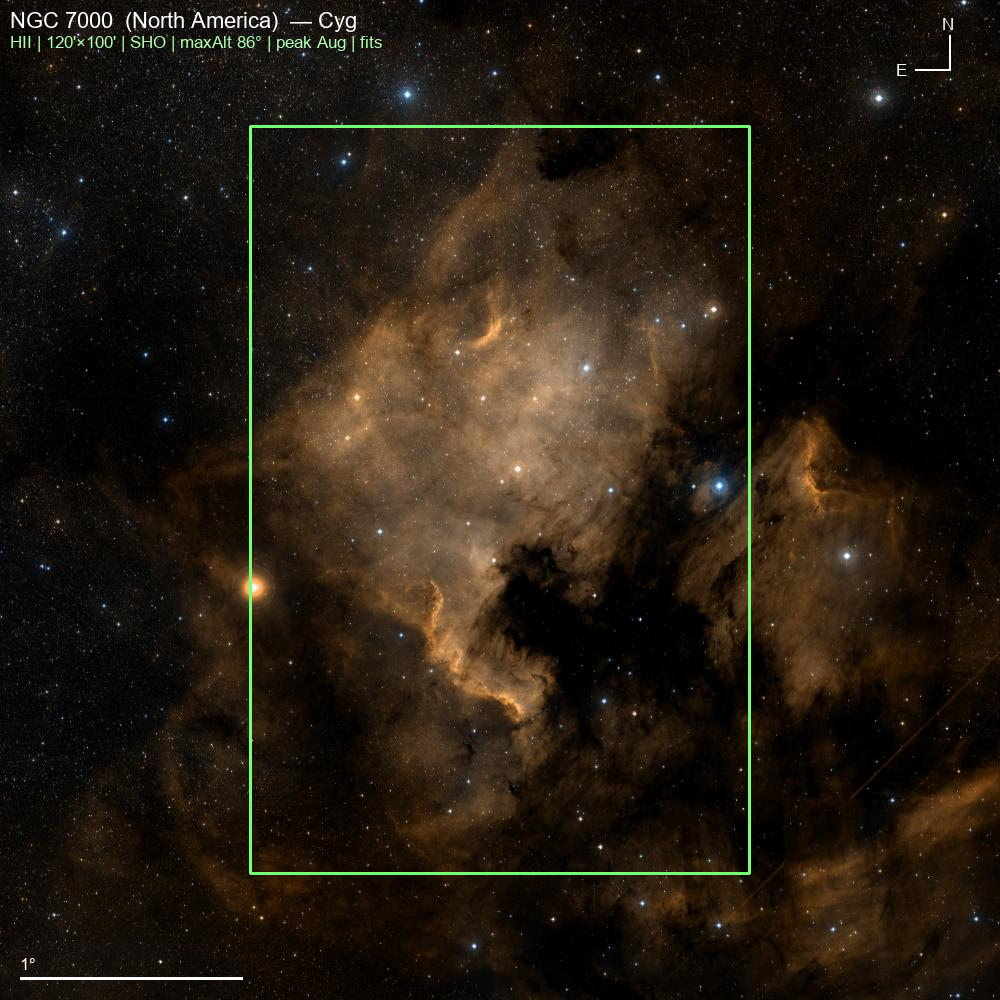

- **Coords (J2000):** 20h58m46s +44°19'  (314.696°, 44.33°) — *SIMBAD*
- **Type / size:** HII, 120'×100'  → **fits** in the Esprit 80 frame
- **Rotation:** any (round)
- **Palette:** SHO
- **JC observability:** max altitude 86°, peaks ~Aug
- **Note:** NA alone fits with room (mosaic on the 120); +Pelican combo ~2.2°+ E-W = S30 or 2-panel

## IC 5070 — Pelican  (Cyg)

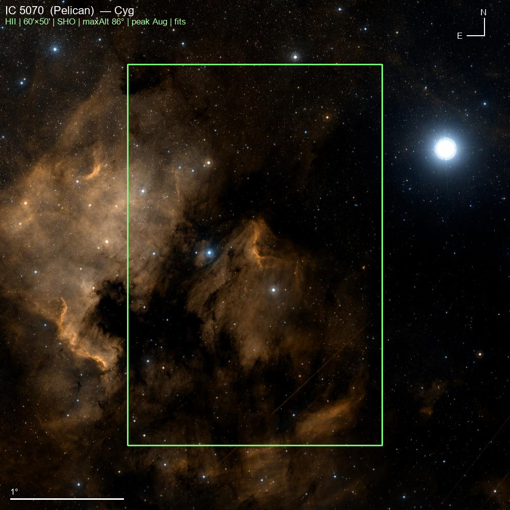

- **Coords (J2000):** 20h51m00s +44°22'  (312.75°, 44.367°) — *SIMBAD*
- **Type / size:** HII, 60'×50'  → **fits** in the Esprit 80 frame
- **Rotation:** any (round)
- **Palette:** SHO
- **JC observability:** max altitude 86°, peaks ~Aug
- **Note:** own frame with context (tight on the 120)

## IC 5146 — Cocoon (+B168)  (Cyg)

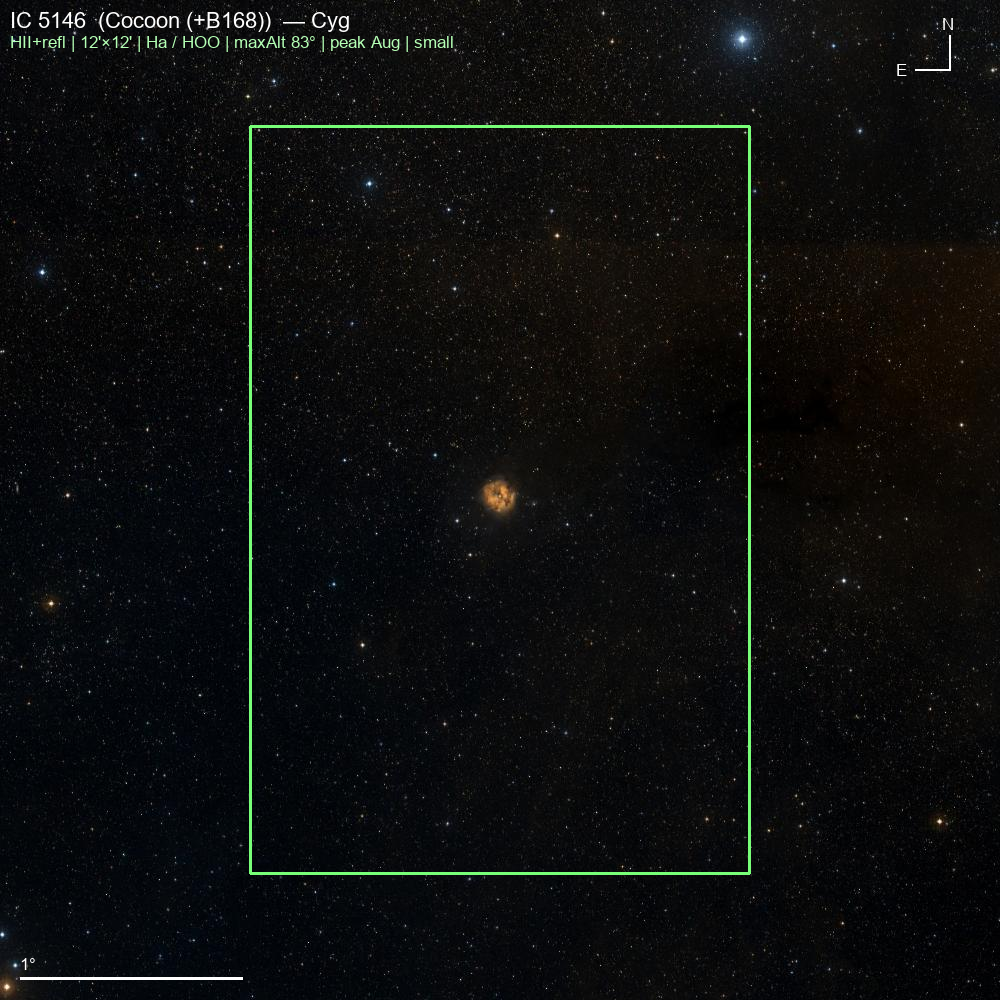

- **Coords (J2000):** 21h53m29s +47°14'  (328.372°, 47.246°) — *SIMBAD*
- **Type / size:** HII+refl, 12'×12'  → **small** in the Esprit 80 frame
- **Rotation:** any (round)
- **Palette:** Ha / HOO
- **JC observability:** max altitude 83°, peaks ~Aug
- **Note:** nebula is small, but at PA~105 the B168 dark river (~1.5°) makes the frame

## NGC 6992 — Eastern Veil  (Cyg)

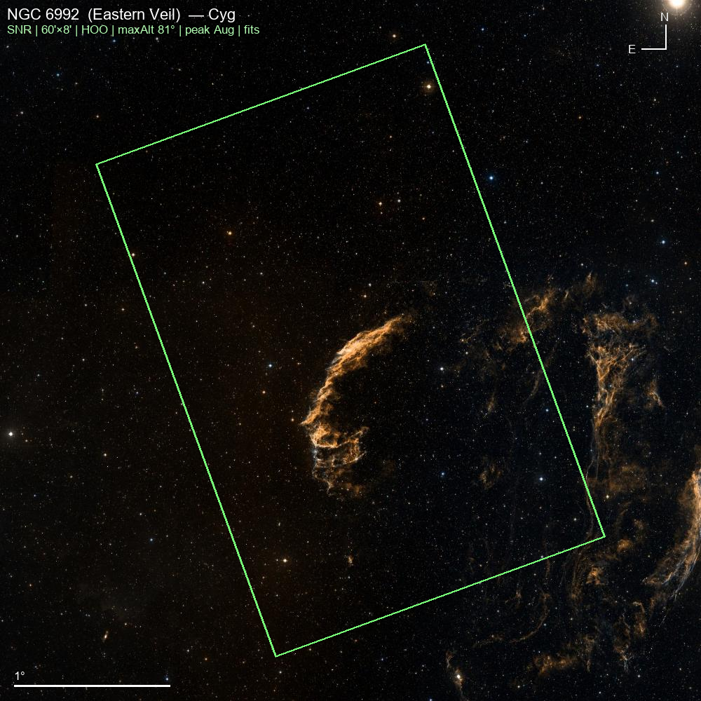

- **Coords (J2000):** 20h56m19s +31°44'  (314.079°, 31.743°) — *SIMBAD*
- **Type / size:** SNR, 60'×8'  → **fits** in the Esprit 80 frame
- **Rotation:** PA 200° (long axis)
- **Palette:** HOO
- **JC observability:** max altitude 81°, peaks ~Aug
- **Note:** Network + Bat in one frame

## NGC 6960 — Western Veil  (Cyg)

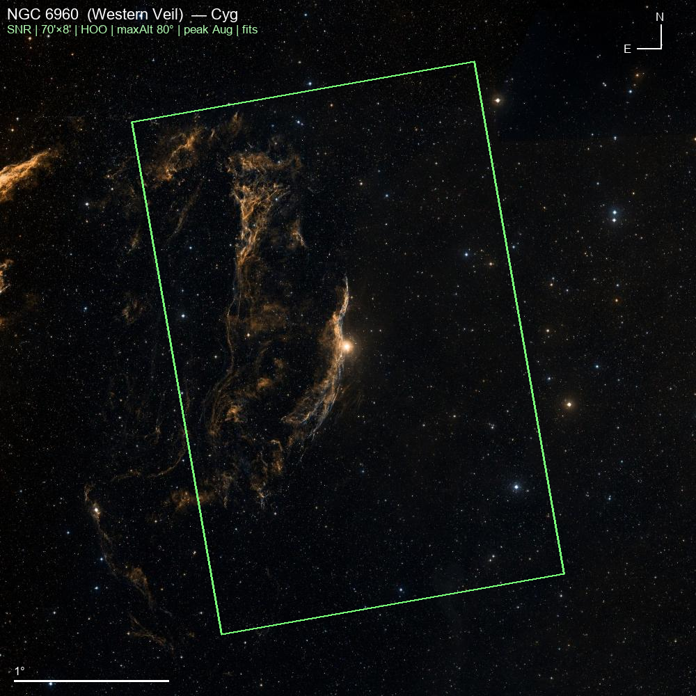

- **Coords (J2000):** 20h45m37s +30°42'  (311.408°, 30.708°) — *SIMBAD*
- **Type / size:** SNR, 70'×8'  → **fits** in the Esprit 80 frame
- **Rotation:** PA 010° (long axis)
- **Palette:** HOO
- **JC observability:** max altitude 80°, peaks ~Aug
- **Note:** Witch's Broom + Pickering's with room the 120 can't give; full loop = 2-panel on this rig

## Sh2-132 — Lion  (Cep)

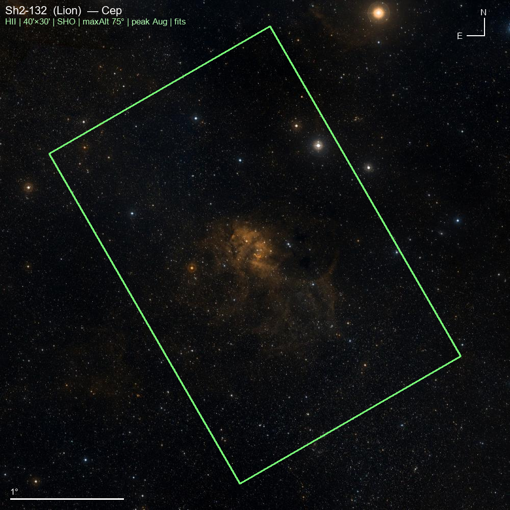

- **Coords (J2000):** 22h19m08s +56°04'  (334.787°, 56.079°) — *SIMBAD*
- **Type / size:** HII, 40'×30'  → **fits** in the Esprit 80 frame
- **Rotation:** PA 030° (long axis)
- **Palette:** SHO
- **JC observability:** max altitude 75°, peaks ~Aug
- **Note:** faint; SHO rewards it

## IC 1396 — Elephant's Trunk (full)  (Cep)

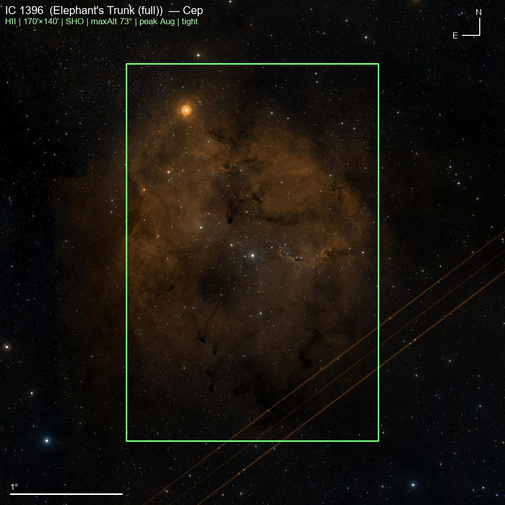

- **Coords (J2000):** 21h38m58s +57°30'  (324.745°, 57.514°) — *SIMBAD*
- **Type / size:** HII, 170'×140'  → **tight** in the Esprit 80 frame
- **Rotation:** any (round)
- **Palette:** SHO
- **JC observability:** max altitude 73°, peaks ~Aug
- **Note:** tight: 140' across vs 135' short axis — rim kiss; mu Cep + trunk + full shell

## Sh2-129 — Flying Bat (+OU4 Squid)  (Cep)

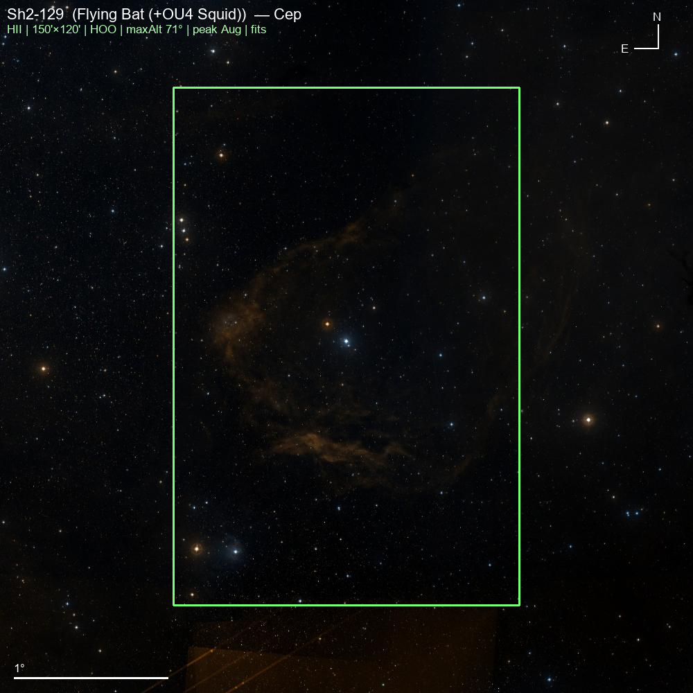

- **Coords (J2000):** 21h11m47s +59°56'  (317.95°, 59.95°) — *SIMBAD*
- **Type / size:** HII, 150'×120'  → **fits** in the Esprit 80 frame
- **Rotation:** any (round)
- **Palette:** HOO
- **JC observability:** max altitude 71°, peaks ~Aug
- **Note:** Bat+Squid fit together; the OIII Squid is dark-site-deep

## NGC 7380 — Wizard  (Cep)

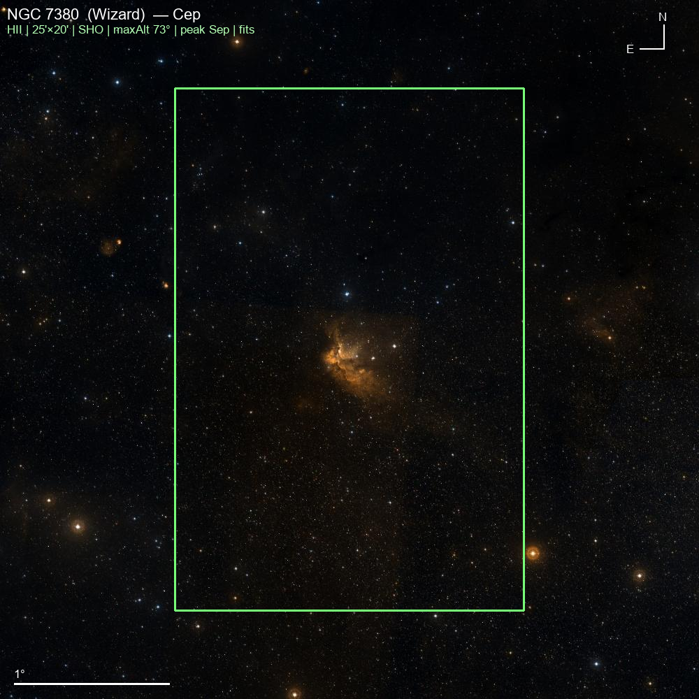

- **Coords (J2000):** 22h47m16s +58°07'  (341.817°, 58.125°) — *SIMBAD*
- **Type / size:** HII, 25'×20'  → **fits** in the Esprit 80 frame
- **Rotation:** any (round)
- **Palette:** SHO
- **JC observability:** max altitude 73°, peaks ~Sep
- **Note:** fits with generous field

## Sh2-157 — Lobster Claw (+Bubble)  (Cas)

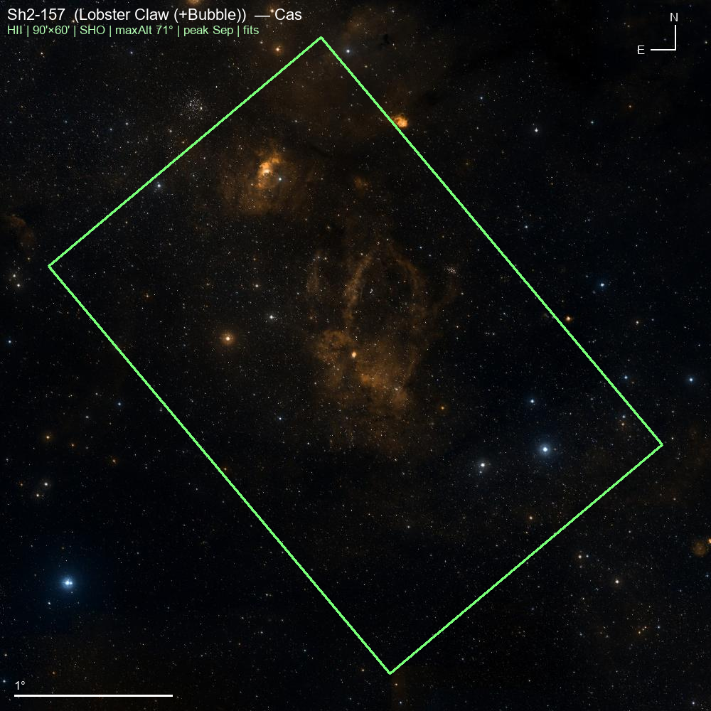

- **Coords (J2000):** 23h16m03s +60°02'  (349.016°, 60.034°) — *SIMBAD*
- **Type / size:** HII, 90'×60'  → **fits** in the Esprit 80 frame
- **Rotation:** PA 040° (long axis)
- **Palette:** SHO
- **JC observability:** max altitude 71°, peaks ~Sep
- **Note:** claw fits easily; claw+Bubble combo is razor-tight at PA~90 — test frame; M52 won't make it

## NGC 7635 — Bubble (+M52)  (Cas)

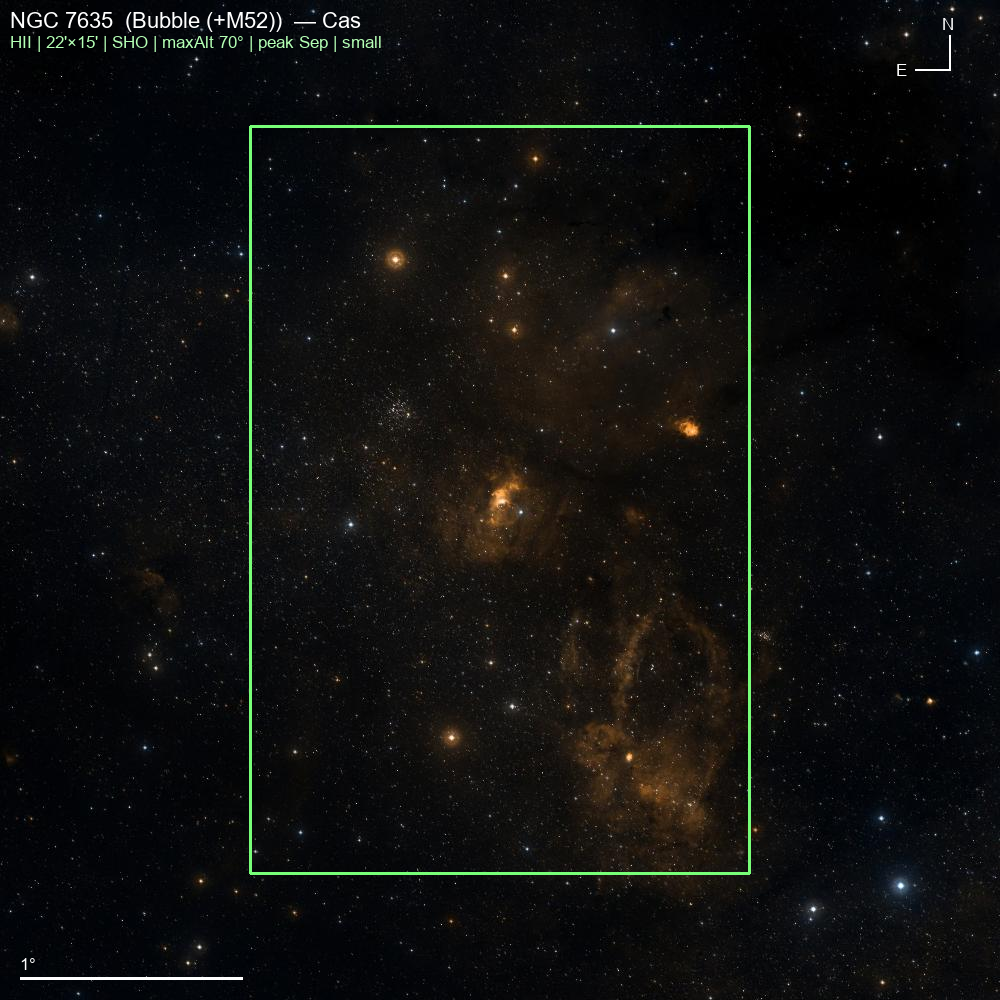

- **Coords (J2000):** 23h20m48s +61°12'  (350.201°, 61.202°) — *SIMBAD*
- **Type / size:** HII, 22'×15'  → **small** in the Esprit 80 frame
- **Rotation:** PA 000° (long axis)
- **Palette:** SHO
- **JC observability:** max altitude 70°, peaks ~Sep
- **Note:** 840mm feature; or shoot it inside the Sh2-157 combo below

## Sh2-155 — Cave  (Cep)

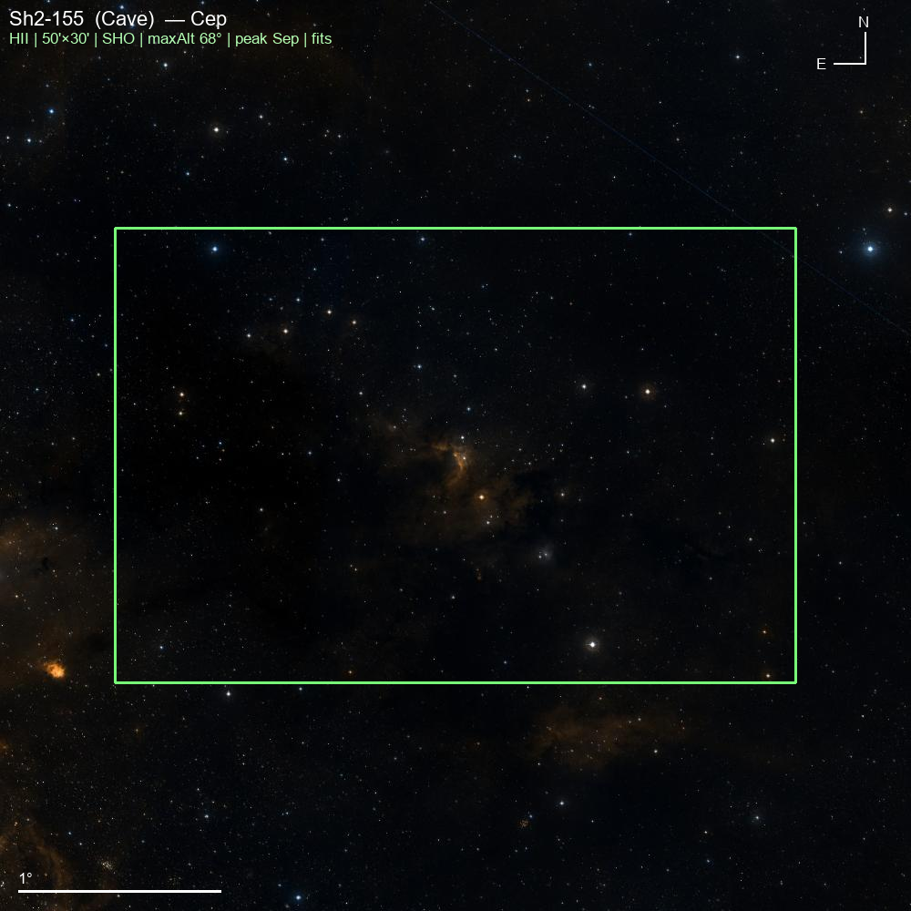

- **Coords (J2000):** 22h57m05s +62°38'  (344.275°, 62.636°) — *SIMBAD*
- **Type / size:** HII, 50'×30'  → **fits** in the Esprit 80 frame
- **Rotation:** PA 090° (long axis)
- **Palette:** SHO
- **JC observability:** max altitude 68°, peaks ~Sep
- **Note:** comfortable, dark rim + field

## NGC 7822 — Ced 214 / Sh2-171  (Cep)

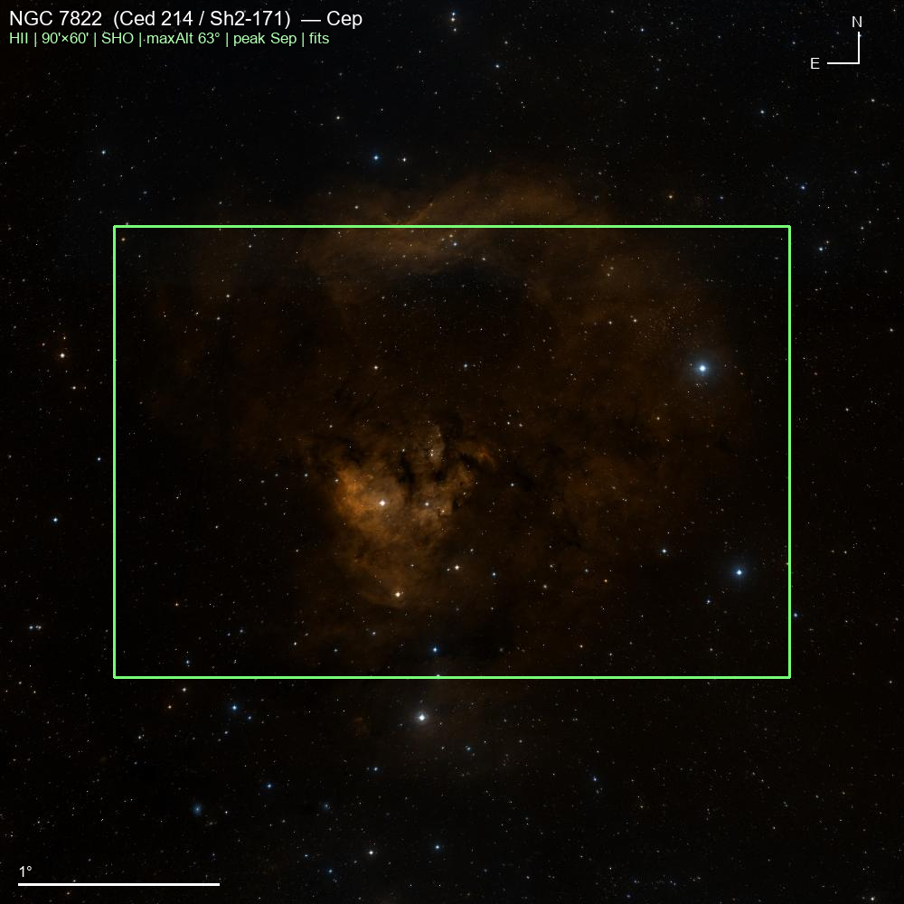

- **Coords (J2000):** 00h01m08s +67°25'  (0.286°, 67.421°) — *SIMBAD*
- **Type / size:** HII, 90'×60'  → **fits** in the Esprit 80 frame
- **Rotation:** PA 090° (long axis)
- **Palette:** SHO
- **JC observability:** max altitude 63°, peaks ~Sep
- **Note:** whole complex + Berkeley 59; circumpolar

## NGC 281 — Pacman  (Cas)

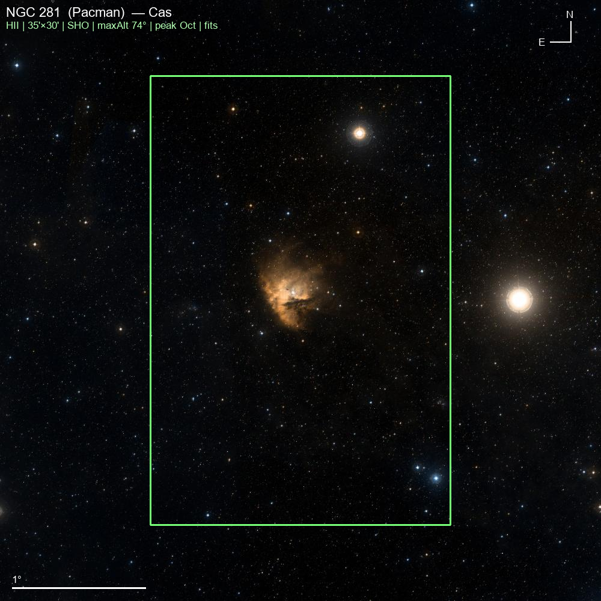

- **Coords (J2000):** 00h52m25s +56°33'  (13.105°, 56.565°) — *SIMBAD*
- **Type / size:** HII, 35'×30'  → **fits** in the Esprit 80 frame
- **Rotation:** any (round)
- **Palette:** SHO
- **JC observability:** max altitude 74°, peaks ~Oct
- **Note:** round; Bok globules

## IC 1805 — Heart  (Cas)

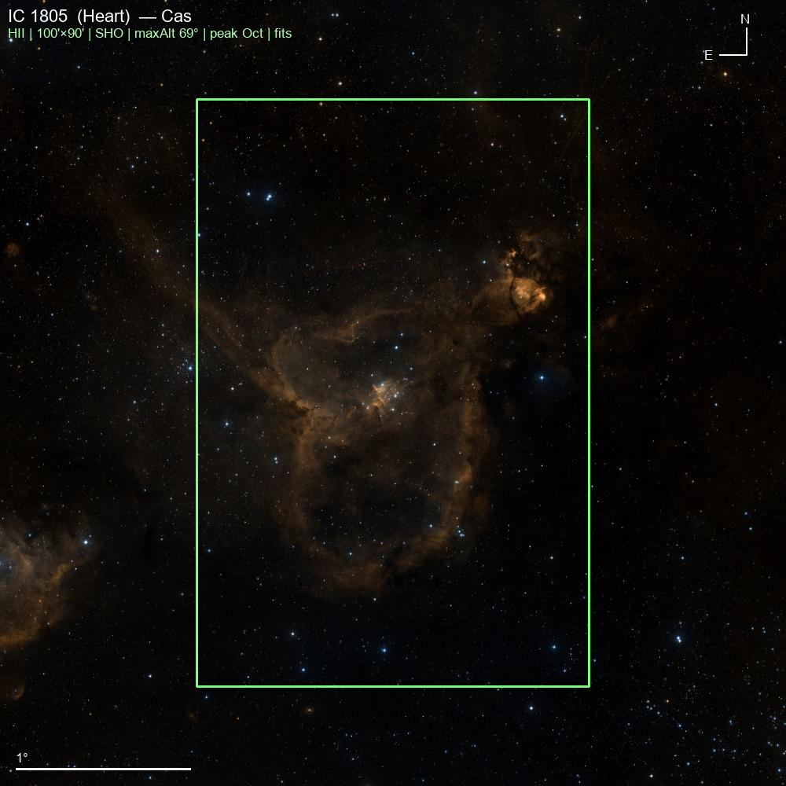

- **Coords (J2000):** 02h32m50s +61°28'  (38.21°, 61.471°) — *SIMBAD*
- **Type / size:** HII, 100'×90'  → **fits** in the Esprit 80 frame
- **Rotation:** any (round)
- **Palette:** SHO
- **JC observability:** max altitude 69°, peaks ~Oct
- **Note:** Heart alone with room (overflows the 120); Heart+Soul pair ~5° = 2-panel

## NGC 1499 — California  (Per)

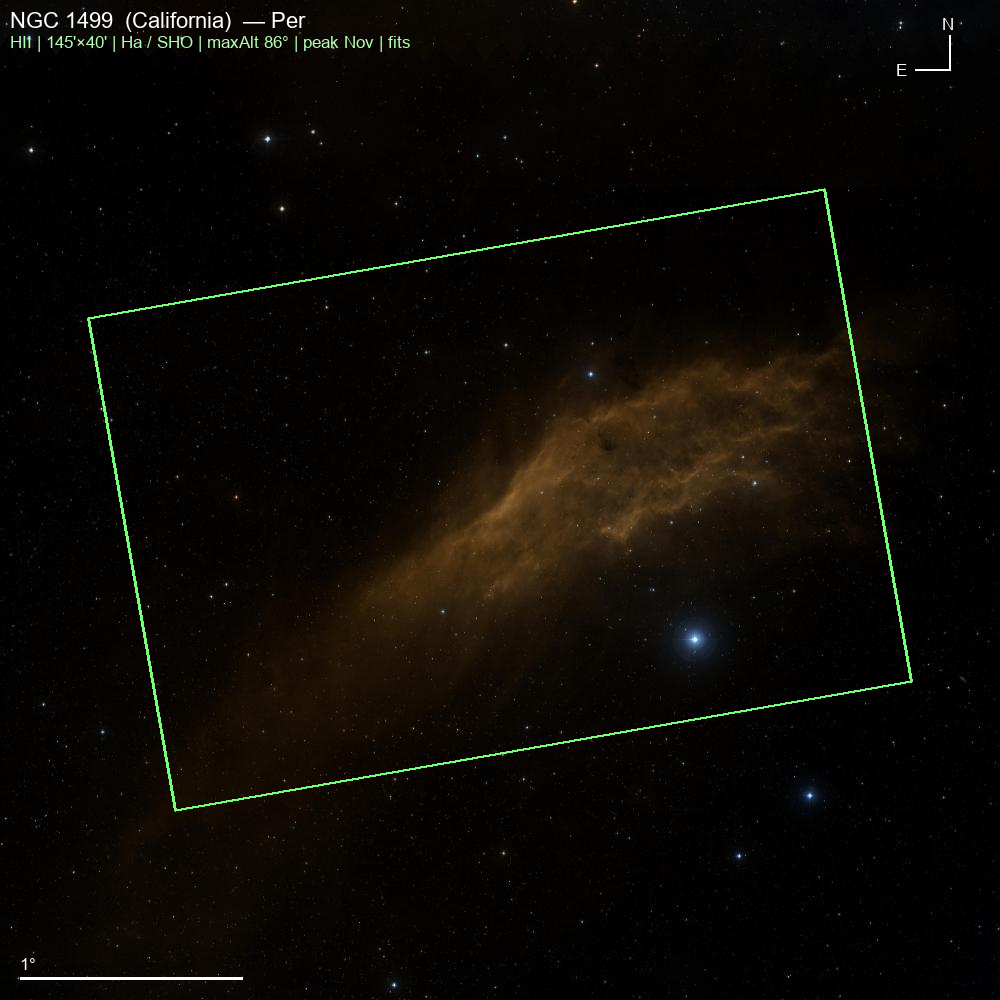

- **Coords (J2000):** 04h03m17s +36°25'  (60.825°, 36.422°) — *SIMBAD*
- **Type / size:** HII, 145'×40'  → **fits** in the Esprit 80 frame
- **Rotation:** PA 100° (long axis)
- **Palette:** Ha / SHO
- **JC observability:** max altitude 86°, peaks ~Nov
- **Note:** THE rotation win: PA~100 lays the 145' ribbon along the 3.37° axis — overflows the S30's fixed frame, mosaic on the 120

## IC 1848 — Soul  (Cas)

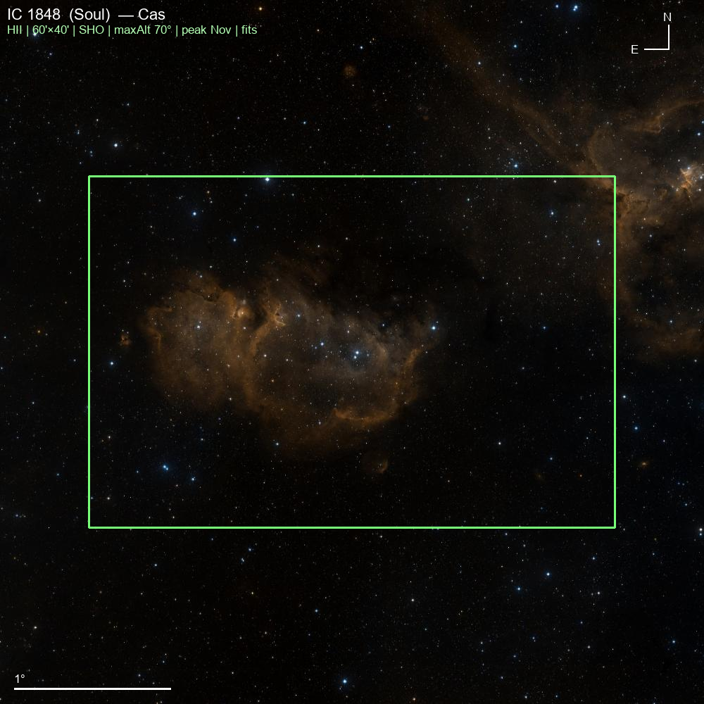

- **Coords (J2000):** 02h51m25s +60°25'  (42.855°, 60.419°) — *SIMBAD*
- **Type / size:** HII, 60'×40'  → **fits** in the Esprit 80 frame
- **Rotation:** PA 090° (long axis)
- **Palette:** SHO
- **JC observability:** max altitude 70°, peaks ~Nov
- **Note:** fits; natural 2-panel partner with Heart

## IC 405 — Flaming Star  (Aur)

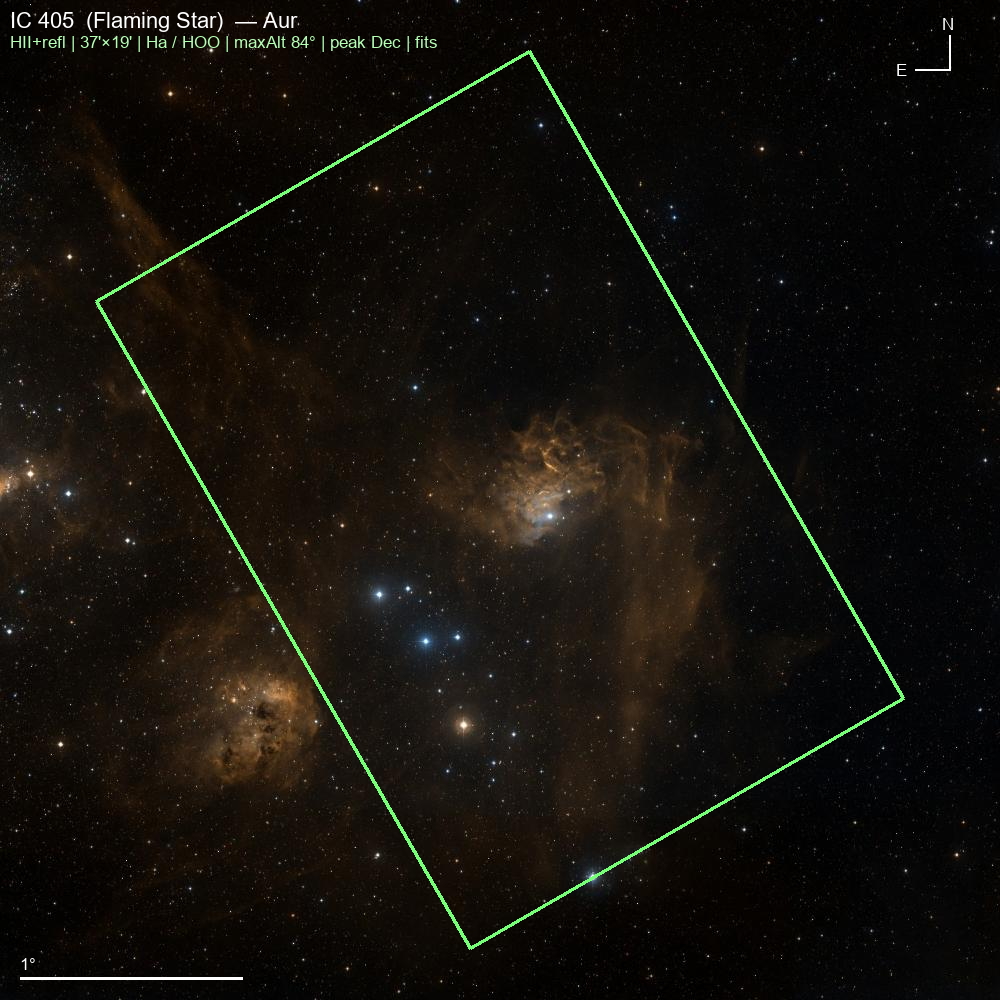

- **Coords (J2000):** 05h17m24s +34°22'  (79.35°, 34.383°) — *SIMBAD*
- **Type / size:** HII+refl, 37'×19'  → **fits** in the Esprit 80 frame
- **Rotation:** PA 030° (long axis)
- **Palette:** Ha / HOO
- **JC observability:** max altitude 84°, peaks ~Dec
- **Note:** or frame the IC405+IC410 pair: ~2.7° span at PA~115 fits this rig only

## IC 410 — Tadpoles  (Aur)

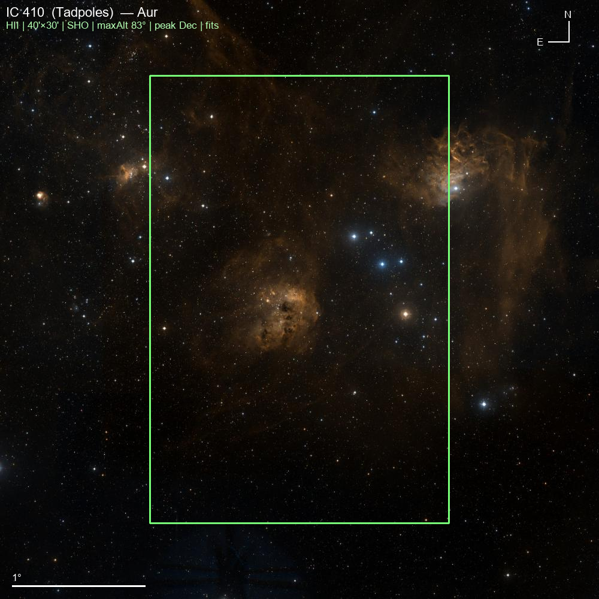

- **Coords (J2000):** 05h21m59s +33°29'  (80.5°, 33.483°) — *SIMBAD*
- **Type / size:** HII, 40'×30'  → **fits** in the Esprit 80 frame
- **Rotation:** PA 000° (long axis)
- **Palette:** SHO
- **JC observability:** max altitude 83°, peaks ~Dec
- **Note:** pairs with IC 405 in one frame at PA~115

## IC 443 — Jellyfish  (Gem)

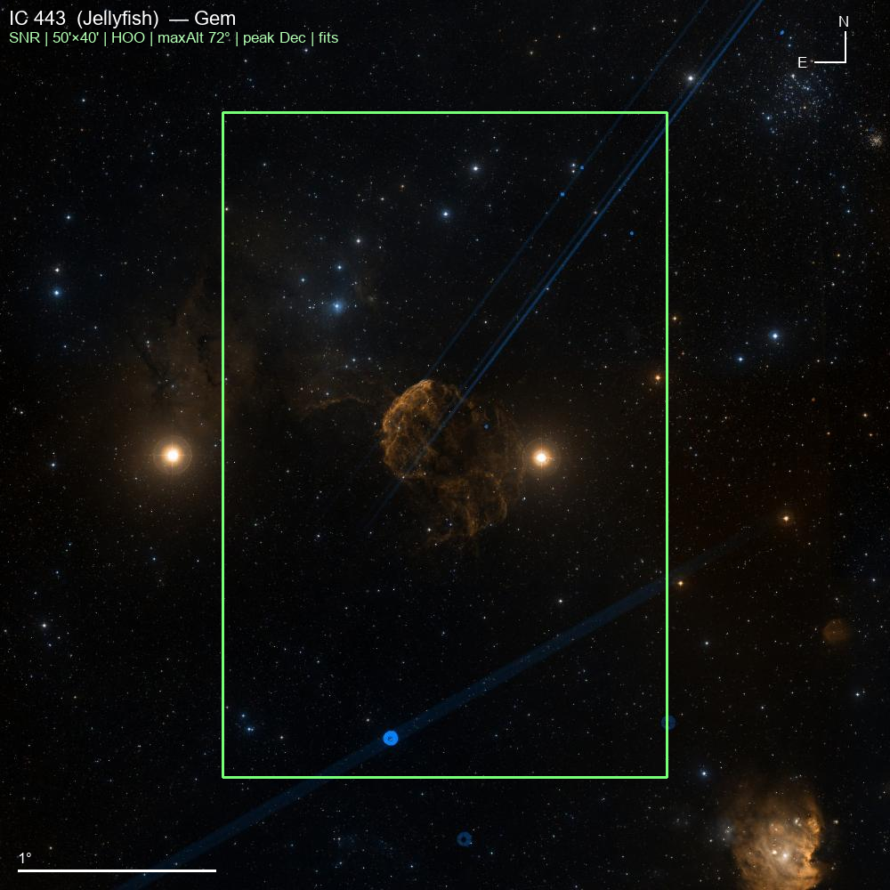

- **Coords (J2000):** 06h16m59s +22°34'  (94.25°, 22.57°) — *SIMBAD*
- **Type / size:** SNR, 50'×40'  → **fits** in the Esprit 80 frame
- **Rotation:** any (round)
- **Palette:** HOO
- **JC observability:** max altitude 72°, peaks ~Dec
- **Note:** +IC 444 context in frame

## M1 — Crab  (Tau)

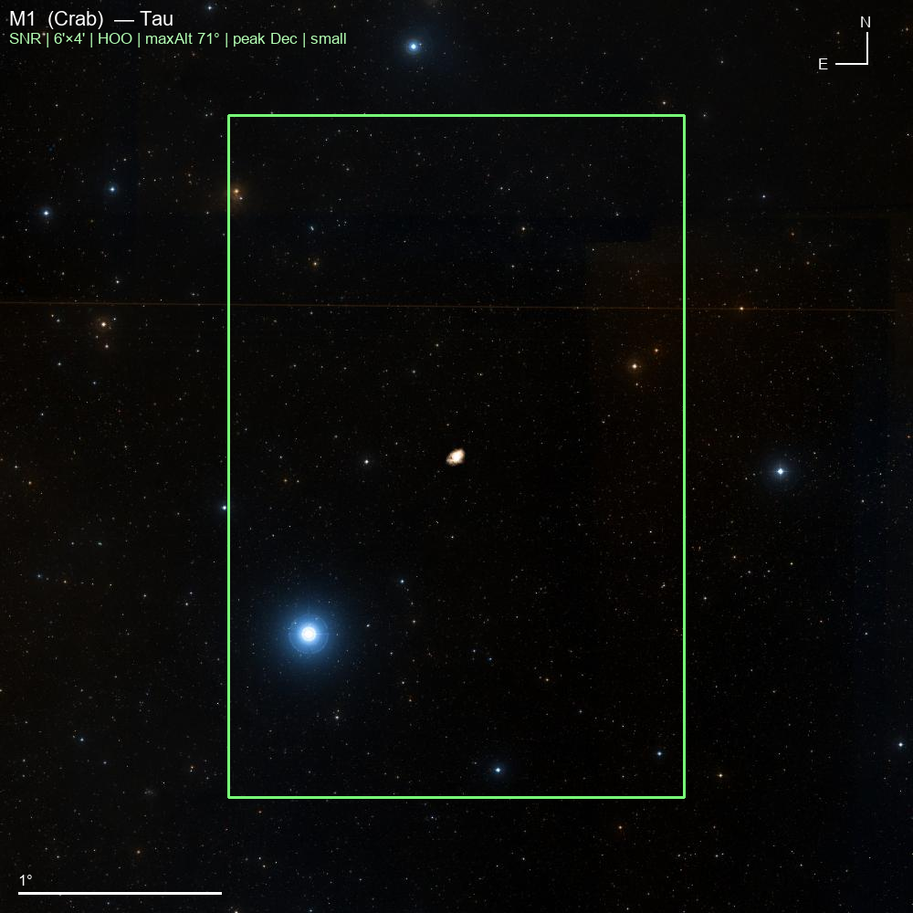

- **Coords (J2000):** 05h34m31s +22°01'  (83.632°, 22.017°) — *SIMBAD*
- **Type / size:** SNR, 6'×4'  → **small** in the Esprit 80 frame
- **Rotation:** PA 000° (long axis)
- **Palette:** HOO
- **JC observability:** max altitude 71°, peaks ~Dec
- **Note:** 840mm/long-FL territory

## NGC 2174 — Monkey Head  (Ori)

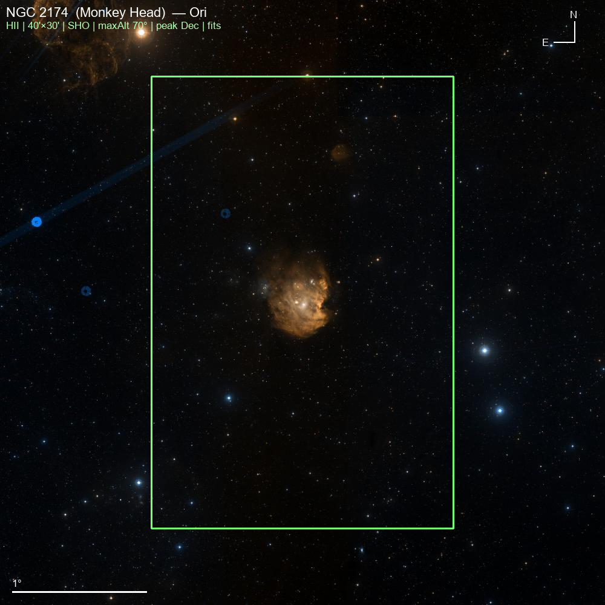

- **Coords (J2000):** 06h09m42s +20°30'  (92.425°, 20.5°) — *SIMBAD*
- **Type / size:** HII, 40'×30'  → **fits** in the Esprit 80 frame
- **Rotation:** PA 000° (long axis)
- **Palette:** SHO
- **JC observability:** max altitude 70°, peaks ~Dec
- **Note:** fall/winter

## NGC 2264 — Christmas Tree / Cone  (Mon)

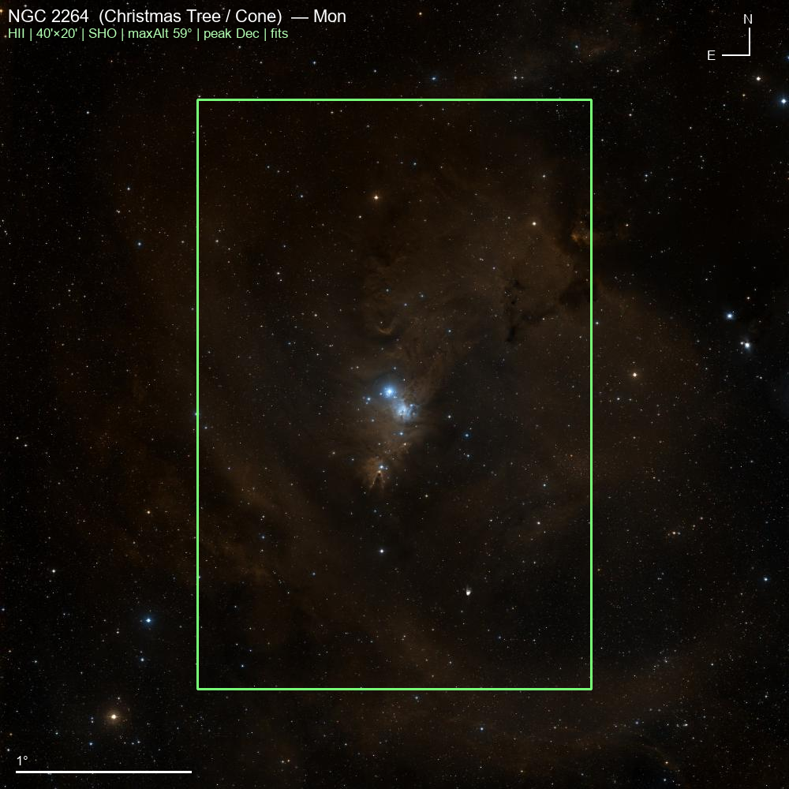

- **Coords (J2000):** 06h40m52s +09°52'  (100.217°, 9.877°) — *SIMBAD*
- **Type / size:** HII, 40'×20'  → **fits** in the Esprit 80 frame
- **Rotation:** PA 000° (long axis)
- **Palette:** SHO
- **JC observability:** max altitude 59°, peaks ~Dec
- **Note:** Cone + Fox Fur + cluster

## NGC 2237 — Rosette  (Mon)

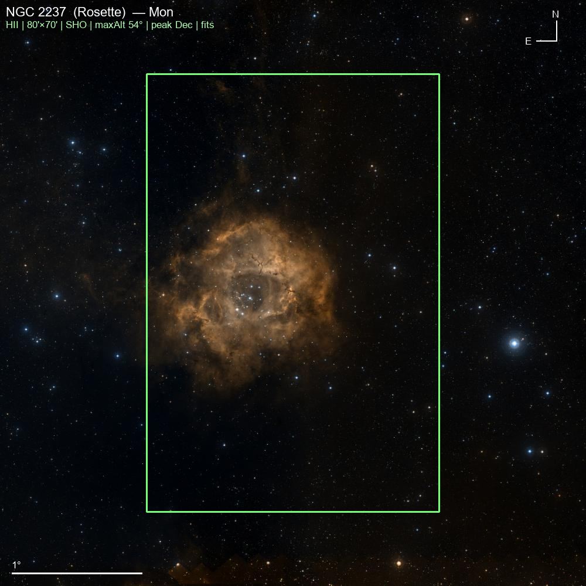

- **Coords (J2000):** 06h30m36s +04°58'  (97.65°, 4.981°) — *SIMBAD*
- **Type / size:** HII, 80'×70'  → **fits** in the Esprit 80 frame
- **Rotation:** any (round)
- **Palette:** SHO
- **JC observability:** max altitude 54°, peaks ~Dec
- **Note:** fits with room (tight on the 120); low from JC

## IC 434 — Belt: Flame+Horsehead  (Ori)

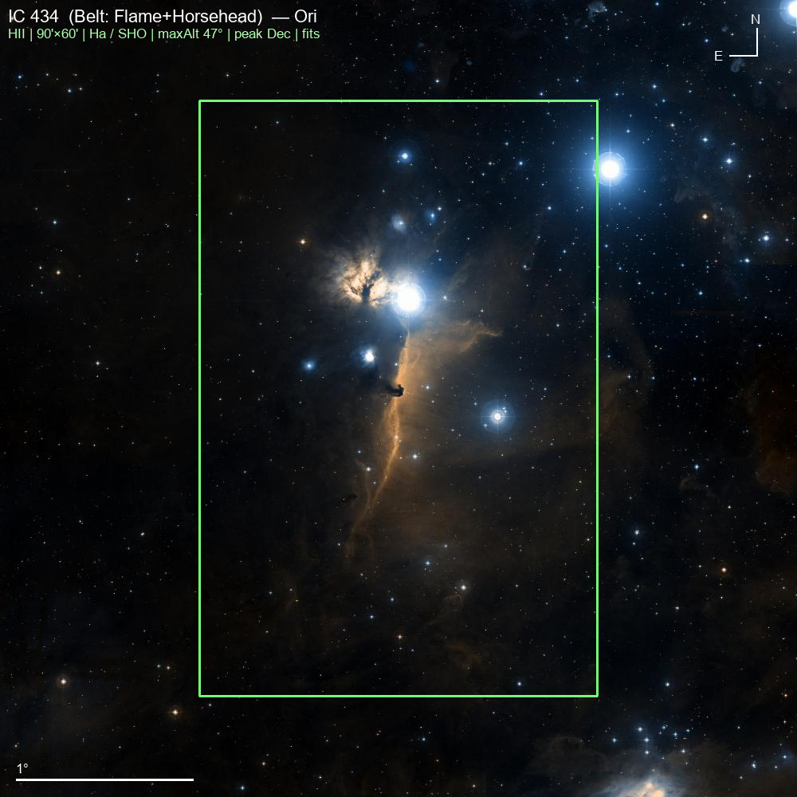

- **Coords (J2000):** 05h41m00s -02°30'  (85.25°, -2.5°) — *SIMBAD*
- **Type / size:** HII, 90'×60'  → **fits** in the Esprit 80 frame
- **Rotation:** PA 000° (long axis)
- **Palette:** Ha / SHO
- **JC observability:** max altitude 47°, peaks ~Dec
- **Note:** Alnitak + Flame + Horsehead strip in one

## M42 — Orion Nebula (+Running Man)  (Ori)

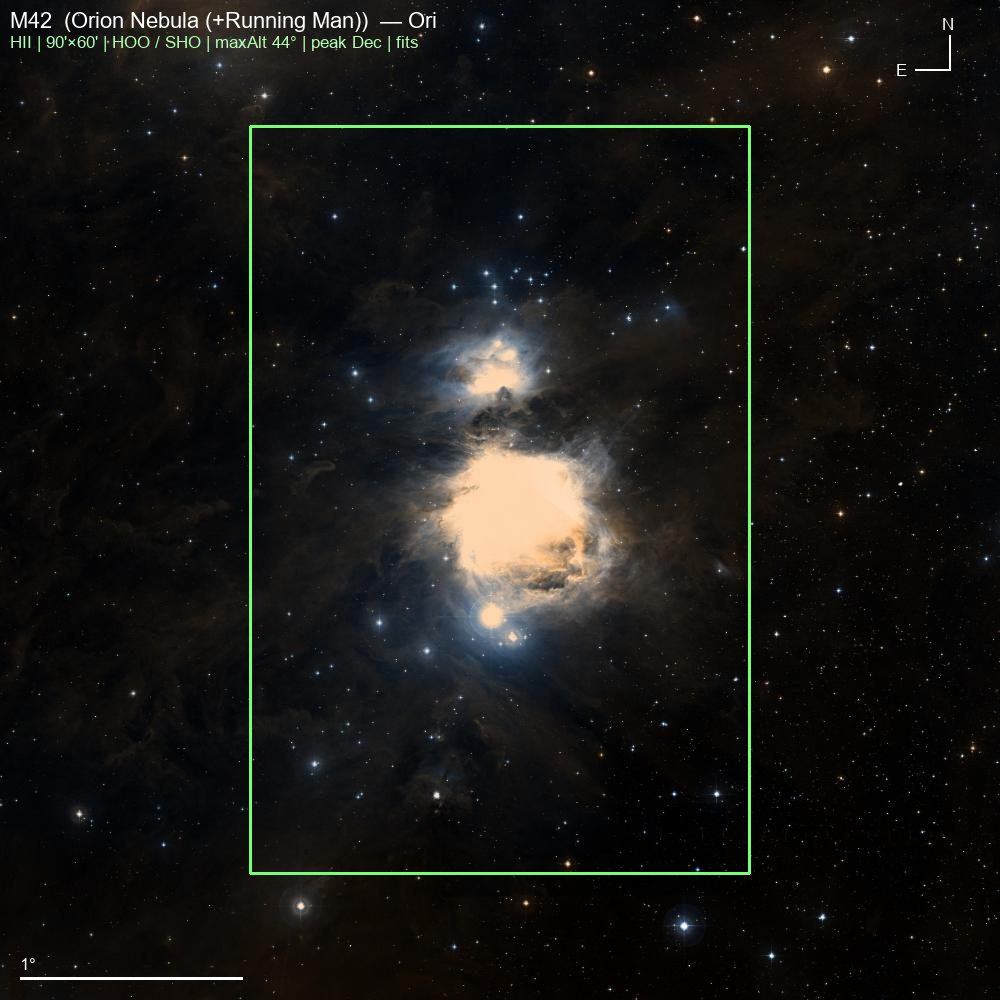

- **Coords (J2000):** 05h35m16s -05°23'  (83.82°, -5.388°) — *SIMBAD*
- **Type / size:** HII, 90'×60'  → **fits** in the Esprit 80 frame
- **Rotation:** PA 000° (long axis)
- **Palette:** HOO / SHO
- **JC observability:** max altitude 44°, peaks ~Dec
- **Note:** whole sword fits; HDR the core

## Abell 21 — Medusa  (Gem)

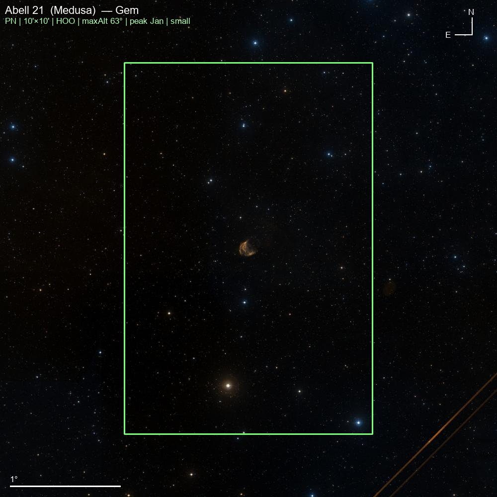

- **Coords (J2000):** 07h29m02s +13°14'  (112.261°, 13.247°) — *SIMBAD*
- **Type / size:** PN, 10'×10'  → **small** in the Esprit 80 frame
- **Rotation:** any (round)
- **Palette:** HOO
- **JC observability:** max altitude 63°, peaks ~Jan
- **Note:** 840mm territory; large faint OIII PN

## IC 2177 — Seagull  (CMa)

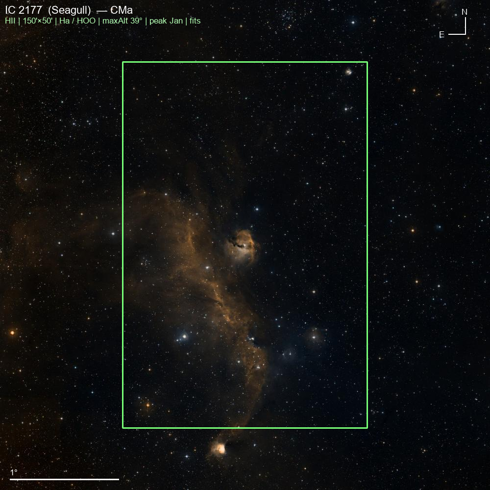

- **Coords (J2000):** 07h04m24s -10°27'  (106.104°, -10.455°) — *SIMBAD*
- **Type / size:** HII, 150'×50'  → **fits** in the Esprit 80 frame
- **Rotation:** PA 000° (long axis)
- **Palette:** Ha / HOO
- **JC observability:** max altitude 39°, peaks ~Jan
- **Note:** 150' wingspan along the long axis; low from JC (~39°)

## NGC 2359 — Thor's Helmet  (CMa)

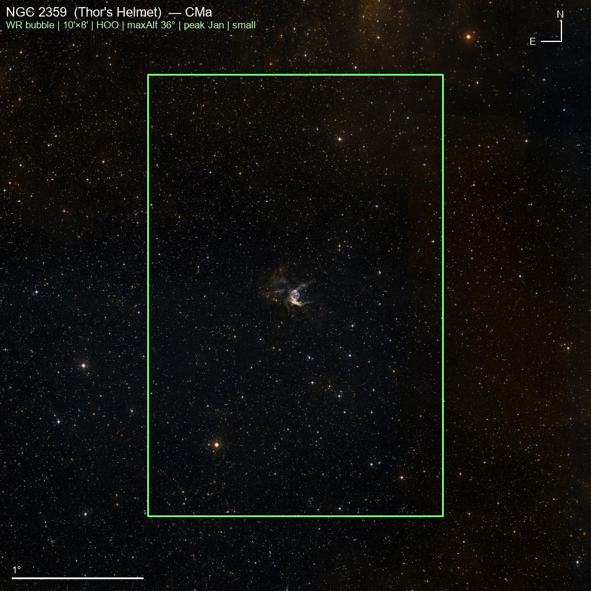

- **Coords (J2000):** 07h18m30s -13°13'  (109.625°, -13.227°) — *SIMBAD*
- **Type / size:** WR bubble, 10'×8'  → **small** in the Esprit 80 frame
- **Rotation:** any (round)
- **Palette:** HOO
- **JC observability:** max altitude 36°, peaks ~Jan
- **Note:** 840mm territory + low from JC
