# Esprit 120 — Emission Nebula Image Book (single-frame)

Single-frame framing previews for **emission nebulae** (HII / planetary / SNR / WR) that fit one Esprit 120 frame (**1.60°×1.07°**, 96'×64' @ 840mm, ASI2600MM) and are observable from Jersey City this **summer/fall**. Mosaics excluded by design — these are the objects that work as a single shot. Coordinates resolved via SIMBAD; yellow box = Esprit FOV at the suggested rotation; DSS2 color (Ha reads brown here — through your 3nm filters it's vivid red/SHO). Sorted by peak month.

**Excluded as too low from JC (<35° / deep southern Milky Way):** Lagoon M8, Trifid M20, Eagle M16, Swan M17. **Excluded as too big for one frame (mosaic/wide-field):** North America NGC7000, Heart & Soul IC1805/1848, California NGC1499, full IC1396, Sh2-119 Clamshell.

| Target | Common | Type | Size | Fit | Rotation | Palette | maxAlt(JC) | Peak |
|---|---|---|---|---|---|---|---|---|
| NGC 6888 | Crescent | WR bubble | 18'×12' | fits | PA 060° (long axis) | SHO / HOO | 88° | Jul |
| Sh2-101 | Tulip | HII | 16'×9' | fits | PA 135° (long axis) | SHO | 85° | Jul |
| M57 | Ring | PN | 1.4'×1.0' | fits | PA 000° (long axis) | HOO | 82° | Jul |
| NGC 6820 | Sh2-86 | HII | 40'×30' | fits | PA 000° (long axis) | SHO | 72° | Jul |
| M27 | Dumbbell | PN | 8'×6' | fits | PA 030° (long axis) | HOO / SHO | 72° | Jul |
| IC 5070 | Pelican | HII | 60'×50' | fits | any (round) | SHO | 86° | Aug |
| IC 5146 | Cocoon | HII+refl | 12'×12' | fits | any (round) | Ha / HOO | 83° | Aug |
| NGC 6992 | Eastern Veil | SNR | 60'×8' | fits | PA 200° (long axis) | HOO | 81° | Aug |
| NGC 6960 | Western Veil | SNR | 70'×8' | fits | PA 010° (long axis) | HOO | 80° | Aug |
| Sh2-132 | Lion | HII | 40'×30' | fits | PA 030° (long axis) | SHO | 75° | Aug |
| IC 1396A | Elephant's Trunk | HII | 20'×10' | fits | PA 120° (long axis) | SHO | 73° | Aug |
| Abell 21 | Medusa | PN | 10'×10' | fits | any (round) | HOO | 78° | Sep |
| NGC 7380 | Wizard | HII | 25'×20' | fits | any (round) | SHO | 73° | Sep |
| Sh2-157 | Lobster Claw | HII | 60'×30' | fits | PA 040° (long axis) | SHO | 71° | Sep |
| NGC 7635 | Bubble | HII | 22'×15' | fits | PA 000° (long axis) | SHO | 70° | Sep |
| Sh2-155 | Cave | HII | 50'×30' | fits | PA 090° (long axis) | SHO | 68° | Sep |
| NGC 7822 | Sh2-171 | HII | 60'×60' | tight | any (round) | SHO | 63° | Sep |
| NGC 281 | Pacman | HII | 35'×30' | fits | any (round) | SHO | 74° | Oct |
| IC 405 | Flaming Star | HII+refl | 37'×19' | fits | PA 030° (long axis) | Ha / HOO | 84° | Dec |
| IC 410 | Tadpoles | HII | 40'×30' | fits | PA 000° (long axis) | SHO | 83° | Dec |
| IC 443 | Jellyfish | SNR | 50'×40' | fits | any (round) | HOO | 72° | Dec |
| M1 | Crab | SNR | 6'×4' | fits | PA 000° (long axis) | HOO | 71° | Dec |
| NGC 2174 | Monkey Head | HII | 40'×30' | fits | PA 000° (long axis) | SHO | 70° | Dec |
| NGC 2264 | Christmas Tree / Cone | HII | 40'×20' | fits | PA 000° (long axis) | SHO | 59° | Dec |
| NGC 2237 | Rosette | HII | 80'×70' | tight | any (round) | SHO | 54° | Dec |
| NGC 2024 | Flame | HII | 30'×30' | fits | any (round) | SHO | 47° | Dec |
| IC 434 | Horsehead | HII | 60'×10' | fits | PA 000° (long axis) | Ha / SHO | 47° | Dec |
| M42 | Orion Nebula | HII | 85'×60' | tight | PA 000° (long axis) | HOO / SHO | 44° | Dec |
| NGC 2359 | Thor's Helmet | WR bubble | 10'×8' | fits | any (round) | HOO | 36° | Jan |

## NGC 6888 — Crescent  (Cyg)

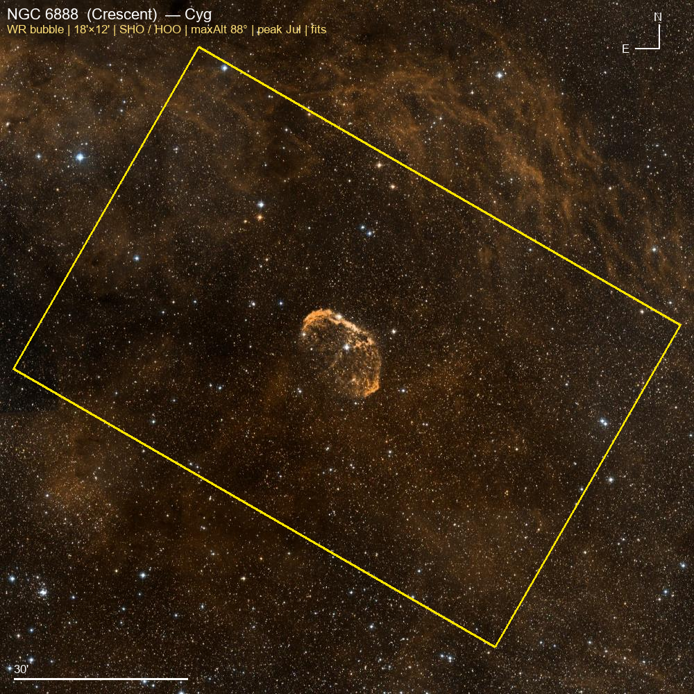

- **Coords (J2000):** 20h12m06s +38°21'  (303.027°, 38.355°) — *SIMBAD*
- **Type / size:** WR bubble, 18'×12'  → **fits** in the Esprit frame
- **Rotation:** PA 060° (long axis)
- **Palette:** SHO / HOO
- **JC observability:** max altitude 88°, peaks ~Jul
- **Note:** OIII shell + Ha; classic

## Sh2-101 — Tulip  (Cyg)

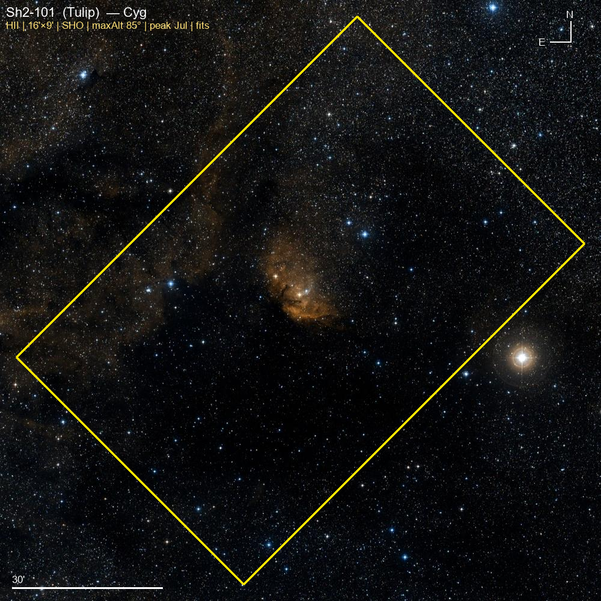

- **Coords (J2000):** 19h59m55s +35°16'  (299.979°, 35.277°) — *SIMBAD*
- **Type / size:** HII, 16'×9'  → **fits** in the Esprit frame
- **Rotation:** PA 135° (long axis)
- **Palette:** SHO
- **JC observability:** max altitude 85°, peaks ~Jul
- **Note:** near Cyg X-1

## M57 — Ring  (Lyr)

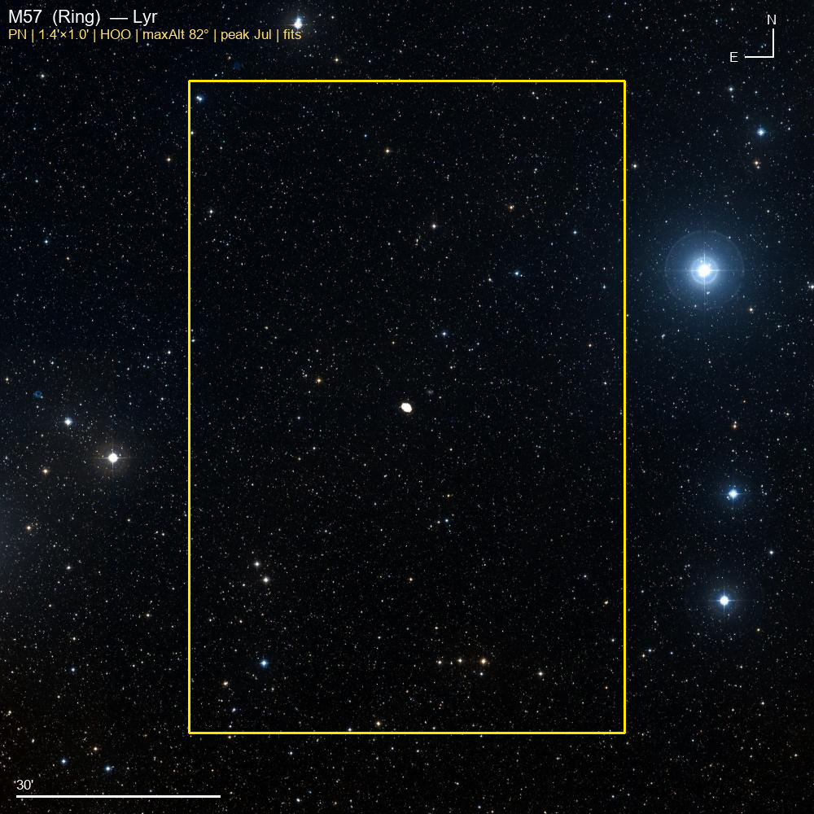

- **Coords (J2000):** 18h53m35s +33°01'  (283.396°, 33.029°) — *SIMBAD*
- **Type / size:** PN, 1.4'×1.0'  → **fits** in the Esprit frame
- **Rotation:** PA 000° (long axis)
- **Palette:** HOO
- **JC observability:** max altitude 82°, peaks ~Jul
- **Note:** tiny — better long-FL/cropped

## NGC 6820 — Sh2-86  (Vul)

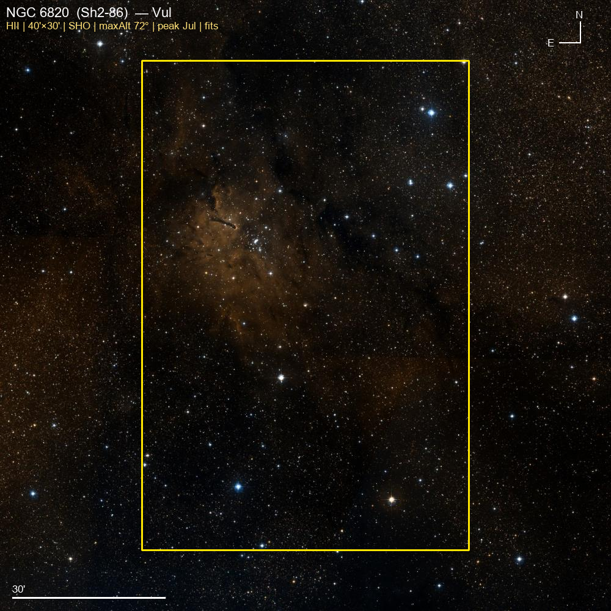

- **Coords (J2000):** 19h42m27s +23°05'  (295.616°, 23.087°) — *SIMBAD*
- **Type / size:** HII, 40'×30'  → **fits** in the Esprit frame
- **Rotation:** PA 000° (long axis)
- **Palette:** SHO
- **JC observability:** max altitude 72°, peaks ~Jul
- **Note:** pillar + NGC6823 cluster

## M27 — Dumbbell  (Vul)

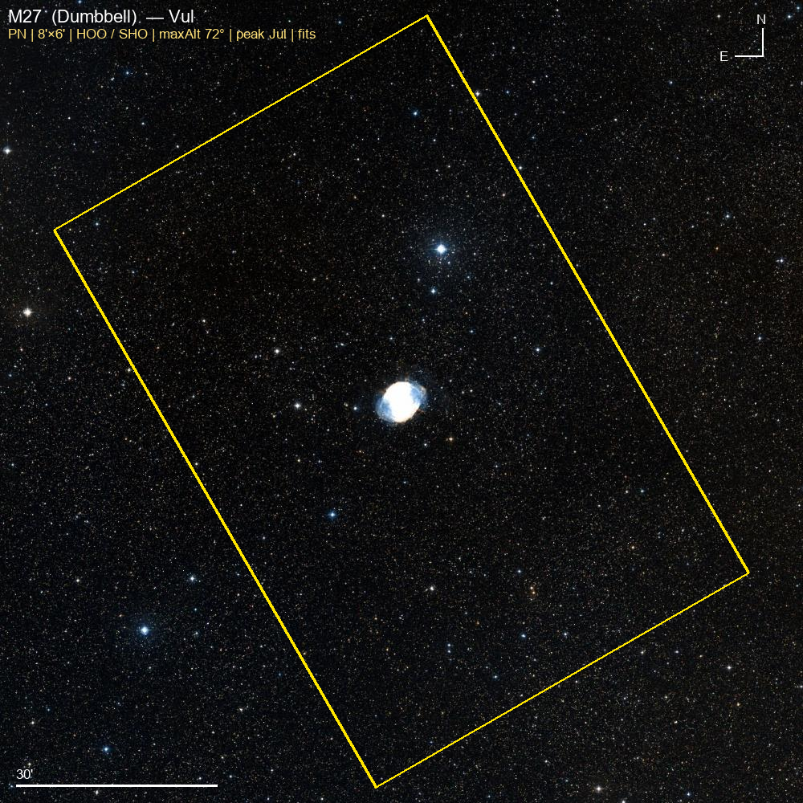

- **Coords (J2000):** 19h59m36s +22°43'  (299.902°, 22.721°) — *SIMBAD*
- **Type / size:** PN, 8'×6'  → **fits** in the Esprit frame
- **Rotation:** PA 030° (long axis)
- **Palette:** HOO / SHO
- **JC observability:** max altitude 72°, peaks ~Jul
- **Note:** bright PN; OIII strong

## IC 5070 — Pelican  (Cyg)

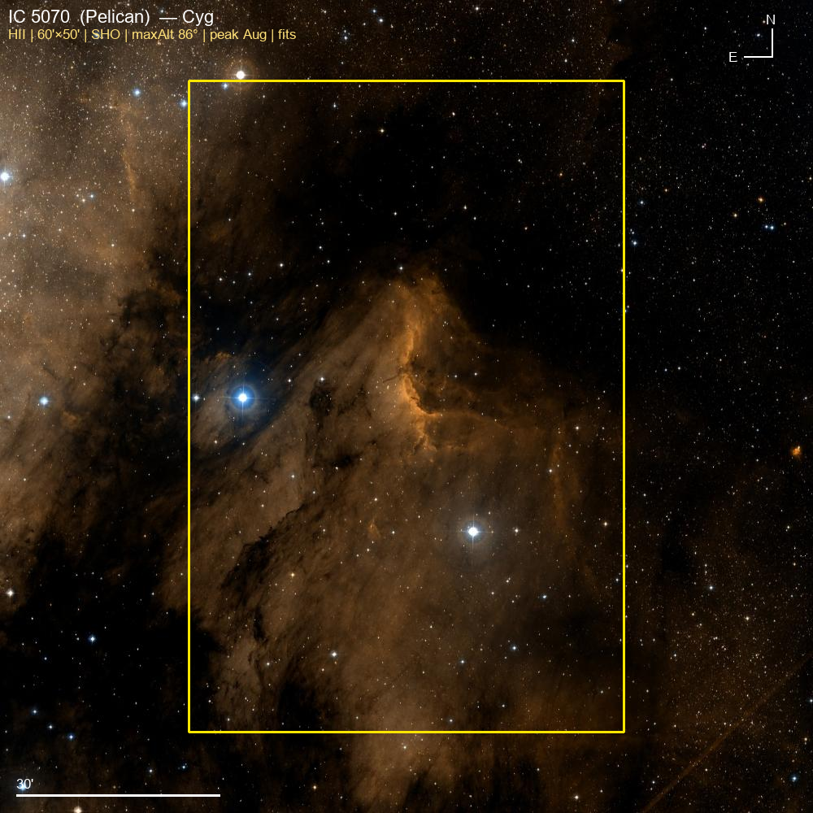

- **Coords (J2000):** 20h51m00s +44°22'  (312.750°, 44.367°) — *SIMBAD*
- **Type / size:** HII, 60'×50'  → **fits** in the Esprit frame
- **Rotation:** any (round)
- **Palette:** SHO
- **JC observability:** max altitude 86°, peaks ~Aug
- **Note:** fits tight; pairs w/ NGC7000

## IC 5146 — Cocoon  (Cyg)

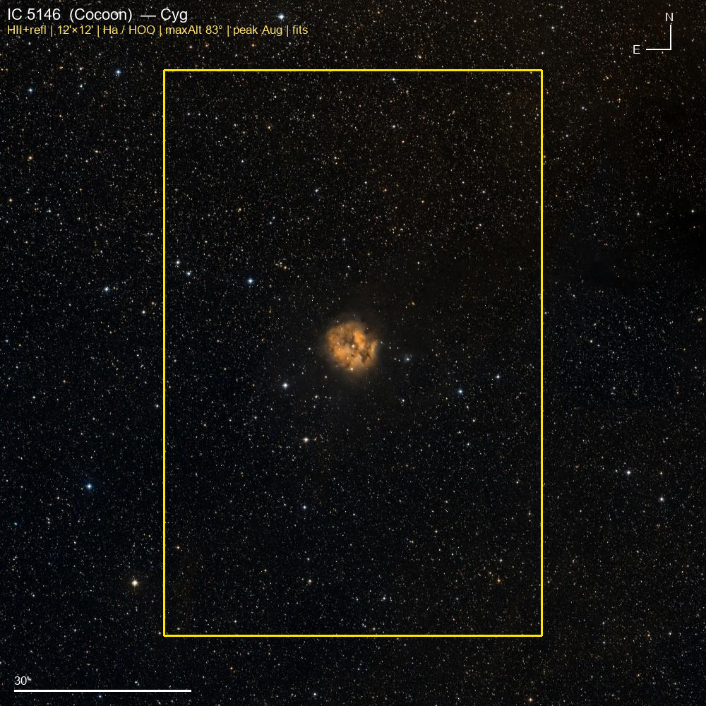

- **Coords (J2000):** 21h53m29s +47°14'  (328.372°, 47.246°) — *SIMBAD*
- **Type / size:** HII+refl, 12'×12'  → **fits** in the Esprit frame
- **Rotation:** any (round)
- **Palette:** Ha / HOO
- **JC observability:** max altitude 83°, peaks ~Aug
- **Note:** small; emission core + dust

## NGC 6992 — Eastern Veil  (Cyg)

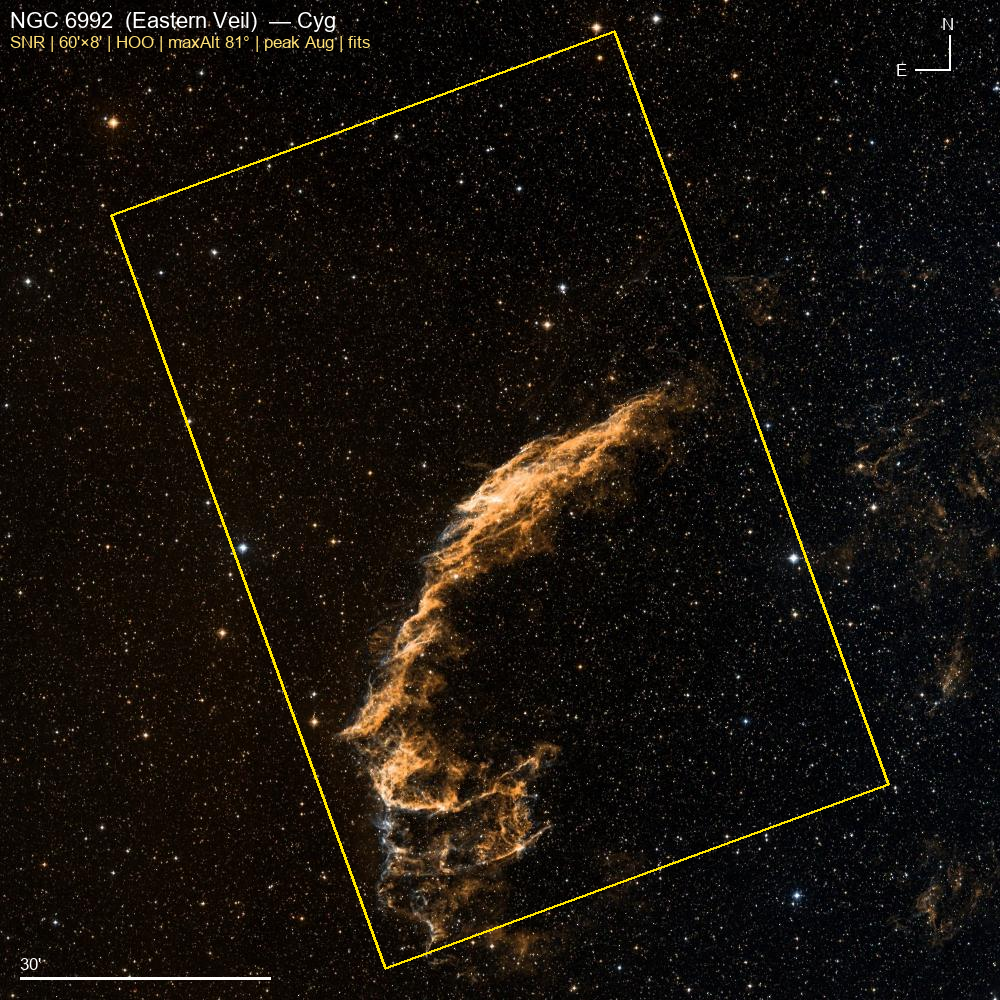

- **Coords (J2000):** 20h56m19s +31°44'  (314.079°, 31.743°) — *SIMBAD*
- **Type / size:** SNR, 60'×8'  → **fits** in the Esprit frame
- **Rotation:** PA 200° (long axis)
- **Palette:** HOO
- **JC observability:** max altitude 81°, peaks ~Aug
- **Note:** Network; OIII-rich filament

## NGC 6960 — Western Veil  (Cyg)

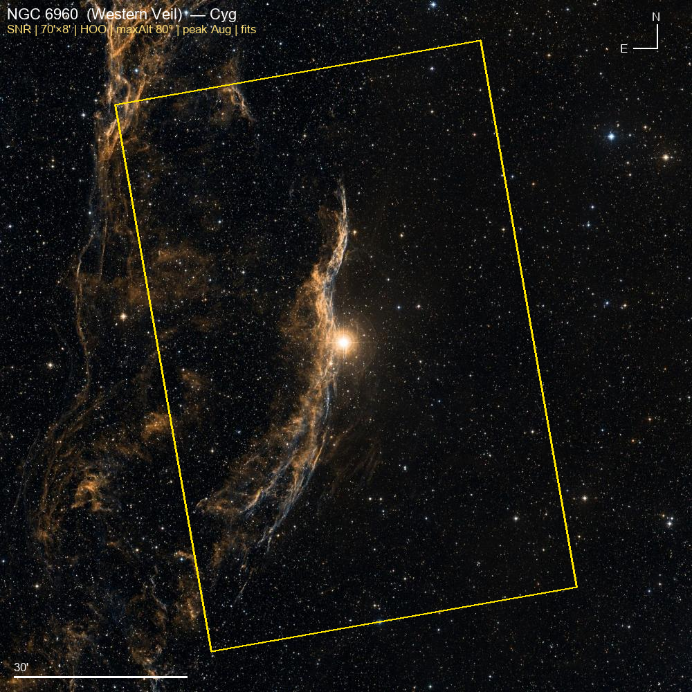

- **Coords (J2000):** 20h45m37s +30°42'  (311.408°, 30.708°) — *SIMBAD*
- **Type / size:** SNR, 70'×8'  → **fits** in the Esprit frame
- **Rotation:** PA 010° (long axis)
- **Palette:** HOO
- **JC observability:** max altitude 80°, peaks ~Aug
- **Note:** Witch's Broom / 52 Cyg; long thin

## Sh2-132 — Lion  (Cep)

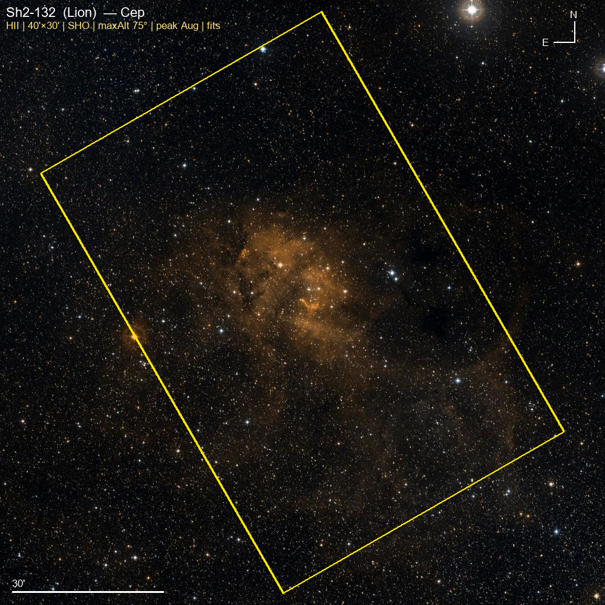

- **Coords (J2000):** 22h19m08s +56°04'  (334.787°, 56.079°) — *SIMBAD*
- **Type / size:** HII, 40'×30'  → **fits** in the Esprit frame
- **Rotation:** PA 030° (long axis)
- **Palette:** SHO
- **JC observability:** max altitude 75°, peaks ~Aug
- **Note:** faint; SHO rewards it

## IC 1396A — Elephant's Trunk  (Cep)

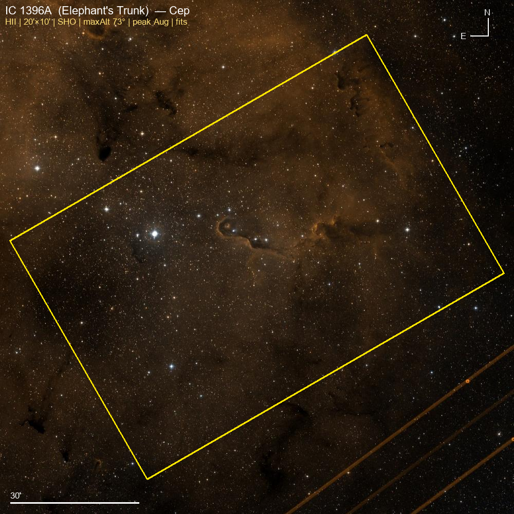

- **Coords (J2000):** 21h36m00s +57°23'  (324.000°, 57.400°) — *SIMBAD*
- **Type / size:** HII, 20'×10'  → **fits** in the Esprit frame
- **Rotation:** PA 120° (long axis)
- **Palette:** SHO
- **JC observability:** max altitude 73°, peaks ~Aug
- **Note:** trunk only (full IC1396 too big)

## Abell 21 — Medusa  (Gem)

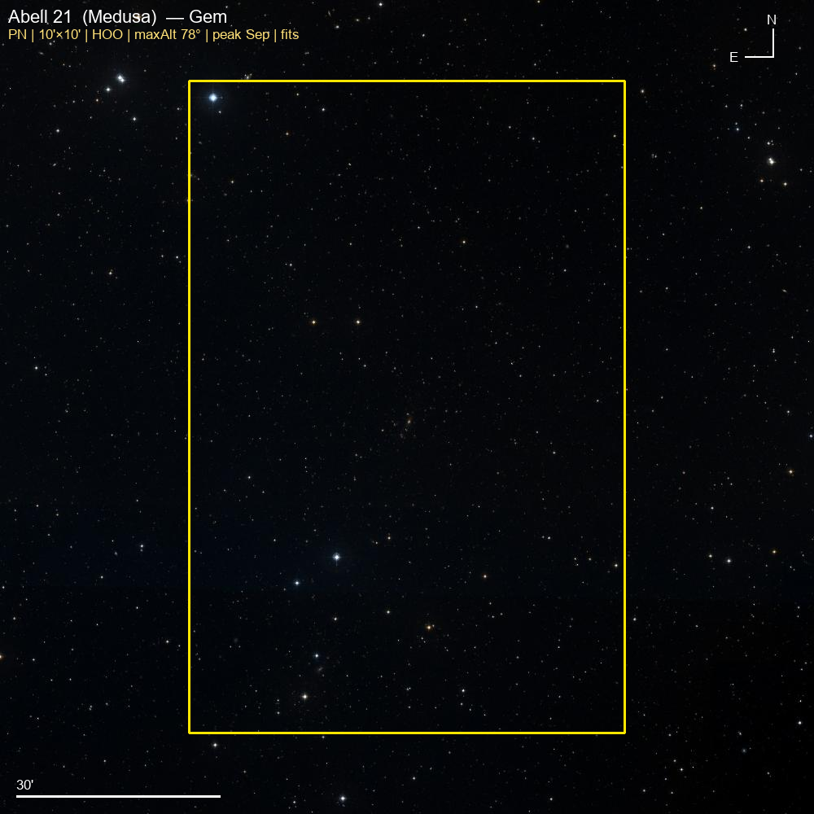

- **Coords (J2000):** 00h20m38s +28°41'  (5.161°, 28.695°) — *SIMBAD*
- **Type / size:** PN, 10'×10'  → **fits** in the Esprit frame
- **Rotation:** any (round)
- **Palette:** HOO
- **JC observability:** max altitude 78°, peaks ~Sep
- **Note:** large faint PN; OIII-rich

## NGC 7380 — Wizard  (Cep)

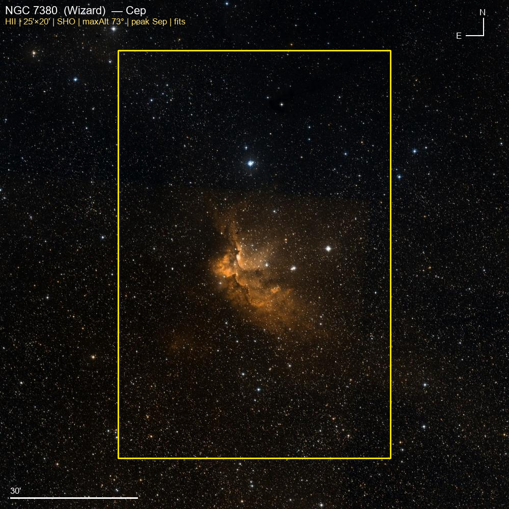

- **Coords (J2000):** 22h47m16s +58°07'  (341.817°, 58.125°) — *SIMBAD*
- **Type / size:** HII, 25'×20'  → **fits** in the Esprit frame
- **Rotation:** any (round)
- **Palette:** SHO
- **JC observability:** max altitude 73°, peaks ~Sep
- **Note:** open cluster + neb

## Sh2-157 — Lobster Claw  (Cas)

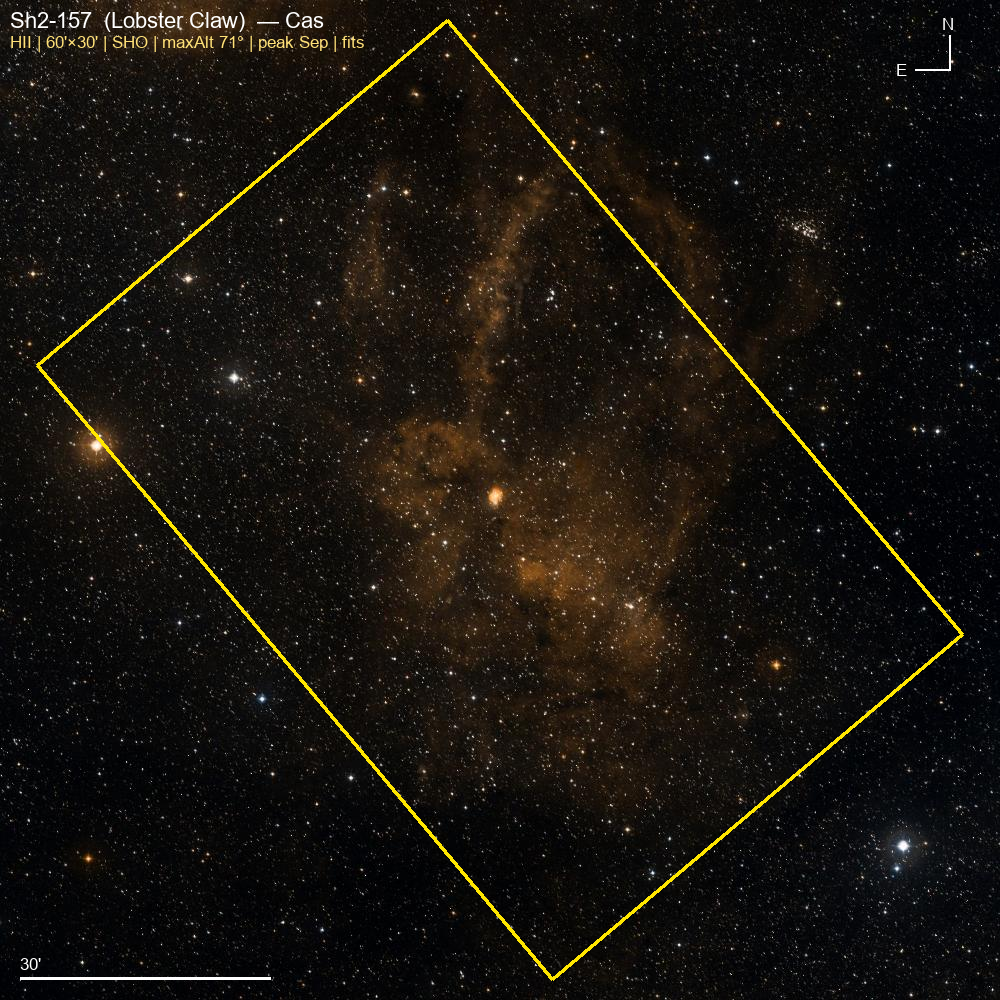

- **Coords (J2000):** 23h16m03s +60°02'  (349.016°, 60.034°) — *SIMBAD*
- **Type / size:** HII, 60'×30'  → **fits** in the Esprit frame
- **Rotation:** PA 040° (long axis)
- **Palette:** SHO
- **JC observability:** max altitude 71°, peaks ~Sep
- **Note:** 60' fits long axis

## NGC 7635 — Bubble  (Cas)

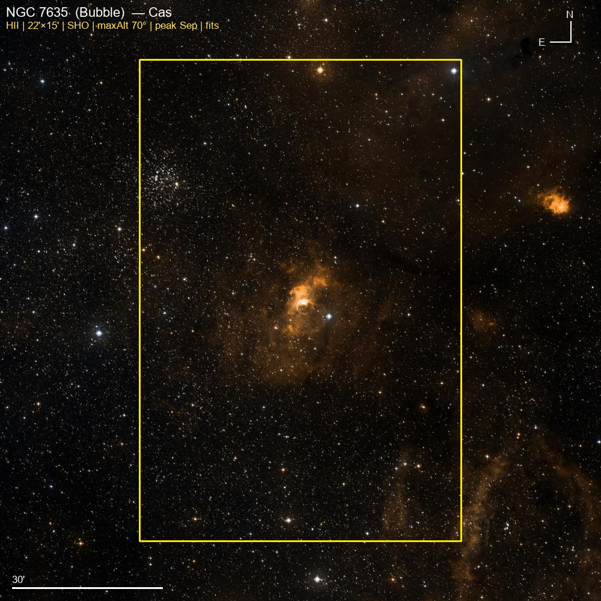

- **Coords (J2000):** 23h20m48s +61°12'  (350.201°, 61.202°) — *SIMBAD*
- **Type / size:** HII, 22'×15'  → **fits** in the Esprit frame
- **Rotation:** PA 000° (long axis)
- **Palette:** SHO
- **JC observability:** max altitude 70°, peaks ~Sep
- **Note:** bubble + M52 nearby

## Sh2-155 — Cave  (Cep)

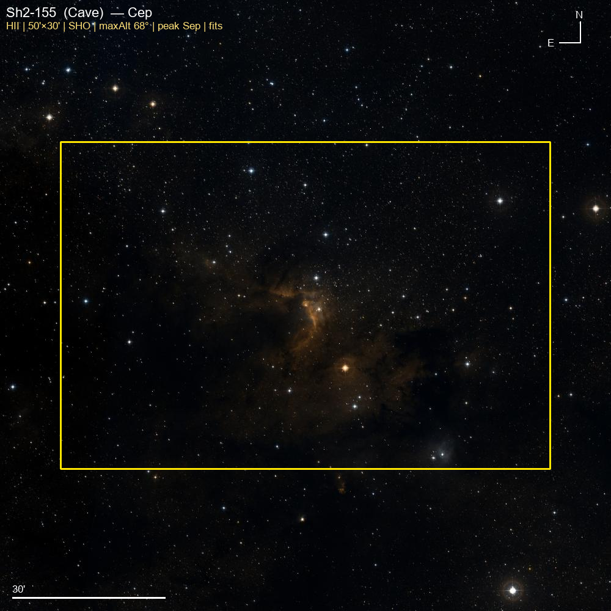

- **Coords (J2000):** 22h57m05s +62°38'  (344.275°, 62.636°) — *SIMBAD*
- **Type / size:** HII, 50'×30'  → **fits** in the Esprit frame
- **Rotation:** PA 090° (long axis)
- **Palette:** SHO
- **JC observability:** max altitude 68°, peaks ~Sep
- **Note:** dark cave rim

## NGC 7822 — Sh2-171  (Cep)

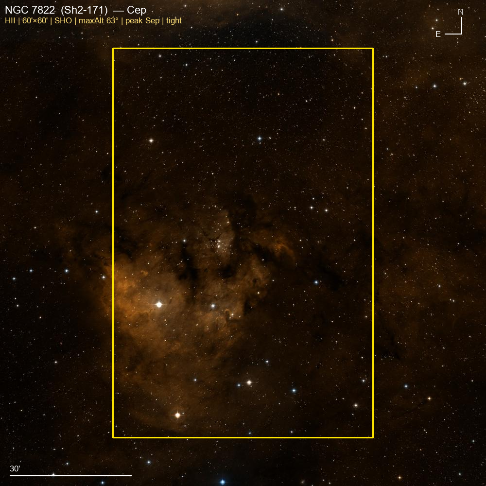

- **Coords (J2000):** 00h01m08s +67°25'  (0.286°, 67.421°) — *SIMBAD*
- **Type / size:** HII, 60'×60'  → **tight** in the Esprit frame
- **Rotation:** any (round)
- **Palette:** SHO
- **JC observability:** max altitude 63°, peaks ~Sep
- **Note:** fills frame; pillars

## NGC 281 — Pacman  (Cas)

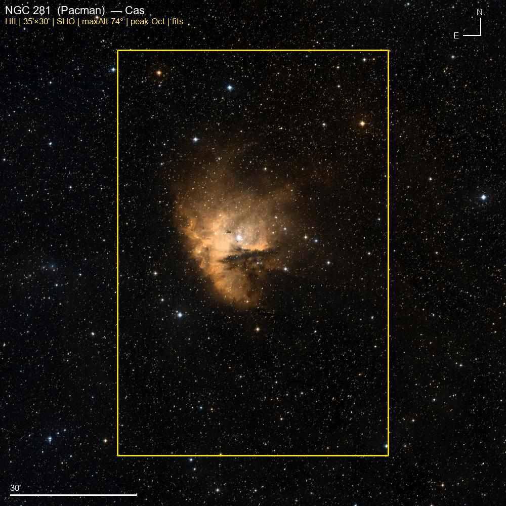

- **Coords (J2000):** 00h52m25s +56°33'  (13.105°, 56.565°) — *SIMBAD*
- **Type / size:** HII, 35'×30'  → **fits** in the Esprit frame
- **Rotation:** any (round)
- **Palette:** SHO
- **JC observability:** max altitude 74°, peaks ~Oct
- **Note:** round; Bok globules

## IC 405 — Flaming Star  (Aur)

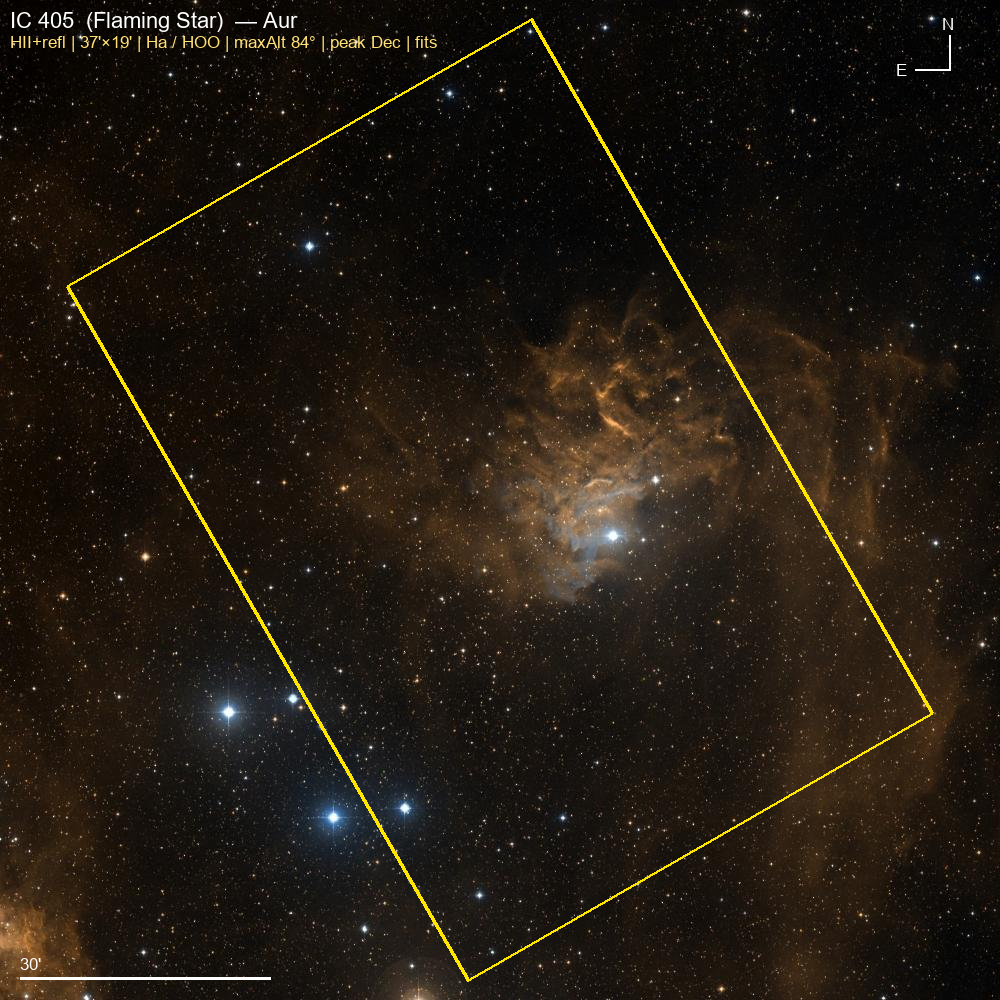

- **Coords (J2000):** 05h17m24s +34°22'  (79.350°, 34.383°) — *SIMBAD*
- **Type / size:** HII+refl, 37'×19'  → **fits** in the Esprit frame
- **Rotation:** PA 030° (long axis)
- **Palette:** Ha / HOO
- **JC observability:** max altitude 84°, peaks ~Dec
- **Note:** late-fall rising; AE Aur

## IC 410 — Tadpoles  (Aur)

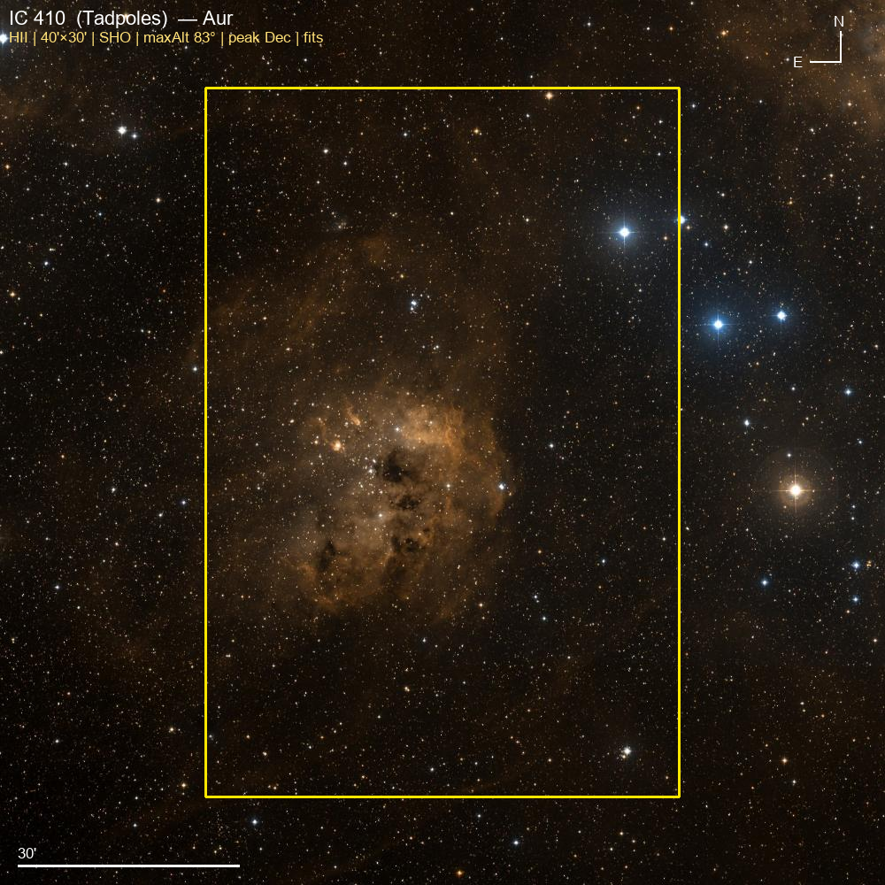

- **Coords (J2000):** 05h21m59s +33°29'  (80.500°, 33.483°) — *SIMBAD*
- **Type / size:** HII, 40'×30'  → **fits** in the Esprit frame
- **Rotation:** PA 000° (long axis)
- **Palette:** SHO
- **JC observability:** max altitude 83°, peaks ~Dec
- **Note:** late-fall; tadpole globs

## IC 443 — Jellyfish  (Gem)

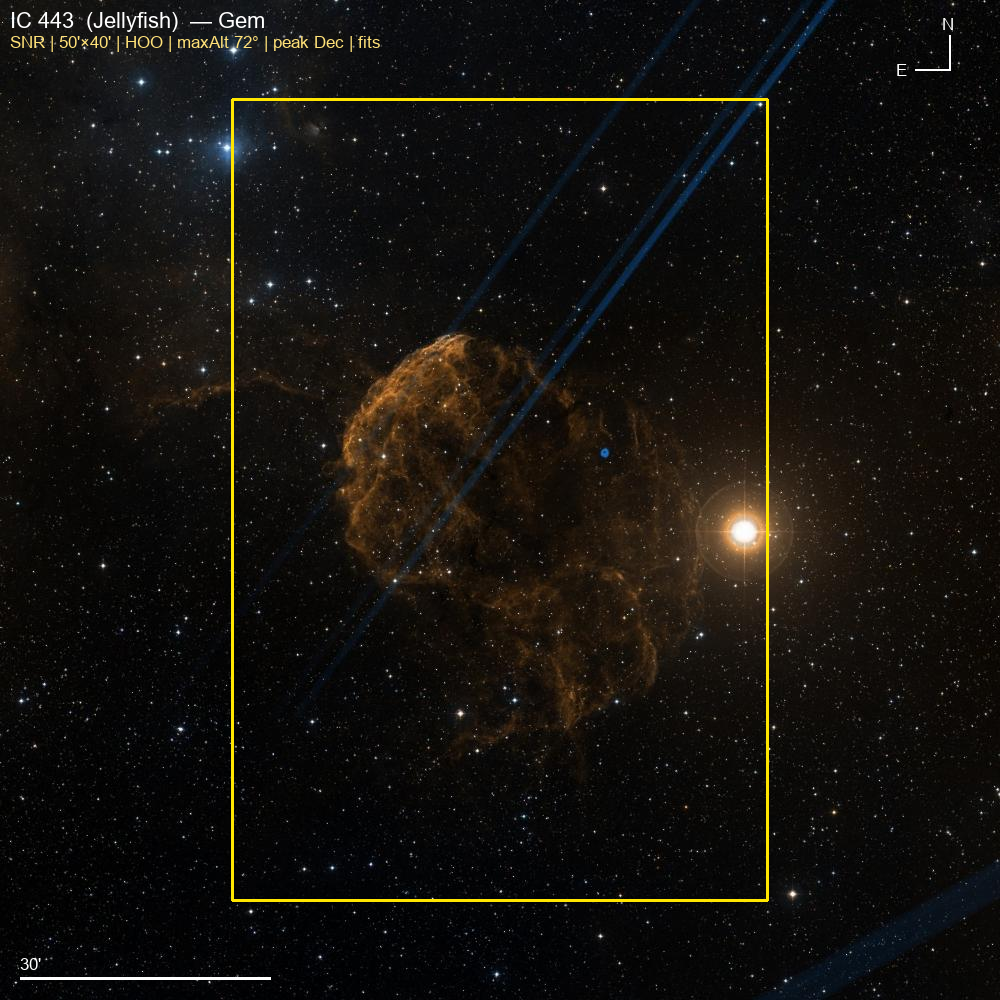

- **Coords (J2000):** 06h16m59s +22°34'  (94.250°, 22.570°) — *SIMBAD*
- **Type / size:** SNR, 50'×40'  → **fits** in the Esprit frame
- **Rotation:** any (round)
- **Palette:** HOO
- **JC observability:** max altitude 72°, peaks ~Dec
- **Note:** SNR; fall/winter

## M1 — Crab  (Tau)

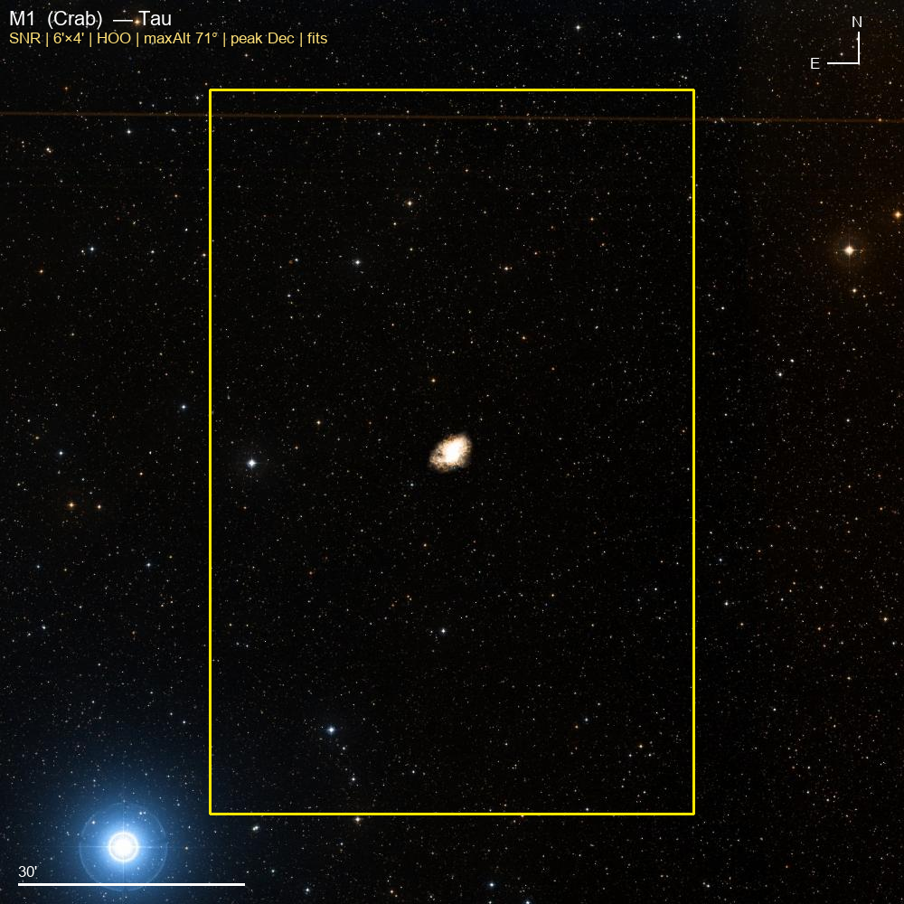

- **Coords (J2000):** 05h34m31s +22°01'  (83.632°, 22.017°) — *SIMBAD*
- **Type / size:** SNR, 6'×4'  → **fits** in the Esprit frame
- **Rotation:** PA 000° (long axis)
- **Palette:** HOO
- **JC observability:** max altitude 71°, peaks ~Dec
- **Note:** small bright SNR; filaments

## NGC 2174 — Monkey Head  (Ori)

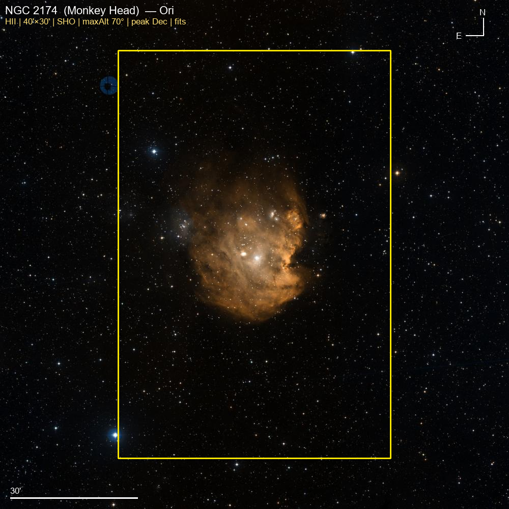

- **Coords (J2000):** 06h09m42s +20°30'  (92.425°, 20.500°) — *SIMBAD*
- **Type / size:** HII, 40'×30'  → **fits** in the Esprit frame
- **Rotation:** PA 000° (long axis)
- **Palette:** SHO
- **JC observability:** max altitude 70°, peaks ~Dec
- **Note:** fall/winter rising

## NGC 2264 — Christmas Tree / Cone  (Mon)

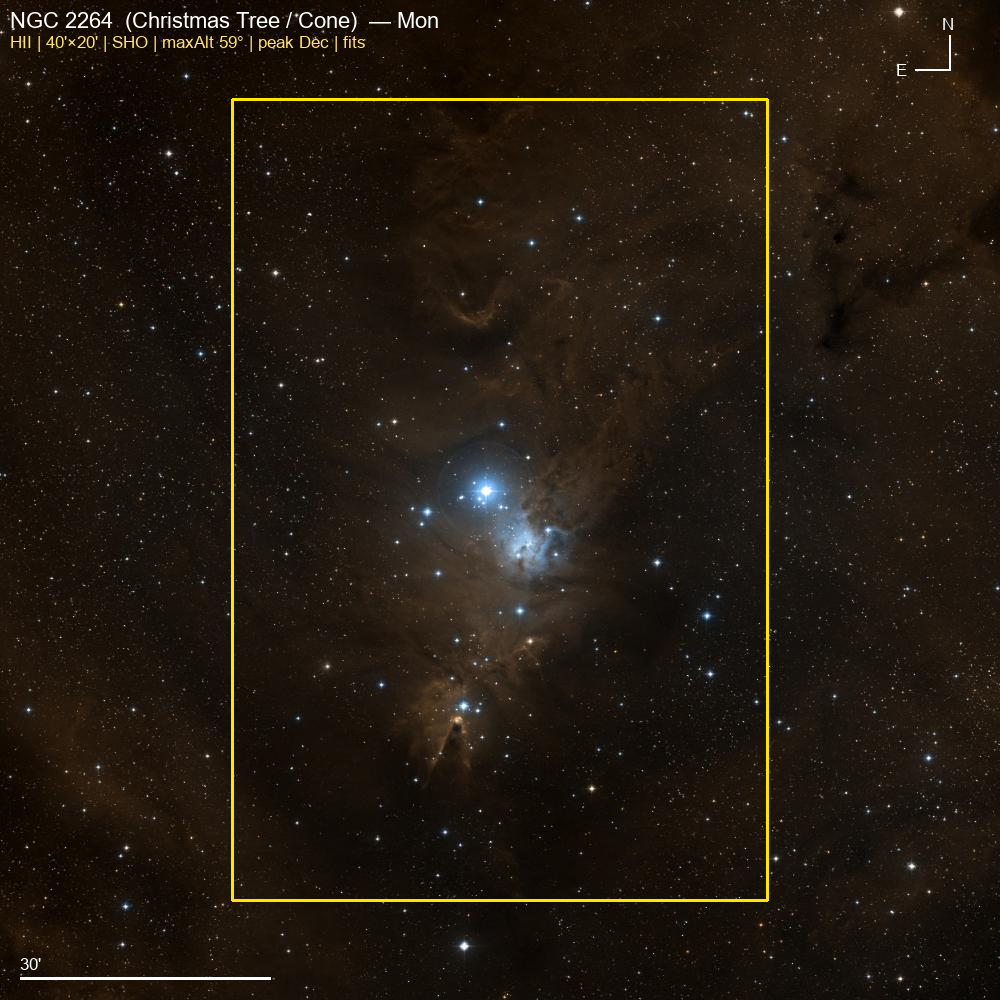

- **Coords (J2000):** 06h40m52s +09°52'  (100.217°, 9.877°) — *SIMBAD*
- **Type / size:** HII, 40'×20'  → **fits** in the Esprit frame
- **Rotation:** PA 000° (long axis)
- **Palette:** SHO
- **JC observability:** max altitude 59°, peaks ~Dec
- **Note:** cluster + Cone; late fall

## NGC 2237 — Rosette  (Mon)

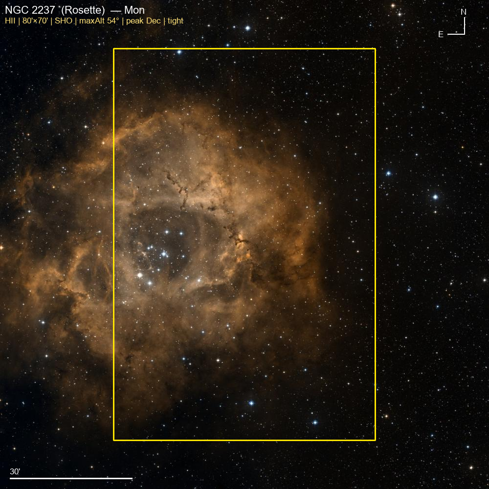

- **Coords (J2000):** 06h30m36s +04°58'  (97.650°, 4.981°) — *SIMBAD*
- **Type / size:** HII, 80'×70'  → **tight** in the Esprit frame
- **Rotation:** any (round)
- **Palette:** SHO
- **JC observability:** max altitude 54°, peaks ~Dec
- **Note:** tight/slight overflow; late fall

## NGC 2024 — Flame  (Ori)

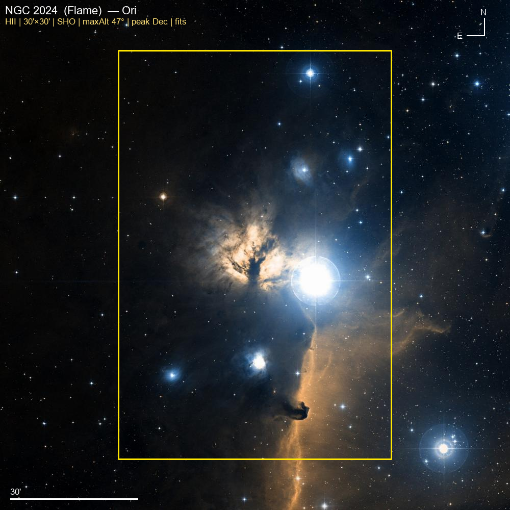

- **Coords (J2000):** 05h41m43s -01°50'  (85.429°, -1.842°) — *SIMBAD*
- **Type / size:** HII, 30'×30'  → **fits** in the Esprit frame
- **Rotation:** any (round)
- **Palette:** SHO
- **JC observability:** max altitude 47°, peaks ~Dec
- **Note:** Alnitak glare; Horsehead in adjacent frame

## IC 434 — Horsehead  (Ori)

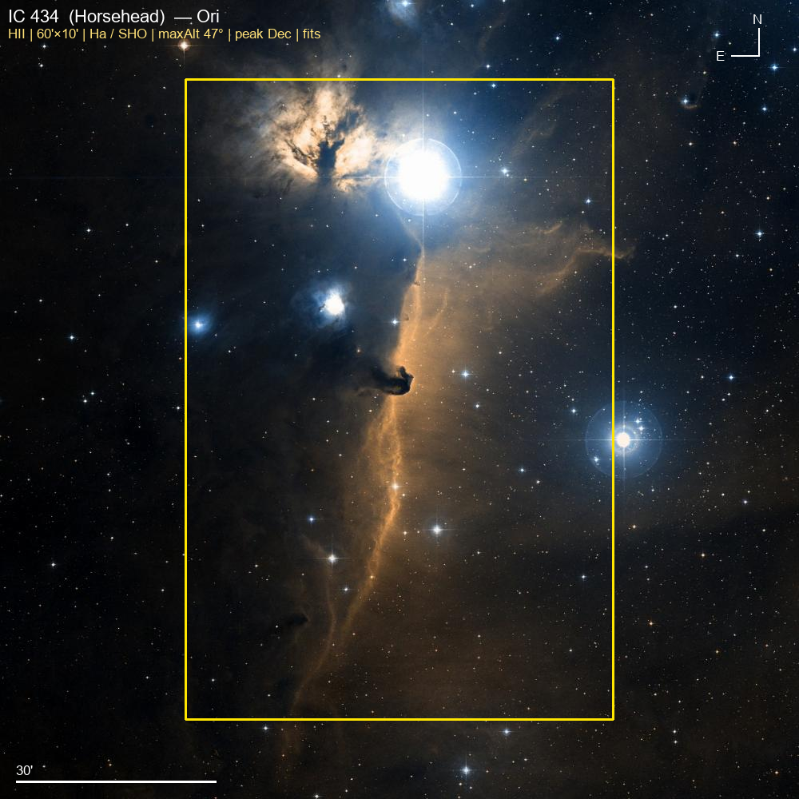

- **Coords (J2000):** 05h41m00s -02°30'  (85.250°, -2.500°) — *SIMBAD*
- **Type / size:** HII, 60'×10'  → **fits** in the Esprit frame
- **Rotation:** PA 000° (long axis)
- **Palette:** Ha / SHO
- **JC observability:** max altitude 47°, peaks ~Dec
- **Note:** B33 dark horse on the IC434 Ha strip

## M42 — Orion Nebula  (Ori)

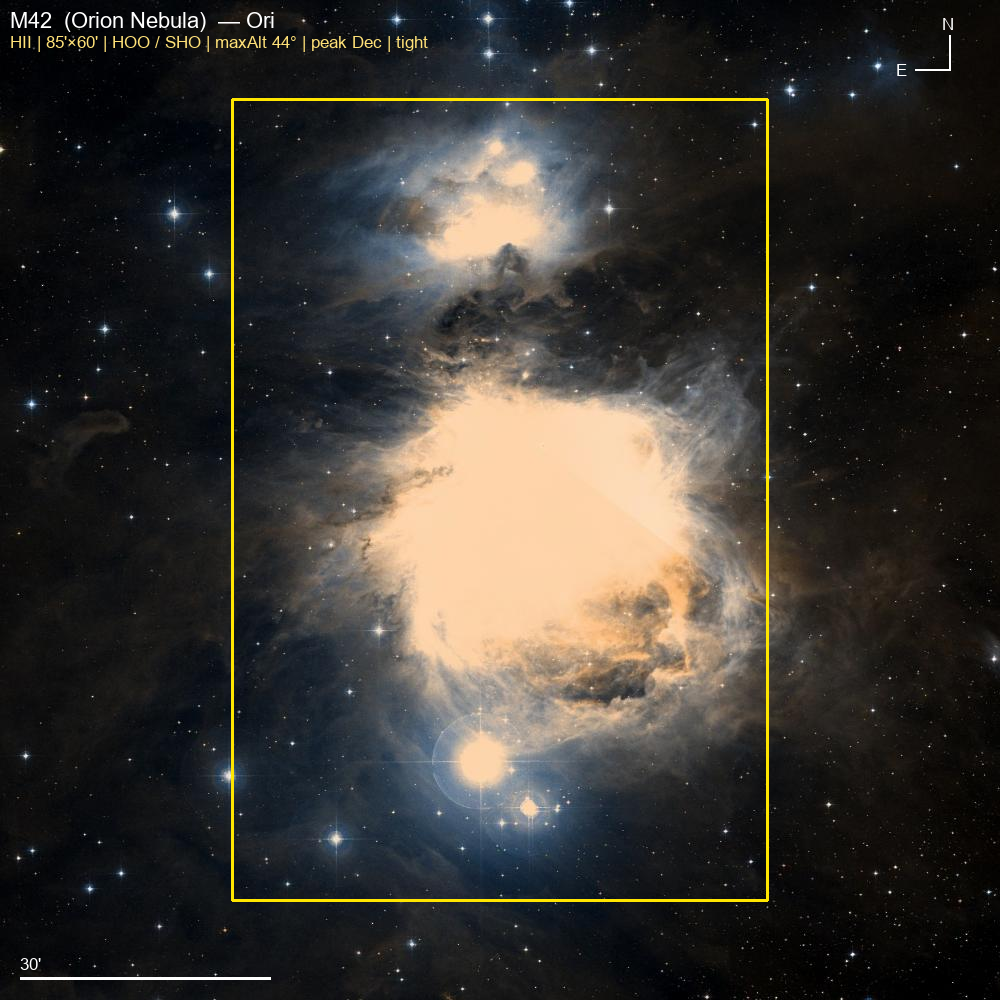

- **Coords (J2000):** 05h35m16s -05°23'  (83.820°, -5.388°) — *SIMBAD*
- **Type / size:** HII, 85'×60'  → **tight** in the Esprit frame
- **Rotation:** PA 000° (long axis)
- **Palette:** HOO / SHO
- **JC observability:** max altitude 44°, peaks ~Dec
- **Note:** very bright; tight in frame; +M43/Running Man

## NGC 2359 — Thor's Helmet  (CMa)

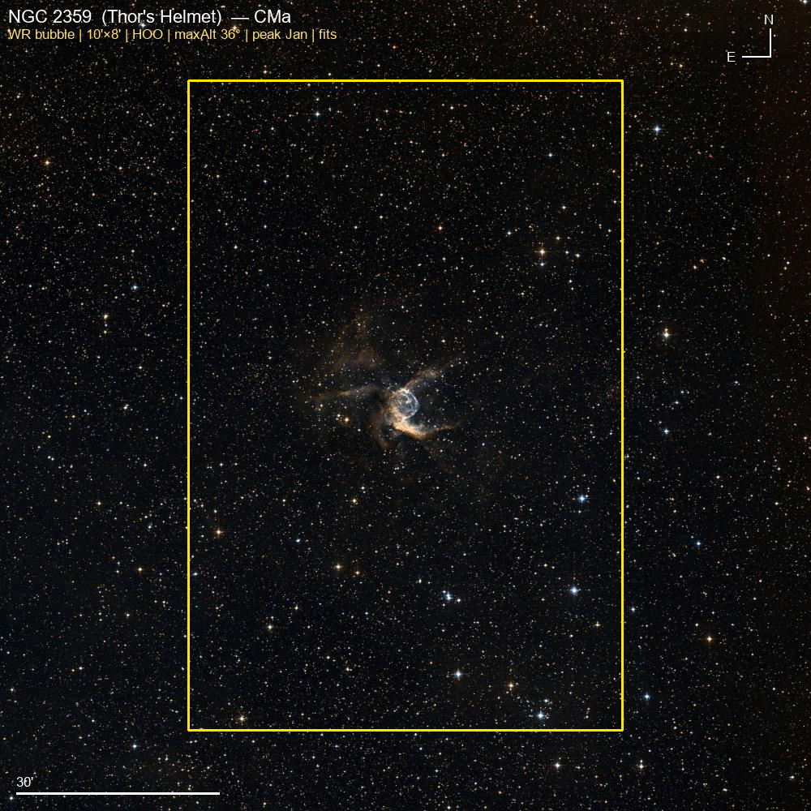

- **Coords (J2000):** 07h18m30s -13°13'  (109.625°, -13.227°) — *SIMBAD*
- **Type / size:** WR bubble, 10'×8'  → **fits** in the Esprit frame
- **Rotation:** any (round)
- **Palette:** HOO
- **JC observability:** max altitude 36°, peaks ~Jan
- **Note:** low from JC; OIII bubble
