# S30 Pro — Emission Nebula Image Book (single-frame, wide-field)

Single-frame framing previews for **emission nebulae** that suit the ZWO Seestar S30 Pro (**3.91°×2.20°** — the *measured* field, 3.66"/px plate scale / eff. 163mm fl, not the nominal-150mm 4.25°×2.39° — **LP dual-band Ha+OIII**) from Jersey City this **summer/fall**. The S30's wide field makes it the *complement* of the Esprit book: it owns the **large complexes** (North America+Pelican, full IC 1396, Heart, Clamshell, the Auriga trio) that overflow the Esprit, while **small targets** (Crescent, Tulip, M27) are flagged — those belong on the Esprit at 840mm. The ~3° round giants (full Veil, Sadr, Simeis 147) overflow even this frame's E–W axis — flagged **EW-overflow** below: crop, or 2-panel them in RA.

**Fixed frame:** the S30 has no rotator; the long (3.91°) axis sits ≈**N–S** (~4° tilt). So framing is choose-the-center only. **E–W-elongated targets (California, 145') overflow the narrower 2.20° axis** — clip the ends or hand them to a rotatable rig. Box = cyan; DSS2 color (Ha reads brown; through the LP it's red/teal HOO).

| Target | Common | Type | Size | Fit | Palette | maxAlt(JC) | Peak |
|---|---|---|---|---|---|---|---|
| IC 1318 | Sadr / Butterfly | HII | 180'×170' | EW-overflow | LP Ha+OIII | 89° | Jul |
| NGC 6888 | Crescent | WR bubble | 18'×12' | small | LP HOO | 88° | Jul |
| Sh2-101 | Tulip | HII | 16'×9' | small | LP Ha+OIII | 85° | Jul |
| M27 | Dumbbell | PN | 8'×6' | small | LP HOO | 72° | Jul |
| Sh2-119 | Clamshell | HII | 90'×90' | fits | LP Ha+OIII | 87° | Aug |
| NGC 7000 | North America (+Pelican) | HII | 120'×100' | fits | LP Ha+OIII | 86° | Aug |
| IC 5146 | Cocoon (+B168 trail) | HII | 12'×12' | small | LP Ha+OIII | 83° | Aug |
| Cygnus Loop | Veil (full loop) | SNR | 180'×170' | EW-overflow | LP HOO (OIII-rich) | 80° | Aug |
| Sh2-132 | Lion | HII | 40'×30' | fits | LP Ha+OIII | 75° | Aug |
| IC 1396 | Elephant's Trunk (full) | HII | 170'×140' | tight | LP Ha+OIII | 73° | Aug |
| Sh2-129 | Flying Bat (Ou4 Squid) | HII | 150'×120' | tight | LP HOO | 71° | Aug |
| Sh2-157 | Lobster Claw (+M52/Bubble) | HII | 90'×60' | fits | LP Ha+OIII | 71° | Sep |
| Sh2-155 | Cave | HII | 50'×30' | fits | LP Ha+OIII | 68° | Sep |
| NGC 7822 | Ced 214 / Sh2-171 | HII | 90'×60' | fits | LP Ha+OIII | 63° | Sep |
| NGC 281 | Pacman | HII | 35'×30' | small | LP Ha+OIII | 74° | Oct |
| IC 1805 | Heart | HII | 100'×90' | fits | LP Ha+OIII | 69° | Oct |
| NGC 1499 | California | HII | 145'×40' | EW-overflow | LP Ha+OIII | 86° | Nov |
| IC 1848 | Soul | HII | 60'×40' | fits | LP Ha+OIII | 70° | Nov |
| IC 405 | Flaming Star (+Tadpoles) | HII | 150'×120' | tight | LP Ha+OIII | 84° | Dec |
| Simeis 147 | Spaghetti (Sh2-240) | SNR | 180'×180' | EW-overflow | LP HOO | 77° | Dec |
| IC 443 | Jellyfish | SNR | 50'×40' | fits | LP HOO | 72° | Dec |
| M1 | Crab | SNR | 6'×4' | small | LP HOO | 71° | Dec |
| NGC 2174 | Monkey Head | HII | 40'×30' | fits | LP Ha+OIII | 70° | Dec |
| NGC 2264 | Christmas Tree / Cone | HII | 40'×20' | fits | LP Ha+OIII | 59° | Dec |
| NGC 2237 | Rosette | HII | 80'×70' | fits | LP Ha+OIII | 54° | Dec |
| IC 434 | Belt: Flame+Horsehead | HII | 90'×60' | fits | LP Ha+OIII | 47° | Dec |
| M42 | Orion Nebula (+Running Man) | HII | 90'×60' | fits | LP HOO | 44° | Dec |
| IC 2177 | Seagull | HII | 150'×50' | fits | LP Ha+OIII | 39° | Jan |
| NGC 2359 | Thor's Helmet | WR bubble | 10'×8' | small | LP HOO | 36° | Jan |

## IC 1318 — Sadr / Butterfly  (Cyg)

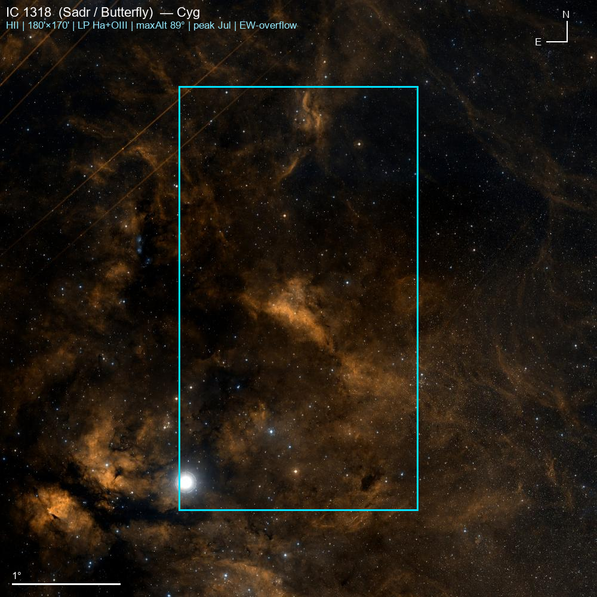

- **Coords (J2000):** 20h16m47s +41°57'  (304.2°, 41.957°) — *SIMBAD*
- **Type / size:** HII, 180'×170'  → **EW-overflow** in the S30 frame
- **Palette:** LP dual-band (Ha+OIII)
- **JC observability:** max altitude 89°, peaks ~Jul
- **Note:** Gamma Cyg complex ~3° round — overflows the 2.20° E-W axis; crop the Butterfly or 2-panel

## NGC 6888 — Crescent  (Cyg)

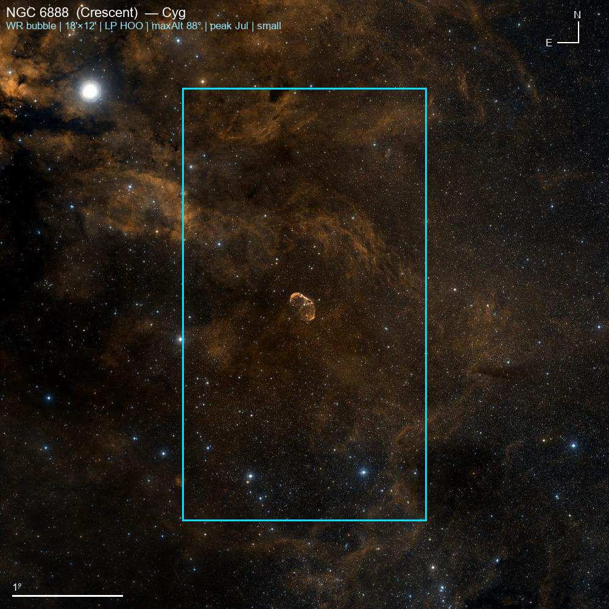

- **Coords (J2000):** 20h12m06s +38°21'  (303.027°, 38.355°) — *SIMBAD*
- **Type / size:** WR bubble, 18'×12'  → **small** in the S30 frame
- **Palette:** LP dual-band (HOO)
- **JC observability:** max altitude 88°, peaks ~Jul
- **Note:** SMALL — better on Esprit; ok as IC1318 context

## Sh2-101 — Tulip  (Cyg)

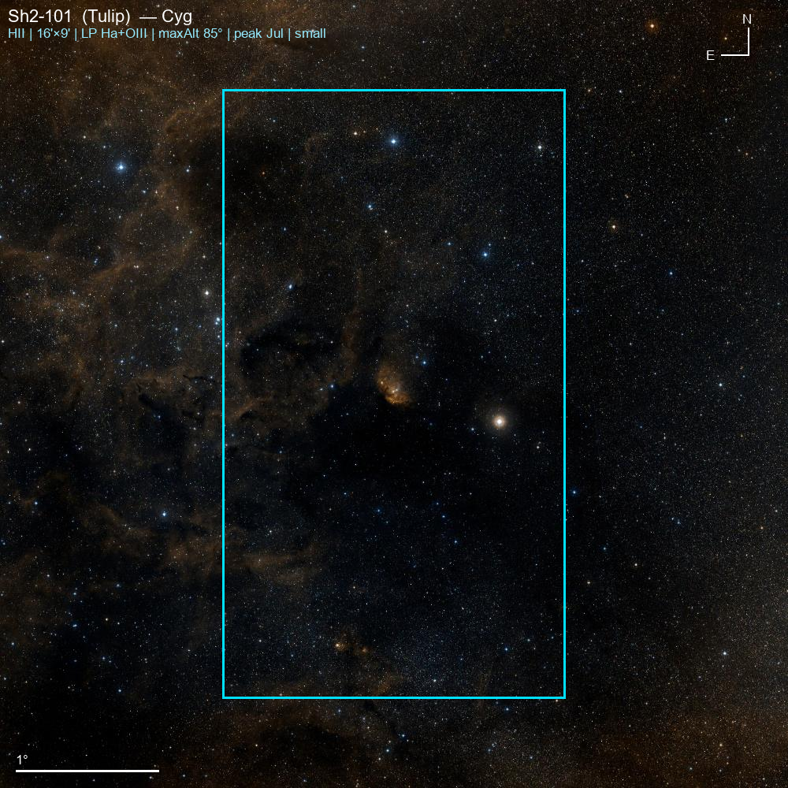

- **Coords (J2000):** 19h59m55s +35°16'  (299.979°, 35.277°) — *SIMBAD*
- **Type / size:** HII, 16'×9'  → **small** in the S30 frame
- **Palette:** LP dual-band (Ha+OIII)
- **JC observability:** max altitude 85°, peaks ~Jul
- **Note:** SMALL — Esprit territory

## M27 — Dumbbell  (Vul)

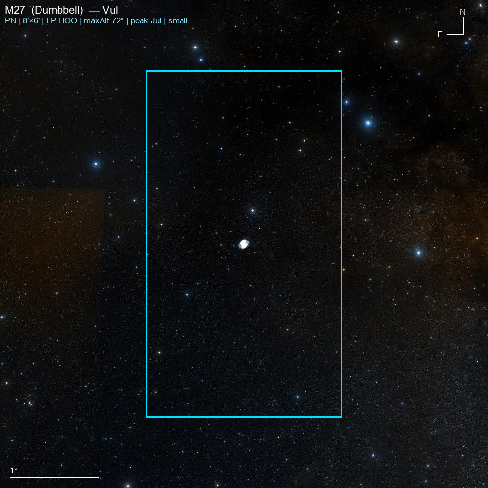

- **Coords (J2000):** 19h59m36s +22°43'  (299.902°, 22.721°) — *SIMBAD*
- **Type / size:** PN, 8'×6'  → **small** in the S30 frame
- **Palette:** LP dual-band (HOO)
- **JC observability:** max altitude 72°, peaks ~Jul
- **Note:** SMALL/tiny — long-FL target

## Sh2-119 — Clamshell  (Cyg)

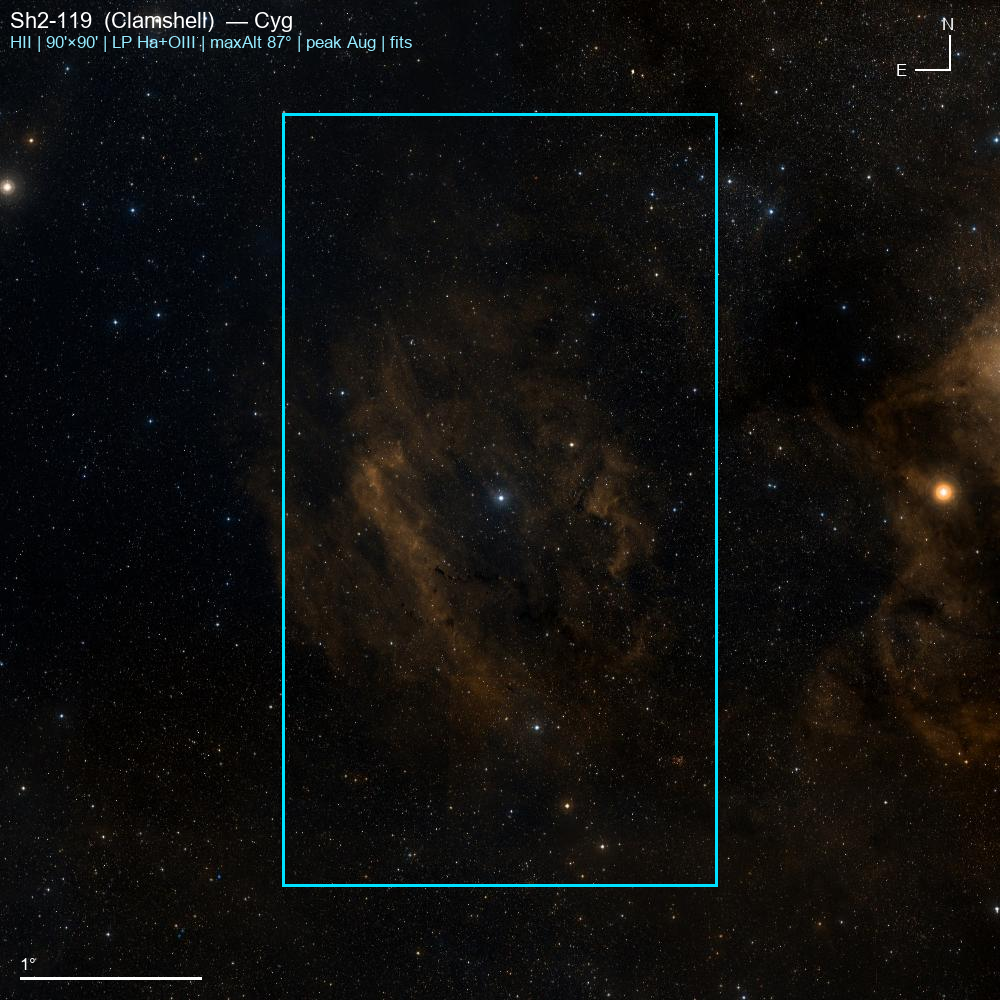

- **Coords (J2000):** 21h18m30s +43°56'  (319.625°, 43.933°) — *SIMBAD*
- **Type / size:** HII, 90'×90'  → **fits** in the S30 frame
- **Palette:** LP dual-band (Ha+OIII)
- **JC observability:** max altitude 87°, peaks ~Aug
- **Note:** fits whole; 68 Cyg

## NGC 7000 — North America (+Pelican)  (Cyg)

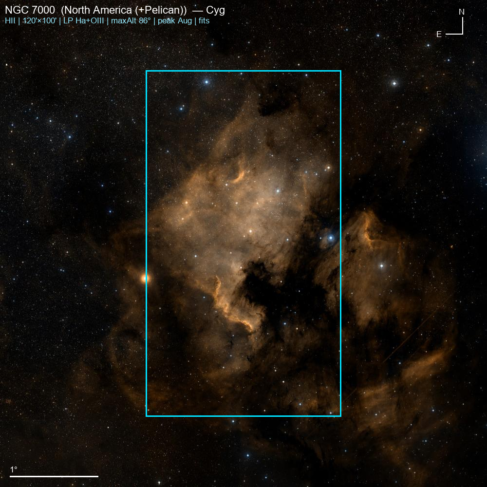

- **Coords (J2000):** 20h58m46s +44°19'  (314.696°, 44.33°) — *SIMBAD*
- **Type / size:** HII, 120'×100'  → **fits** in the S30 frame
- **Palette:** LP dual-band (Ha+OIII)
- **JC observability:** max altitude 86°, peaks ~Aug
- **Note:** NGC7000+IC5070 combo spans ~2.2° E-W = exactly the frame — center carefully (test frame first)

## IC 5146 — Cocoon (+B168 trail)  (Cyg)

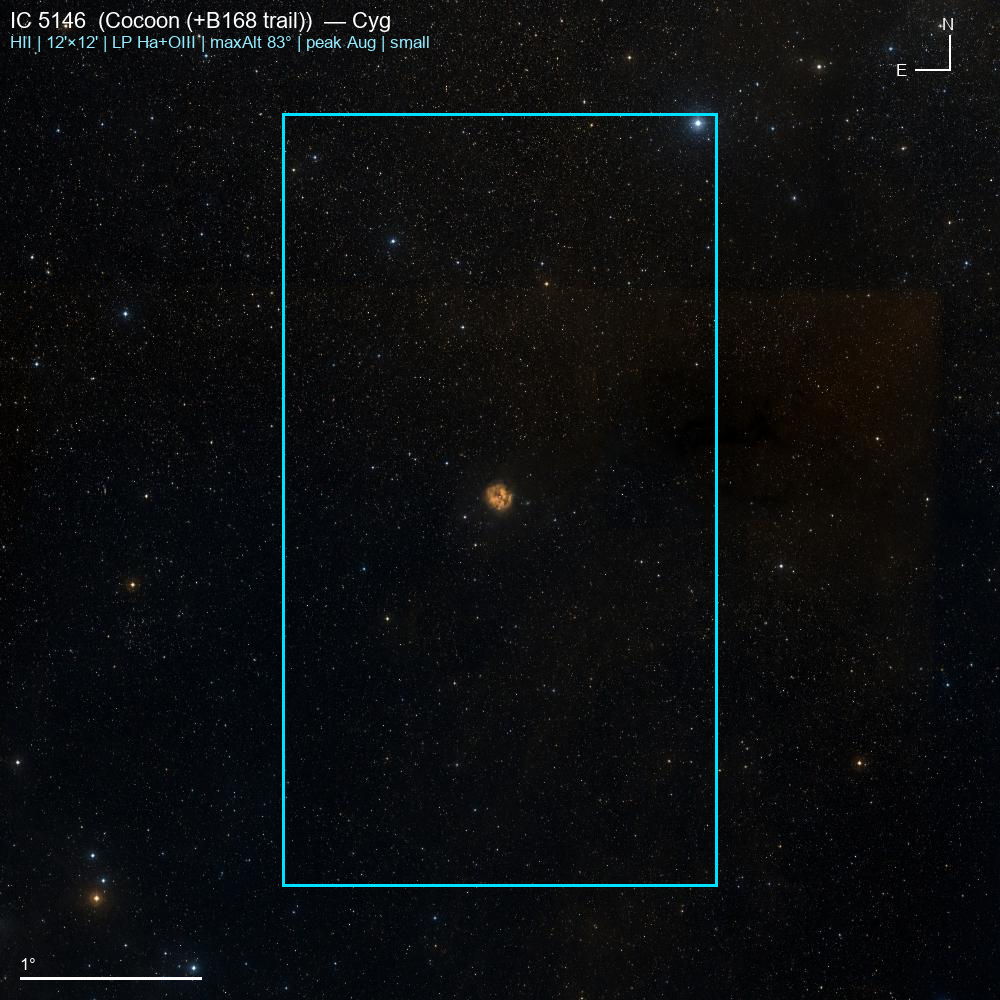

- **Coords (J2000):** 21h53m29s +47°14'  (328.372°, 47.246°) — *SIMBAD*
- **Type / size:** HII, 12'×12'  → **small** in the S30 frame
- **Palette:** LP dual-band (Ha+OIII)
- **JC observability:** max altitude 83°, peaks ~Aug
- **Note:** neb small but the dark trail fills the wide frame

## Cygnus Loop — Veil (full loop)  (Cyg)

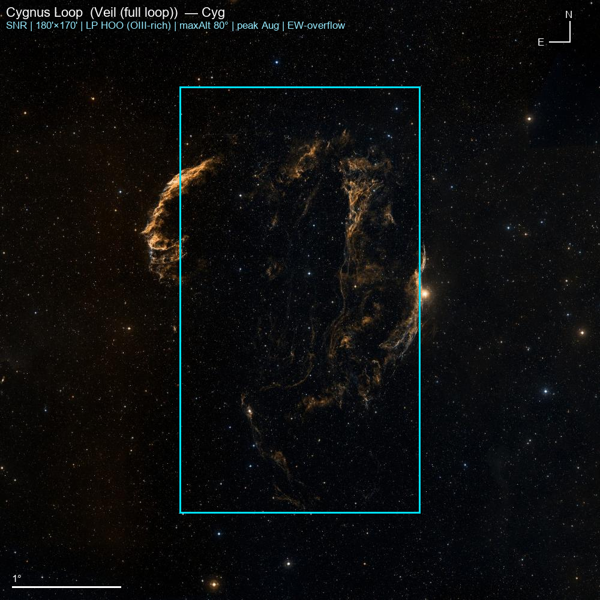

- **Coords (J2000):** 20h51m00s +30°40'  (312.75°, 30.667°) — *SIMBAD*
- **Type / size:** SNR, 180'×170'  → **EW-overflow** in the S30 frame
- **Palette:** LP dual-band (HOO (OIII-rich))
- **JC observability:** max altitude 80°, peaks ~Aug
- **Note:** ~3° wide E-W vs the 2.20° axis — full loop is a 2-panel RA split (trips/catskills_jun18 kit); one frame = the N-S height, E/W arcs clipped

## Sh2-132 — Lion  (Cep)

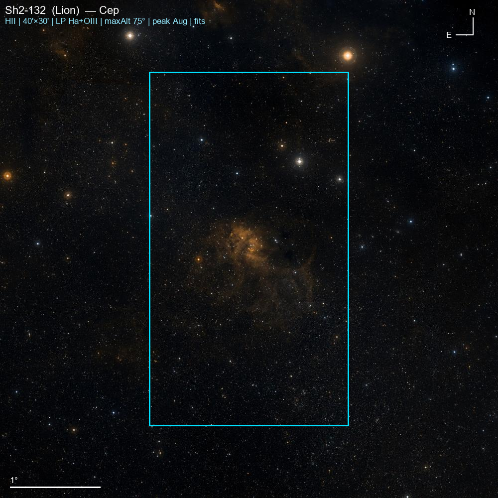

- **Coords (J2000):** 22h19m08s +56°04'  (334.787°, 56.079°) — *SIMBAD*
- **Type / size:** HII, 40'×30'  → **fits** in the S30 frame
- **Palette:** LP dual-band (Ha+OIII)
- **JC observability:** max altitude 75°, peaks ~Aug
- **Note:** faint

## IC 1396 — Elephant's Trunk (full)  (Cep)

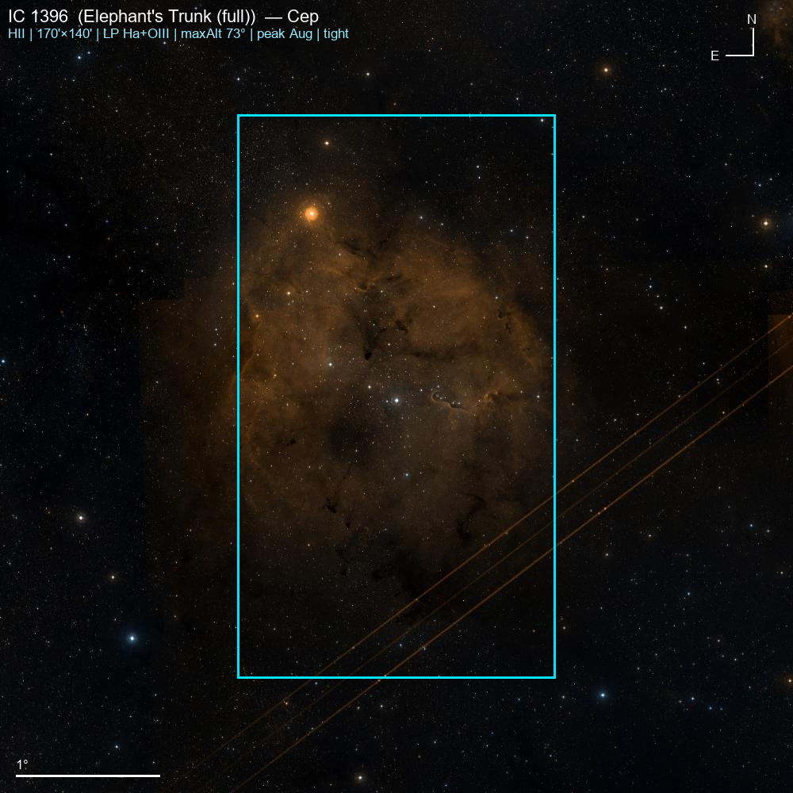

- **Coords (J2000):** 21h38m58s +57°30'  (324.745°, 57.514°) — *SIMBAD*
- **Type / size:** HII, 170'×140'  → **tight** in the S30 frame
- **Palette:** LP dual-band (Ha+OIII)
- **JC observability:** max altitude 73°, peaks ~Aug
- **Note:** full nebula + cluster + trunk

## Sh2-129 — Flying Bat (Ou4 Squid)  (Cep)

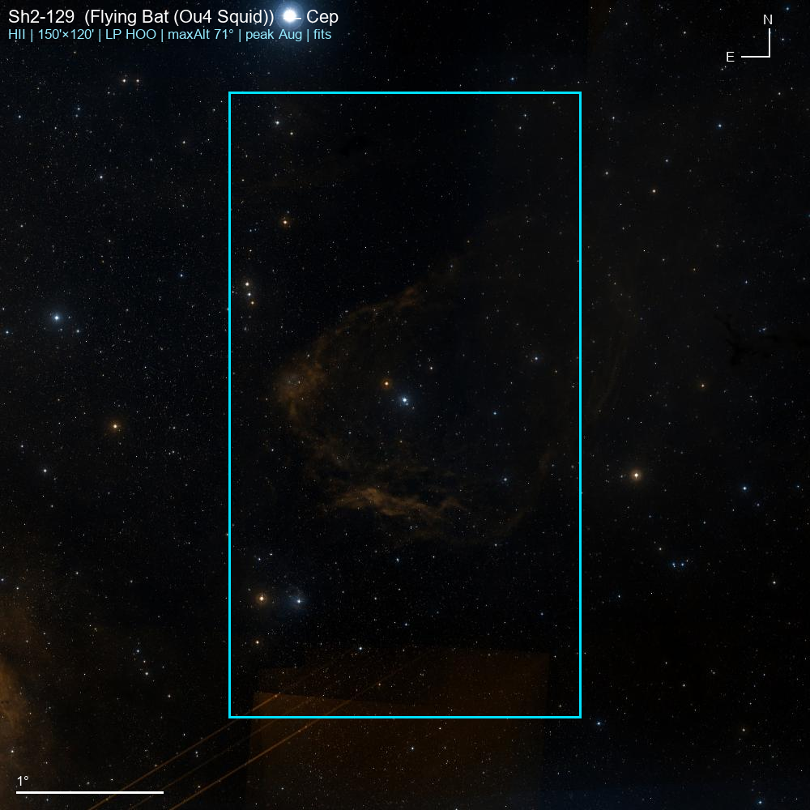

- **Coords (J2000):** 21h11m47s +59°56'  (317.95°, 59.95°) — *SIMBAD*
- **Type / size:** HII, 150'×120'  → **tight** in the S30 frame
- **Palette:** LP dual-band (HOO)
- **JC observability:** max altitude 71°, peaks ~Aug
- **Note:** OIII Squid very faint — dark-site

## Sh2-157 — Lobster Claw (+M52/Bubble)  (Cas)

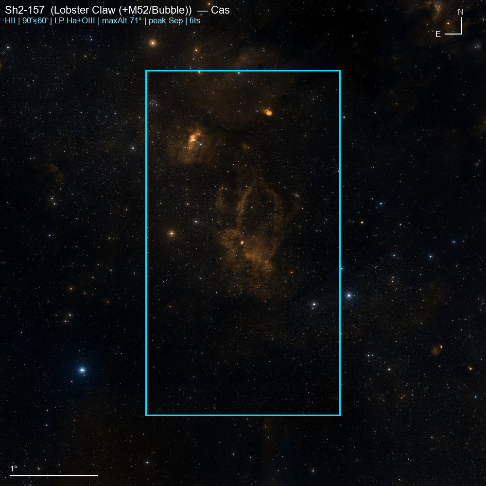

- **Coords (J2000):** 23h16m03s +60°02'  (349.016°, 60.034°) — *SIMBAD*
- **Type / size:** HII, 90'×60'  → **fits** in the S30 frame
- **Palette:** LP dual-band (Ha+OIII)
- **JC observability:** max altitude 71°, peaks ~Sep
- **Note:** rich wide field with NGC7635+M52

## Sh2-155 — Cave  (Cep)

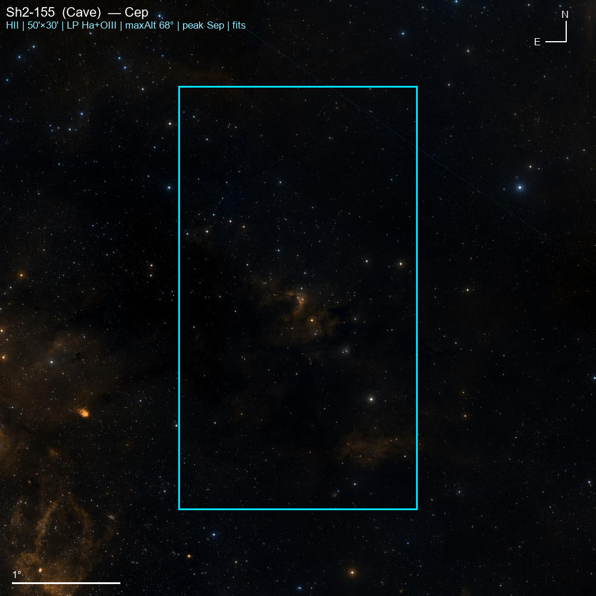

- **Coords (J2000):** 22h57m05s +62°38'  (344.275°, 62.636°) — *SIMBAD*
- **Type / size:** HII, 50'×30'  → **fits** in the S30 frame
- **Palette:** LP dual-band (Ha+OIII)
- **JC observability:** max altitude 68°, peaks ~Sep
- **Note:** fits comfortably

## NGC 7822 — Ced 214 / Sh2-171  (Cep)

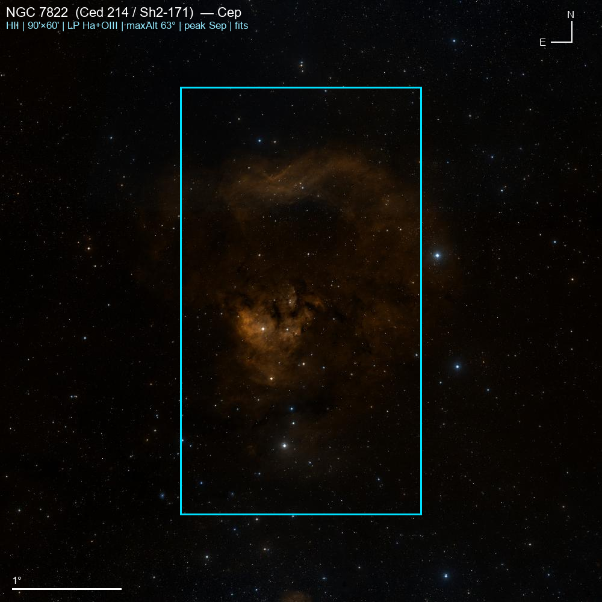

- **Coords (J2000):** 00h01m08s +67°25'  (0.286°, 67.421°) — *SIMBAD*
- **Type / size:** HII, 90'×60'  → **fits** in the S30 frame
- **Palette:** LP dual-band (Ha+OIII)
- **JC observability:** max altitude 63°, peaks ~Sep
- **Note:** pillars; circumpolar

## NGC 281 — Pacman  (Cas)

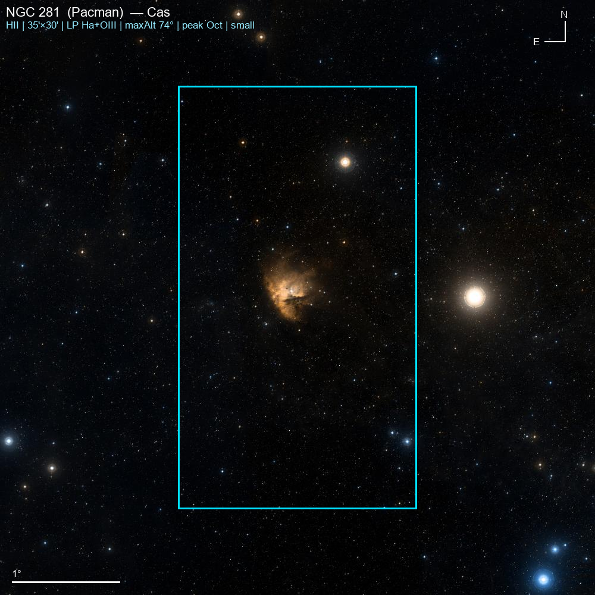

- **Coords (J2000):** 00h52m25s +56°33'  (13.105°, 56.565°) — *SIMBAD*
- **Type / size:** HII, 35'×30'  → **small** in the S30 frame
- **Palette:** LP dual-band (Ha+OIII)
- **JC observability:** max altitude 74°, peaks ~Oct
- **Note:** borderline small at 4"/px

## IC 1805 — Heart  (Cas)

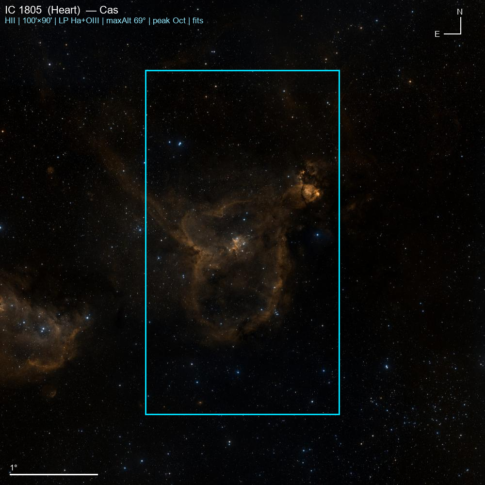

- **Coords (J2000):** 02h32m50s +61°28'  (38.21°, 61.471°) — *SIMBAD*
- **Type / size:** HII, 100'×90'  → **fits** in the S30 frame
- **Palette:** LP dual-band (Ha+OIII)
- **JC observability:** max altitude 69°, peaks ~Oct
- **Note:** Heart alone (Heart+Soul pair ~5° overflows)

## NGC 1499 — California  (Per)

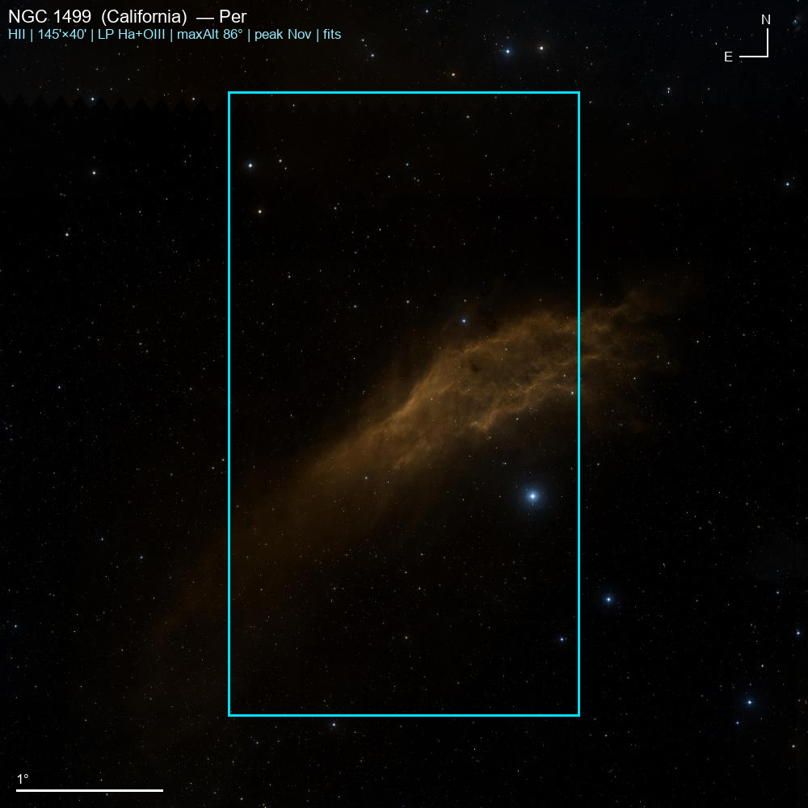

- **Coords (J2000):** 04h03m17s +36°25'  (60.825°, 36.422°) — *SIMBAD*
- **Type / size:** HII, 145'×40'  → **EW-overflow** in the S30 frame
- **Palette:** LP dual-band (Ha+OIII)
- **JC observability:** max altitude 86°, peaks ~Nov
- **Note:** E-W elongated — OVERFLOWS the fixed 2.20° E-W axis by ~13'; clip the ends or use a rotatable rig (Esprit 80 book)

## IC 1848 — Soul  (Cas)

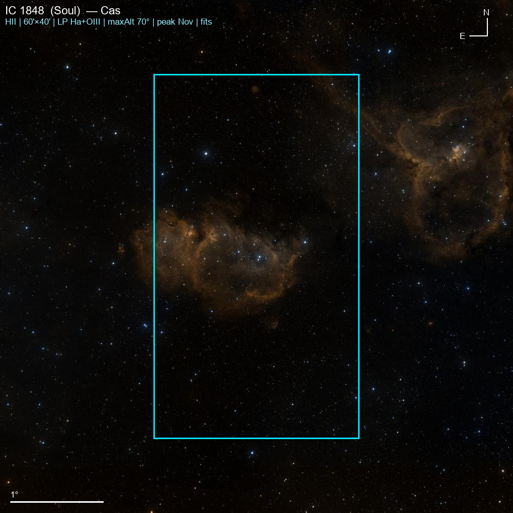

- **Coords (J2000):** 02h51m25s +60°25'  (42.855°, 60.419°) — *SIMBAD*
- **Type / size:** HII, 60'×40'  → **fits** in the S30 frame
- **Palette:** LP dual-band (Ha+OIII)
- **JC observability:** max altitude 70°, peaks ~Nov
- **Note:** pairs with Heart

## IC 405 — Flaming Star (+Tadpoles)  (Aur)

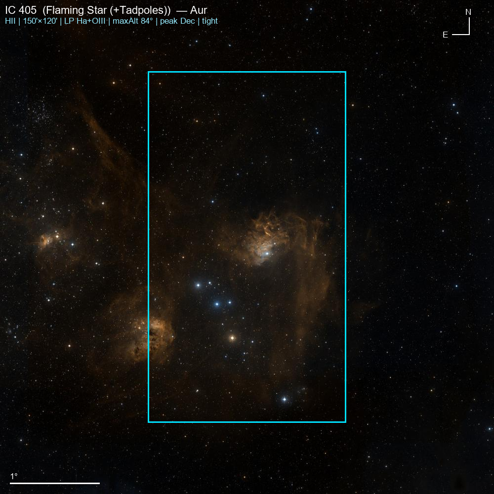

- **Coords (J2000):** 05h17m24s +34°22'  (79.35°, 34.383°) — *SIMBAD*
- **Type / size:** HII, 150'×120'  → **tight** in the S30 frame
- **Palette:** LP dual-band (Ha+OIII)
- **JC observability:** max altitude 84°, peaks ~Dec
- **Note:** IC405+IC410+IC417 Auriga trio; late-fall

## Simeis 147 — Spaghetti (Sh2-240)  (Tau)

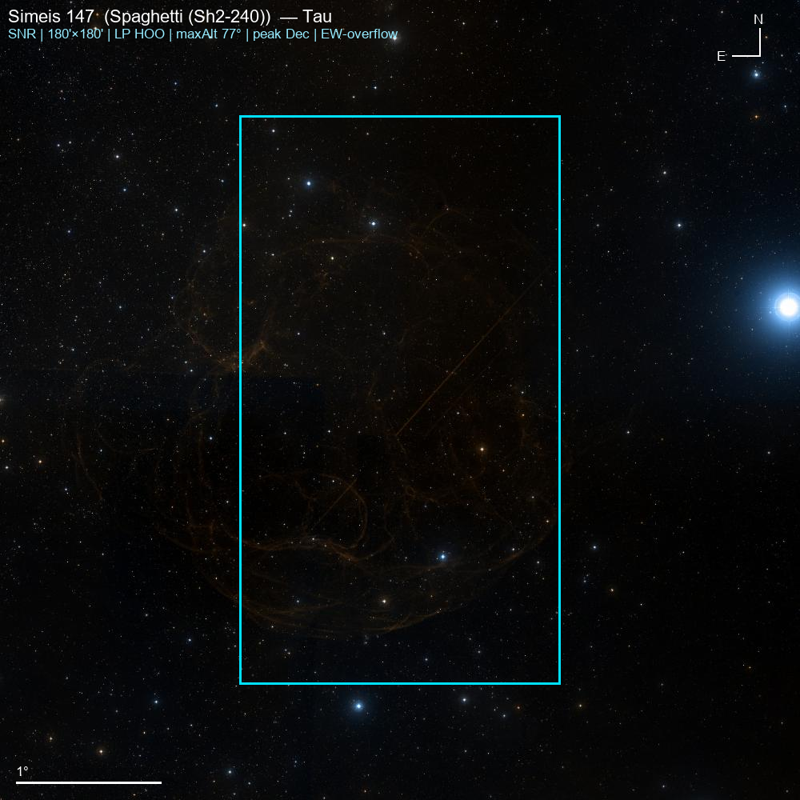

- **Coords (J2000):** 05h38m28s +28°00'  (84.62°, 28.0°) — *fallback*
- **Type / size:** SNR, 180'×180'  → **EW-overflow** in the S30 frame
- **Palette:** LP dual-band (HOO)
- **JC observability:** max altitude 77°, peaks ~Dec
- **Note:** huge faint SNR ~3° round — overflows E-W; dark-site only; late fall

## IC 443 — Jellyfish  (Gem)

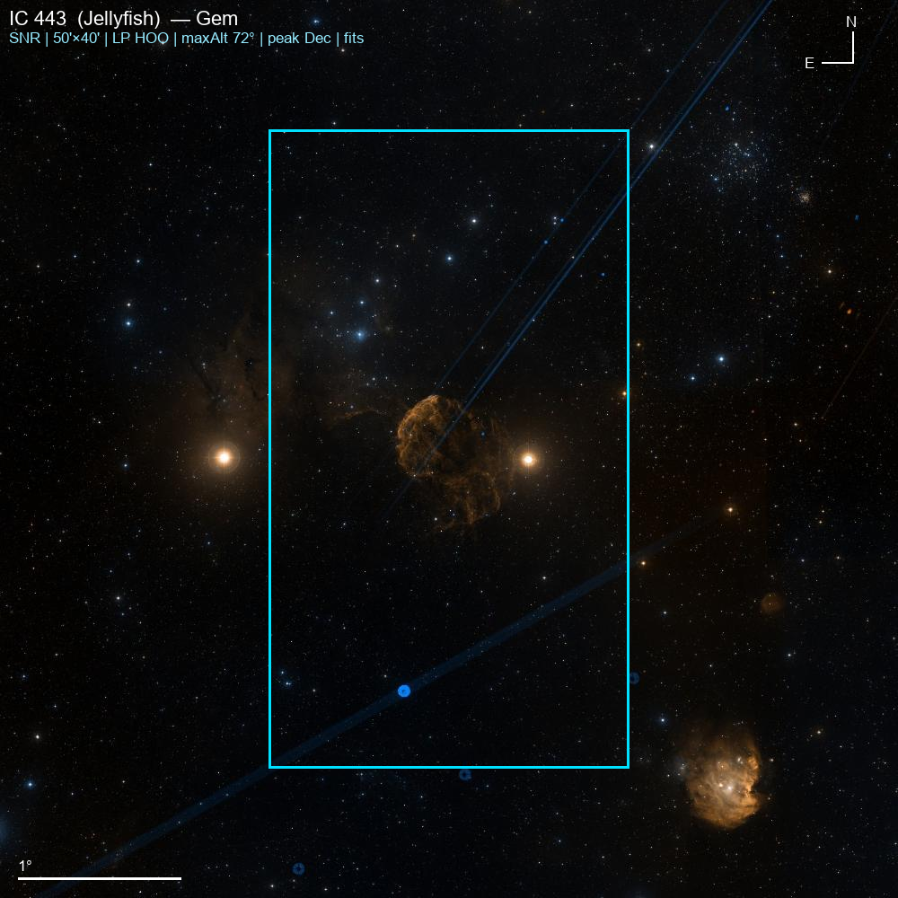

- **Coords (J2000):** 06h16m59s +22°34'  (94.25°, 22.57°) — *SIMBAD*
- **Type / size:** SNR, 50'×40'  → **fits** in the S30 frame
- **Palette:** LP dual-band (HOO)
- **JC observability:** max altitude 72°, peaks ~Dec
- **Note:** SNR; fall/winter

## M1 — Crab  (Tau)

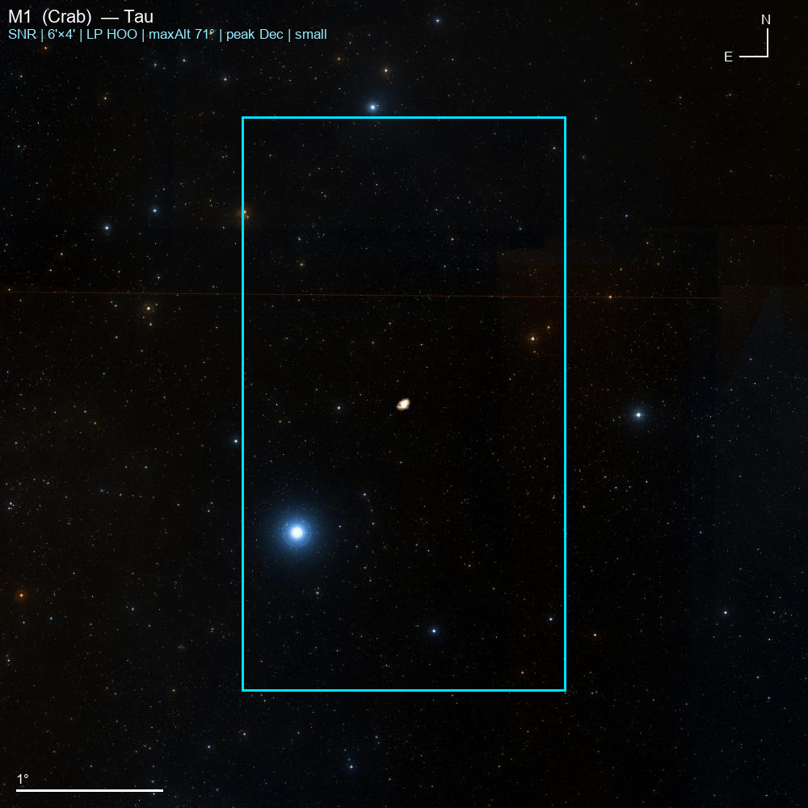

- **Coords (J2000):** 05h34m31s +22°01'  (83.632°, 22.017°) — *SIMBAD*
- **Type / size:** SNR, 6'×4'  → **small** in the S30 frame
- **Palette:** LP dual-band (HOO)
- **JC observability:** max altitude 71°, peaks ~Dec
- **Note:** SMALL/tiny — long-FL target

## NGC 2174 — Monkey Head  (Ori)

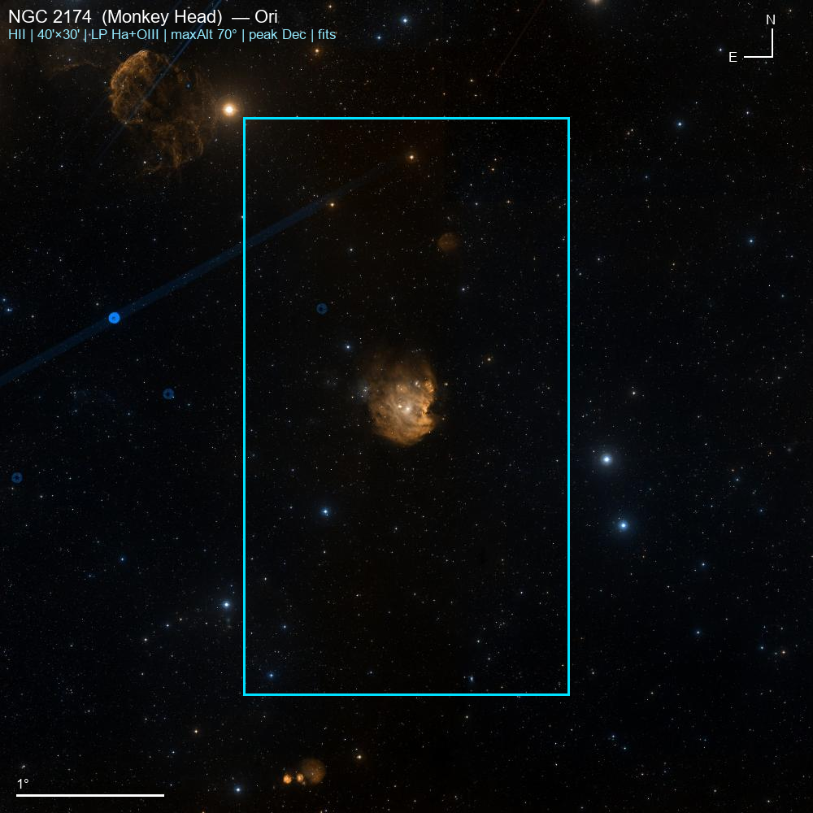

- **Coords (J2000):** 06h09m42s +20°30'  (92.425°, 20.5°) — *SIMBAD*
- **Type / size:** HII, 40'×30'  → **fits** in the S30 frame
- **Palette:** LP dual-band (Ha+OIII)
- **JC observability:** max altitude 70°, peaks ~Dec
- **Note:** fall/winter

## NGC 2264 — Christmas Tree / Cone  (Mon)

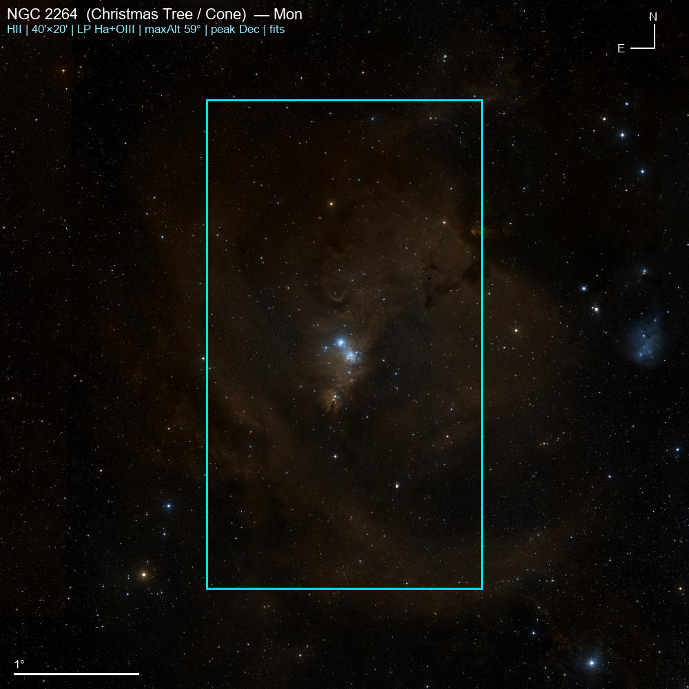

- **Coords (J2000):** 06h40m52s +09°52'  (100.217°, 9.877°) — *SIMBAD*
- **Type / size:** HII, 40'×20'  → **fits** in the S30 frame
- **Palette:** LP dual-band (Ha+OIII)
- **JC observability:** max altitude 59°, peaks ~Dec
- **Note:** cluster + Cone; late fall

## NGC 2237 — Rosette  (Mon)

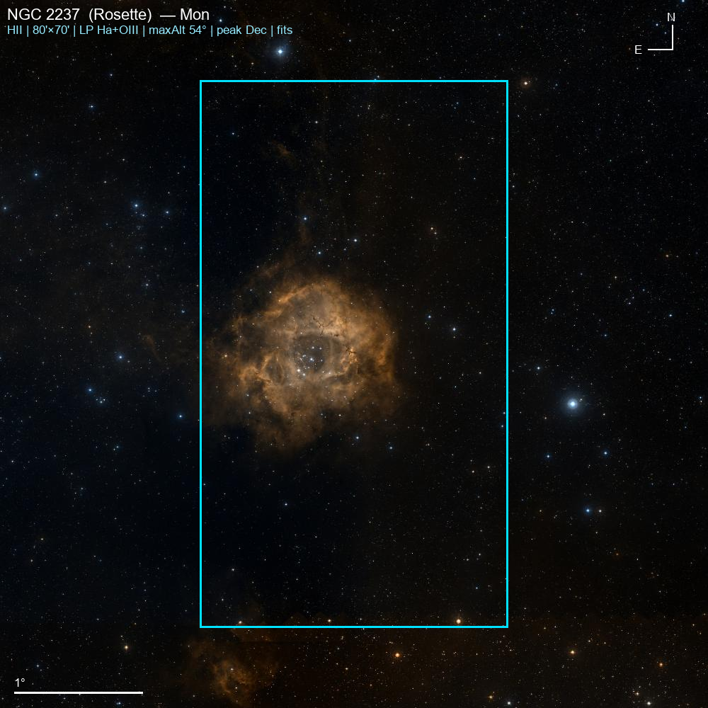

- **Coords (J2000):** 06h30m36s +04°58'  (97.65°, 4.981°) — *SIMBAD*
- **Type / size:** HII, 80'×70'  → **fits** in the S30 frame
- **Palette:** LP dual-band (Ha+OIII)
- **JC observability:** max altitude 54°, peaks ~Dec
- **Note:** fits well; low alt from JC; late fall

## IC 434 — Belt: Flame+Horsehead  (Ori)

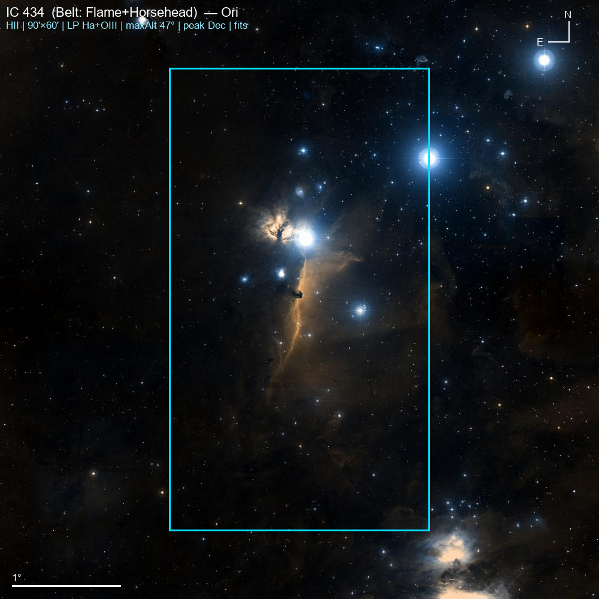

- **Coords (J2000):** 05h41m00s -02°30'  (85.25°, -2.5°) — *SIMBAD*
- **Type / size:** HII, 90'×60'  → **fits** in the S30 frame
- **Palette:** LP dual-band (Ha+OIII)
- **JC observability:** max altitude 47°, peaks ~Dec
- **Note:** Alnitak/Flame/Horsehead region

## M42 — Orion Nebula (+Running Man)  (Ori)

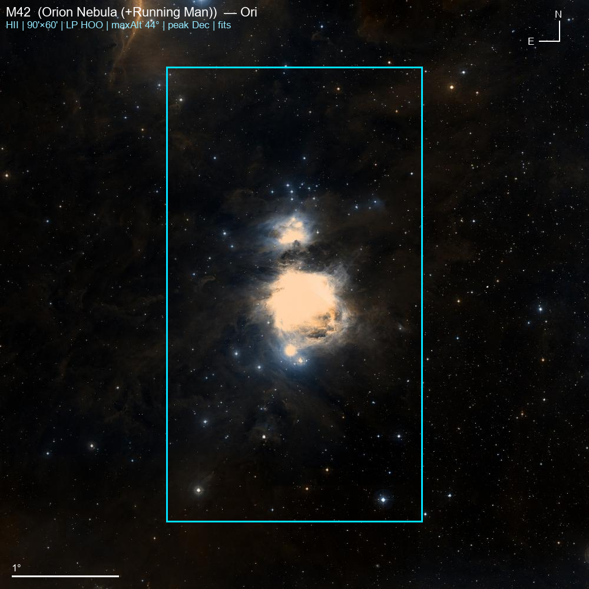

- **Coords (J2000):** 05h35m16s -05°23'  (83.82°, -5.388°) — *SIMBAD*
- **Type / size:** HII, 90'×60'  → **fits** in the S30 frame
- **Palette:** LP dual-band (HOO)
- **JC observability:** max altitude 44°, peaks ~Dec
- **Note:** flagship winter; M42+M43+NGC1977 one frame

## IC 2177 — Seagull  (CMa)

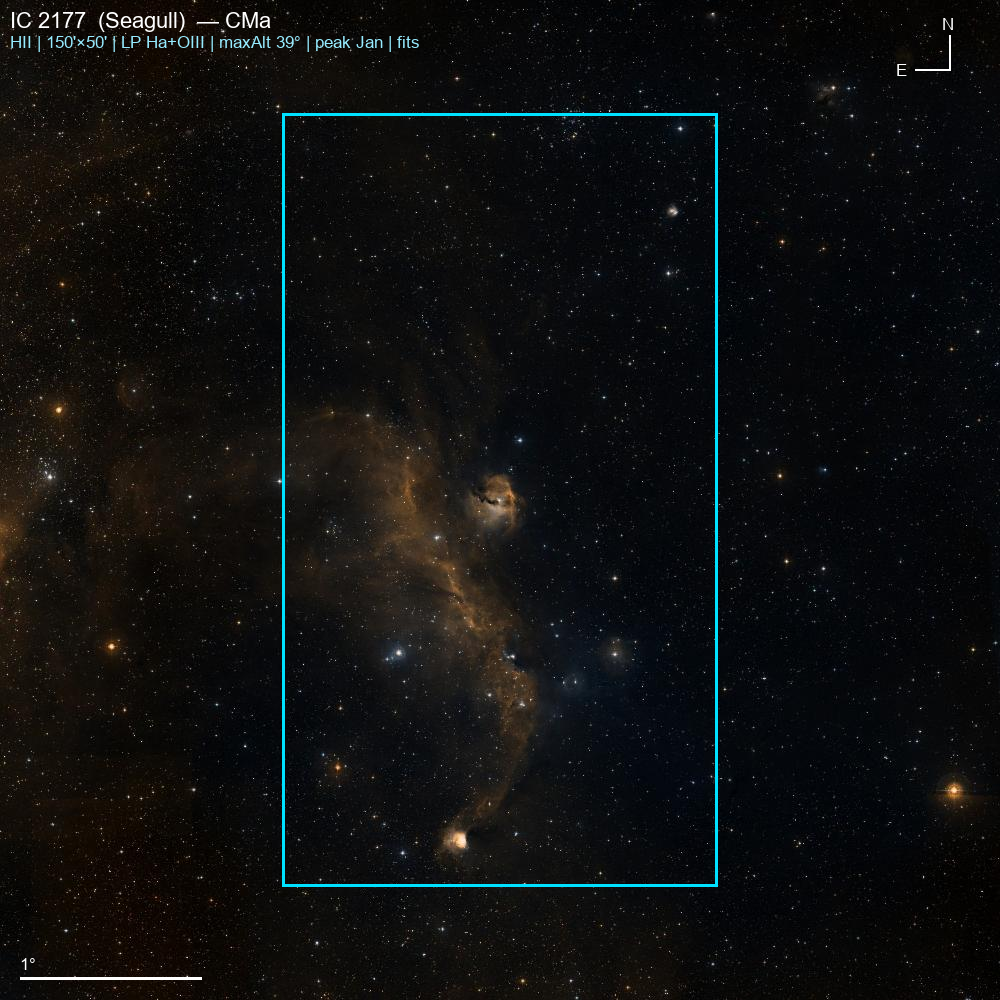

- **Coords (J2000):** 07h04m24s -10°27'  (106.104°, -10.455°) — *SIMBAD*
- **Type / size:** HII, 150'×50'  → **fits** in the S30 frame
- **Palette:** LP dual-band (Ha+OIII)
- **JC observability:** max altitude 39°, peaks ~Jan
- **Note:** low from JC (~39°); spans the wide frame

## NGC 2359 — Thor's Helmet  (CMa)

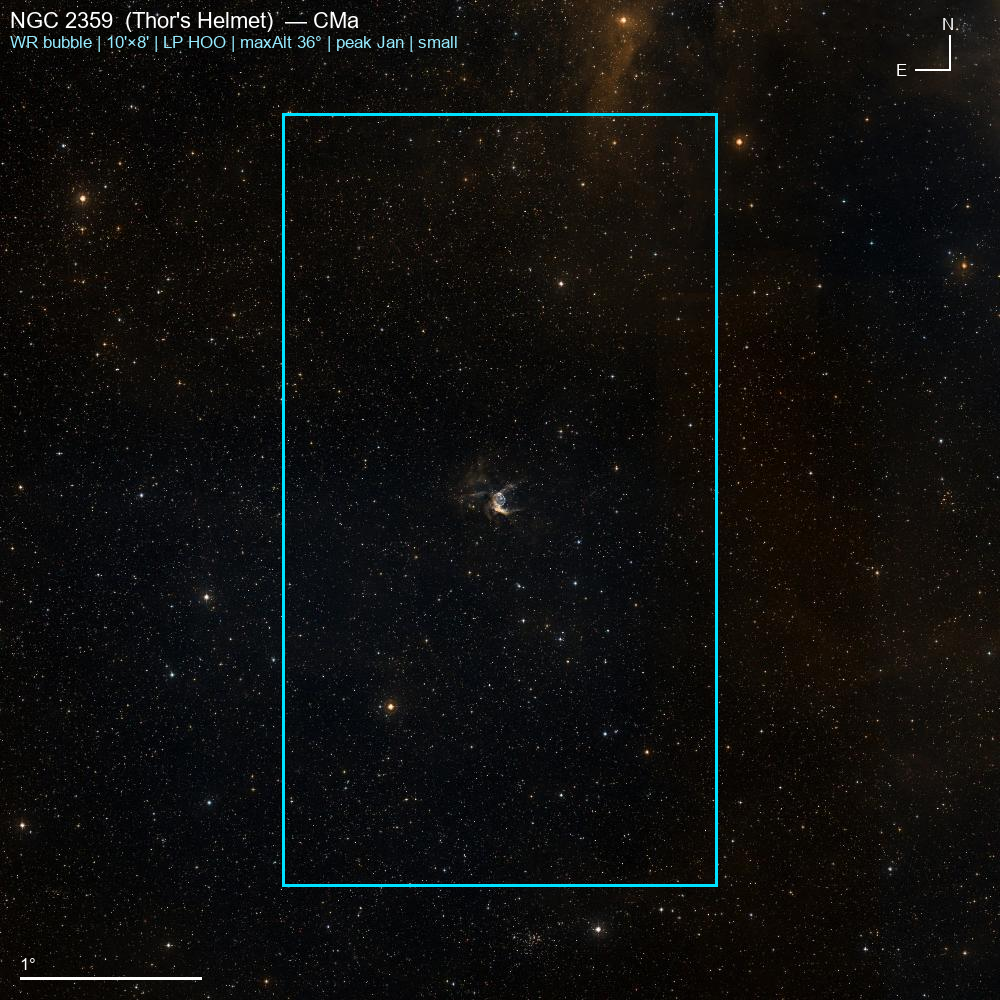

- **Coords (J2000):** 07h18m30s -13°13'  (109.625°, -13.227°) — *SIMBAD*
- **Type / size:** WR bubble, 10'×8'  → **small** in the S30 frame
- **Palette:** LP dual-band (HOO)
- **JC observability:** max altitude 36°, peaks ~Jan
- **Note:** SMALL+low — Esprit/long-FL target
