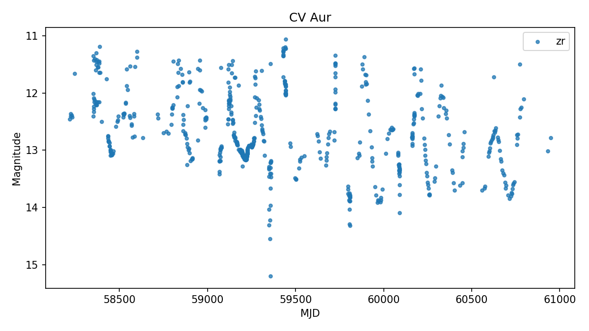
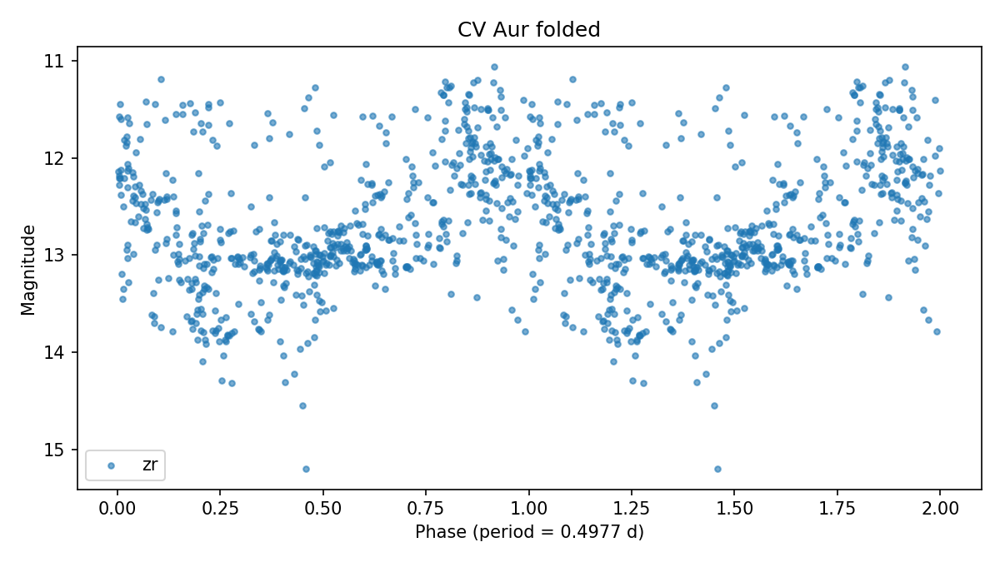

# CV Aur

Score: **93.0**  
Observable from: **Fairbanks**

## Catalog

- VSX type: `LB:`
- Coordinates: RA `99.98992`, Dec `44.04022`
- Catalog photometry: range `14.400-15.600` (pg/pg)
- Catalog amplitude: `1.200` mag
- Period: `` days
- Spectral type: `blank`
- Galactic latitude: `16.6 deg`
- VSX: https://www.aavso.org/vsx/index.php?view=detail.top&oid=3884
- AAVSO finder chart: https://apps.aavso.org/vsp/photometry/?star=CV+Aur&type=chart&fov=900&maglimit=15&resolution=150&north=up&east=left

## Observability from Fairbanks (best)

- Max altitude in dark window: `53.6 deg`
- Best single-night dark time above altitude floor: `330 min`
- Best window date: `2026-09-25`
- Best sampled local time: `2026-09-26T04:30:00-08:00`

## Observing Strategy

- Long-cadence follow-up: one calibrated point every clear night or two is useful; weekly cadence is still worthwhile for slow red variables.

## Why It Was Flagged

- max altitude 53.6 deg from Fairbanks
- long nightly window from Fairbanks
- uncertain or broad VSX type (LB:)
- classical GCVS variable, suitable for practice and follow-up
- catalog amplitude about 1.20 mag
- bright enough for Fairbanks (14.40)
- no catalog period listed
- well away from Galactic plane (b=16.6 deg)
- AAVSO recent-coverage check unavailable

## AAVSO Recent Coverage

- Status: `unavailable`
- Recent observations: not available (status above).
- Note: 405 Client Error: Not Allowed for url: https://vsx.aavso.org/index.php?view=api.object&ident=CV+Aur&data=50000&fromjd=2460435.08672&tojd=2461165.08672&csv=&band=V%2CVis.%2CCV%2CTG%2CB%2CR%2CI&mtype=std

## SIMBAD Context

- Status: `ok`
- Main ID: `V* CV Aur`
- Object type: `LP*`
- Match separation: `0.146` arcsec
- Search: https://simbad.cds.unistra.fr/simbad/sim-coo?Coord=99.989920+44.040220&Radius=5.0&Radius.unit=arcsec
- Other IDs: `TIC 274217494`, `Gaia DR3 964233871784567552`, `SV* HV  7658`, `SV* P  2870`, `V* CV Aur`, `2MASS J06395757+4402247`, `Gaia DR2 964233871784567552`, `LAMOST J063957.56+440224.7`

## Gaia DR3 Context

- Status: `ok`
- Source ID: `964233871784567552`
- G magnitude: `12.123`
- BP-RP color: `3.067`
- Parallax: `0.260` +/- `0.044` mas
- RUWE: `1.327`
- Gaia photometric variability flag: `VARIABLE`
- Match separation: `0.142` arcsec
- IPD multi-peak fraction: `0.000`

## ZTF Enrichment

- Status: `ok`
- Observations parsed: `649`
- Bands: `zr`
- Median magnitude: `12.842`
- 5-95 percentile amplitude: `2.275` mag
- Lomb-Scargle period: `0.4977` d (peak power `0.286`)
- ZTF period derived; no VSX catalog period to compare against.

## Human Review Checklist

- Check VSX and SIMBAD for newer notes or duplicate names.
- Inspect DSS/Pan-STARRS imagery for crowding and bright nearby stars.
- Verify AAVSO comparison stars are available in the field.
- Decide cadence: single nightly point, weekly monitoring, or continuous time-series.
- Treat this as a follow-up candidate, not a discovery claim.
