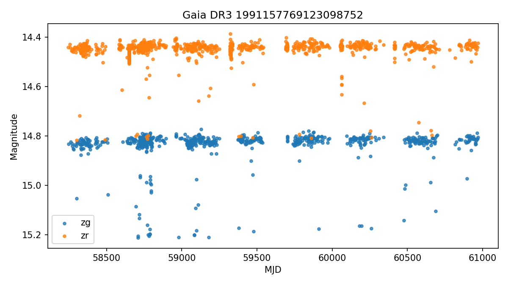
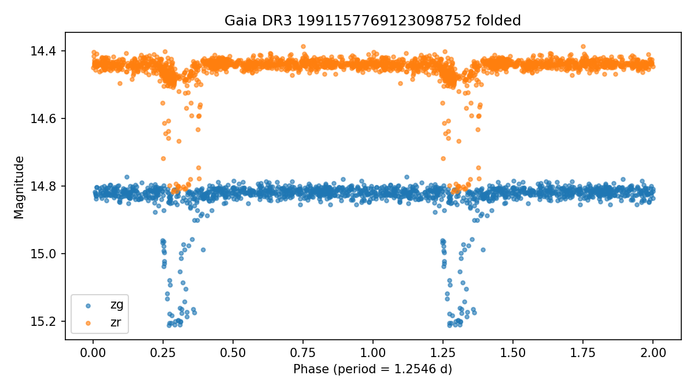

# Gaia DR3 1991157769123098752

Score: **101.0**  
Observable from: **Fairbanks**

## Catalog

- VSX type: `VAR`
- Coordinates: RA `350.21872`, Dec `49.91456`
- Catalog photometry: range `14.450-14.830` (G/G)
- Catalog amplitude: `0.380` mag
- Period: `0.02588320` days
- Spectral type: `F`
- Galactic latitude: `-10.4 deg`
- VSX: https://www.aavso.org/vsx/index.php?view=detail.top&oid=10867466
- AAVSO finder chart: https://apps.aavso.org/vsp/photometry/?star=Gaia+DR3+1991157769123098752&type=chart&fov=900&maglimit=15&resolution=150&north=up&east=left

## Observability from Fairbanks (best)

- Max altitude in dark window: `75.1 deg`
- Best single-night dark time above altitude floor: `420 min`
- Best window date: `2026-09-23`
- Best sampled local time: `2026-09-24T01:00:00-08:00`

## Observing Strategy

- Time-series follow-up: run continuously for 2-4 hours when the target is high, then compare the folded light curve against the VSX period.

## Why It Was Flagged

- max altitude 75.1 deg from Fairbanks
- long nightly window from Fairbanks
- uncertain or broad VSX type (VAR)
- survey-designated object, good data-mining follow-up candidate
- catalog amplitude about 0.38 mag
- bright enough for Fairbanks (14.45)
- well away from Galactic plane (b=-10.4 deg)
- AAVSO recent-coverage check unavailable

## AAVSO Recent Coverage

- Status: `unavailable`
- Recent observations: not available (status above).
- Note: 405 Client Error: Not Allowed for url: https://vsx.aavso.org/index.php?view=api.object&ident=Gaia+DR3+1991157769123098752&data=50000&fromjd=2460435.08668&tojd=2461165.08668&csv=&band=V%2CVis.%2CCV%2CTG%2CB%2CR%2CI&mtype=std

## SIMBAD Context

- Status: `no-match`
- Main ID: `n/a`
- Object type: `n/a`
- Match separation: `` arcsec
- Search: https://simbad.cds.unistra.fr/simbad/sim-coo?Coord=350.218720+49.914560&Radius=5.0&Radius.unit=arcsec

## Gaia DR3 Context

- Status: `ok`
- Source ID: `1991157769123098752`
- G magnitude: `14.461`
- BP-RP color: `0.786`
- Parallax: `0.750` +/- `0.017` mas
- RUWE: `1.057`
- Gaia photometric variability flag: `VARIABLE`
- Match separation: `` arcsec
- IPD multi-peak fraction: `0.000`

## ZTF Enrichment

- Status: `ok`
- Observations parsed: `1940`
- Bands: `zg, zr`
- Median magnitude: `14.457`
- 5-95 percentile amplitude: `0.415` mag
- Lomb-Scargle period: `1.2546` d (peak power `0.118`)
- Period agreement: not assessable (catalog period 0.0259 d is below the searched minimum (0.10 d); cannot assess agreement)

## Human Review Checklist

- Check VSX and SIMBAD for newer notes or duplicate names.
- Inspect DSS/Pan-STARRS imagery for crowding and bright nearby stars.
- Verify AAVSO comparison stars are available in the field.
- Decide cadence: single nightly point, weekly monitoring, or continuous time-series.
- Treat this as a follow-up candidate, not a discovery claim.
