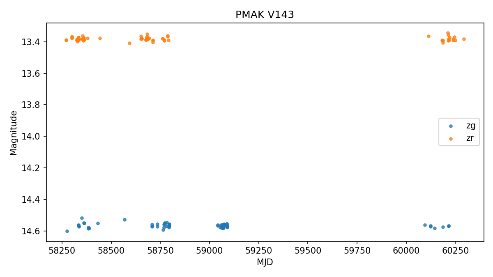
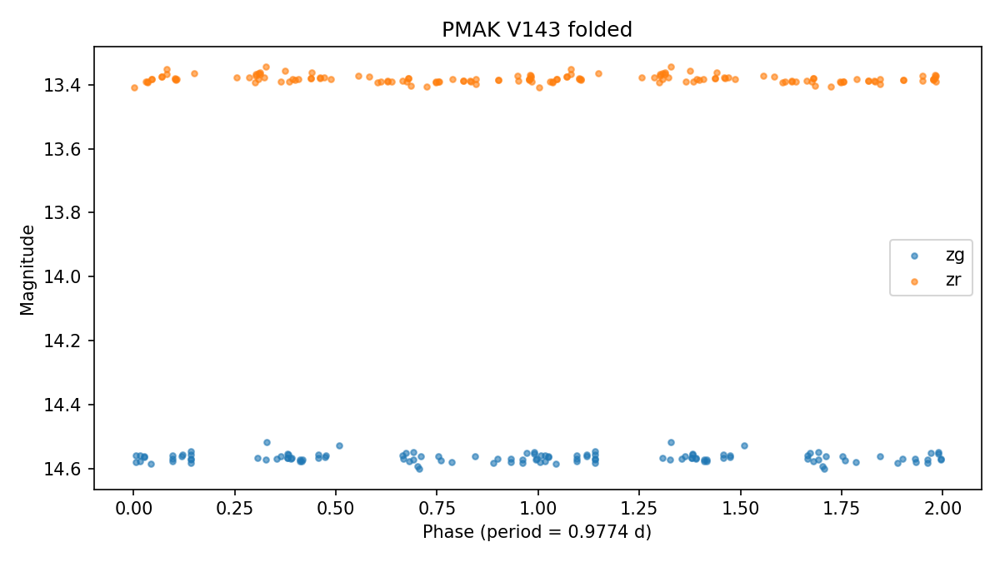

# PMAK V143

Score: **91.0**  
Observable from: **Fairbanks**

## Catalog

- VSX type: `ROT:`
- Coordinates: RA `308.19009`, Dec `60.16806`
- Catalog photometry: bright `13.950` V; amplitude `0.120` mag TESS
- Catalog amplitude: `0.120` mag
- Period: `14.09000000` days
- Spectral type: `K`
- Galactic latitude: `11.9 deg`
- VSX: https://www.aavso.org/vsx/index.php?view=detail.top&oid=10867887
- AAVSO finder chart: https://apps.aavso.org/vsp/photometry/?star=PMAK+V143&type=chart&fov=900&maglimit=15&resolution=150&north=up&east=left

## Observability from Fairbanks (best)

- Max altitude in dark window: `85.3 deg`
- Best single-night dark time above altitude floor: `420 min`
- Best window date: `2026-09-18`
- Best sampled local time: `2026-09-18T22:30:00-08:00`

## Observing Strategy

- Long-cadence follow-up: one calibrated point every clear night or two is useful; weekly cadence is still worthwhile for slow red variables.

## Why It Was Flagged

- max altitude 85.3 deg from Fairbanks
- long nightly window from Fairbanks
- uncertain or broad VSX type (ROT:)
- modest catalog amplitude about 0.12 mag
- bright enough for Fairbanks (13.95)
- long-period cadence friendly (14.09 d)
- well away from Galactic plane (b=11.9 deg)
- AAVSO recent-coverage check unavailable

## AAVSO Recent Coverage

- Status: `unavailable`
- Recent observations: not available (status above).
- Note: 405 Client Error: Not Allowed for url: https://vsx.aavso.org/index.php?view=api.object&ident=PMAK+V143&data=50000&fromjd=2460435.08673&tojd=2461165.08673&csv=&band=V%2CVis.%2CCV%2CTG%2CB%2CR%2CI&mtype=std

## SIMBAD Context

- Not requested for this run.

## Gaia DR3 Context

- Status: `ok`
- Source ID: `2194515296538889472`
- G magnitude: `13.443`
- BP-RP color: `1.610`
- Parallax: `0.379` +/- `0.011` mas
- RUWE: `1.044`
- Gaia photometric variability flag: `not flagged`
- Match separation: `0.072` arcsec
- IPD multi-peak fraction: `0.000`

## ZTF Enrichment

- Status: `ok`
- Observations parsed: `135`
- Bands: `zg, zr`
- Median magnitude: `13.393`
- 5-95 percentile amplitude: `1.212` mag
- Lomb-Scargle period: `0.9774` d (peak power `0.140`)
- Period agreement: not assessable (Lomb-Scargle peak power 0.140 is below the confidence threshold 0.3; period not trusted)

## Human Review Checklist

- Check VSX and SIMBAD for newer notes or duplicate names.
- Inspect DSS/Pan-STARRS imagery for crowding and bright nearby stars.
- Verify AAVSO comparison stars are available in the field.
- Decide cadence: single nightly point, weekly monitoring, or continuous time-series.
- Treat this as a follow-up candidate, not a discovery claim.
