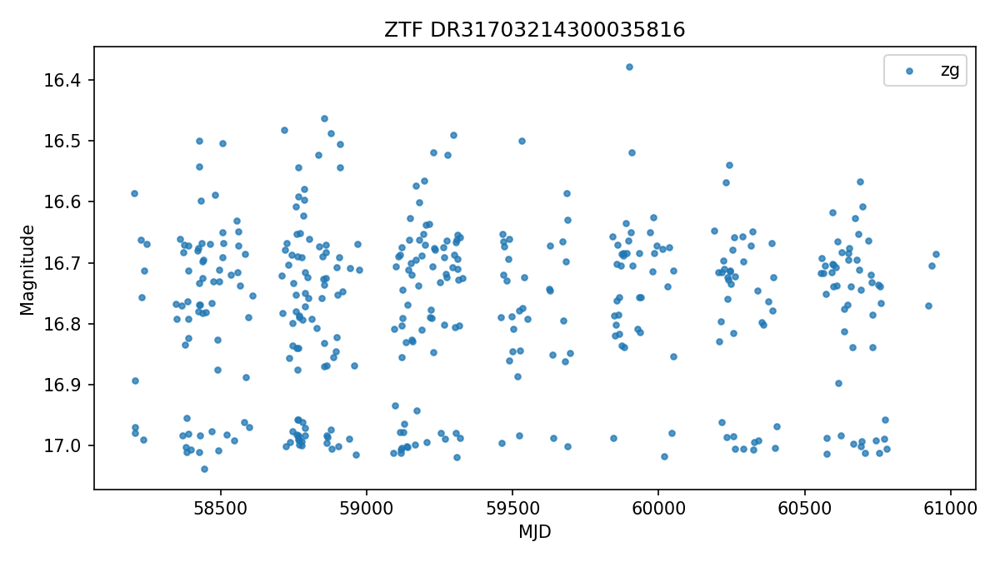
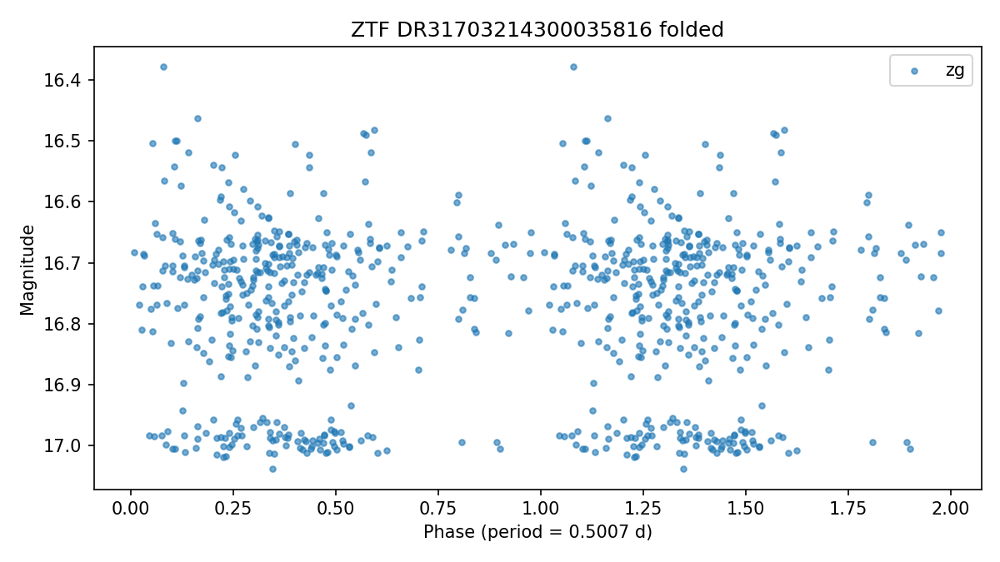

# ZTF DR31703214300035816

Score: **92.0**  
Observable from: **Fairbanks**

## Catalog

- VSX type: `RR:`
- Coordinates: RA `97.01144`, Dec `38.97087`
- Catalog photometry: range `16.270-` (r/)
- Catalog amplitude: `` mag
- Period: `0.44724900` days
- Spectral type: `blank`
- Galactic latitude: `12.5 deg`
- VSX: https://www.aavso.org/vsx/index.php?view=detail.top&oid=10872531
- AAVSO finder chart: https://apps.aavso.org/vsp/photometry/?star=ZTF+DR31703214300035816&type=chart&fov=900&maglimit=15&resolution=150&north=up&east=left

## Observability from Fairbanks (best)

- Max altitude in dark window: `50.6 deg`
- Best single-night dark time above altitude floor: `270 min`
- Best window date: `2026-09-25`
- Best sampled local time: `2026-09-26T04:30:00-08:00`

## Observing Strategy

- Time-series follow-up: run continuously for 2-4 hours when the target is high, then compare the folded light curve against the VSX period.

## Why It Was Flagged

- max altitude 50.6 deg from Fairbanks
- long nightly window from Fairbanks
- uncertain or broad VSX type (RR:)
- survey-designated object, good data-mining follow-up candidate
- bright enough for Fairbanks (16.27)
- time-series candidate (0.4472 d)
- well away from Galactic plane (b=12.5 deg)
- AAVSO recent-coverage check unavailable

## AAVSO Recent Coverage

- Status: `unavailable`
- Recent observations: not available (status above).
- Note: 405 Client Error: Not Allowed for url: https://vsx.aavso.org/index.php?view=api.object&ident=ZTF+DR31703214300035816&data=50000&fromjd=2460435.08673&tojd=2461165.08673&csv=&band=V%2CVis.%2CCV%2CTG%2CB%2CR%2CI&mtype=std

## SIMBAD Context

- Not requested for this run.

## Gaia DR3 Context

- Status: `ok`
- Source ID: `955756151802180352`
- G magnitude: `16.631`
- BP-RP color: `1.062`
- Parallax: `0.629` +/- `0.062` mas
- RUWE: `0.890`
- Gaia photometric variability flag: `not flagged`
- Match separation: `0.020` arcsec
- IPD multi-peak fraction: `0.000`

## ZTF Enrichment

- Status: `ok`
- Observations parsed: `406`
- Bands: `zg`
- Median magnitude: `16.743`
- 5-95 percentile amplitude: `0.428` mag
- Lomb-Scargle period: `0.5007` d (peak power `0.062`)
- Period agreement: not assessable (Lomb-Scargle peak power 0.062 is below the confidence threshold 0.3; period not trusted)

## Human Review Checklist

- Check VSX and SIMBAD for newer notes or duplicate names.
- Inspect DSS/Pan-STARRS imagery for crowding and bright nearby stars.
- Verify AAVSO comparison stars are available in the field.
- Decide cadence: single nightly point, weekly monitoring, or continuous time-series.
- Treat this as a follow-up candidate, not a discovery claim.
