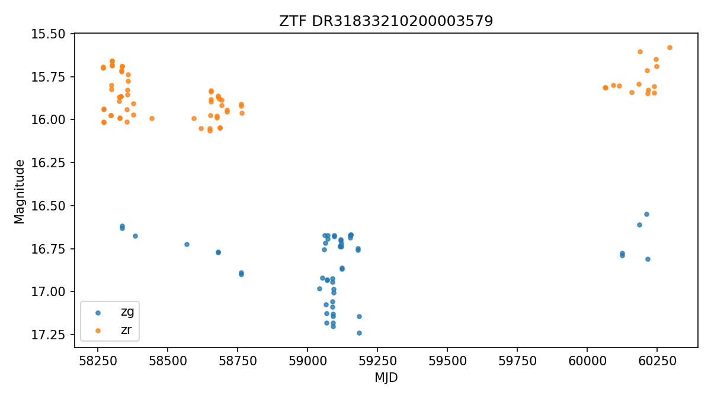
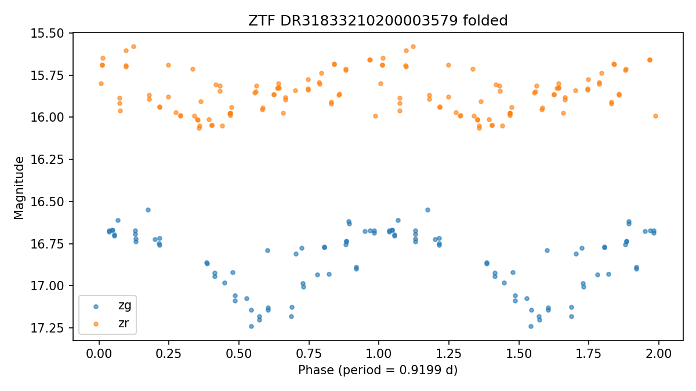

# ZTF DR31833210200003579

Score: **110.0**  
Observable from: **Fairbanks**

## Catalog

- VSX type: `RR:`
- Coordinates: RA `295.31824`, Dec `60.20270`
- Catalog photometry: range `15.860-` (r/)
- Catalog amplitude: `` mag
- Period: `0.53127100` days
- Spectral type: `blank`
- Galactic latitude: `17.5 deg`
- VSX: https://www.aavso.org/vsx/index.php?view=detail.top&oid=10875056
- AAVSO finder chart: https://apps.aavso.org/vsp/photometry/?star=ZTF+DR31833210200003579&type=chart&fov=900&maglimit=15&resolution=150&north=up&east=left

## Observability from Fairbanks (best)

- Max altitude in dark window: `84.8 deg`
- Best single-night dark time above altitude floor: `420 min`
- Best window date: `2026-09-18`
- Best sampled local time: `2026-09-18T22:00:00-08:00`

## Observing Strategy

- Time-series follow-up: run continuously for 2-4 hours when the target is high, then compare the folded light curve against the VSX period.

## Why It Was Flagged

- max altitude 84.8 deg from Fairbanks
- long nightly window from Fairbanks
- uncertain or broad VSX type (RR:)
- survey-designated object, good data-mining follow-up candidate
- bright enough for Fairbanks (15.86)
- time-series candidate (0.5313 d)
- well away from Galactic plane (b=17.5 deg)
- AAVSO recent-coverage check unavailable
- ZTF period 0.9199 d disagrees with catalog 0.531 d

## AAVSO Recent Coverage

- Status: `unavailable`
- Recent observations: not available (status above).
- Note: 405 Client Error: Not Allowed for url: https://vsx.aavso.org/index.php?view=api.object&ident=ZTF+DR31833210200003579&data=50000&fromjd=2460435.08672&tojd=2461165.08672&csv=&band=V%2CVis.%2CCV%2CTG%2CB%2CR%2CI&mtype=std

## SIMBAD Context

- Status: `ok`
- Main ID: `ATO J295.3182+60.2027`
- Object type: `Pu*`
- Match separation: `0.038` arcsec
- Search: https://simbad.cds.unistra.fr/simbad/sim-coo?Coord=295.318240+60.202700&Radius=5.0&Radius.unit=arcsec
- Other IDs: `Gaia DR2 2239067885651037056`, `2MASS J19411637+6012098`, `UCAC4 752-058260`, `WISE J194116.36+601209.8`, `ATO J295.3182+60.2027`, `WISEA J194116.37+601209.8`, `Gaia DR3 2239067885651037056`

## Gaia DR3 Context

- Status: `ok`
- Source ID: `2239067885651037056`
- G magnitude: `15.895`
- BP-RP color: `1.419`
- Parallax: `0.494` +/- `0.031` mas
- RUWE: `1.113`
- Gaia photometric variability flag: `not flagged`
- Match separation: `0.008` arcsec
- IPD multi-peak fraction: `0.000`

## ZTF Enrichment

- Status: `ok`
- Observations parsed: `124`
- Bands: `zg, zr`
- Median magnitude: `15.993`
- 5-95 percentile amplitude: `1.445` mag
- Lomb-Scargle period: `0.9199` d (peak power `0.384`)
- **Period disagrees with VSX catalog** - flagged as a real anomaly signal.

## Human Review Checklist

- Check VSX and SIMBAD for newer notes or duplicate names.
- Inspect DSS/Pan-STARRS imagery for crowding and bright nearby stars.
- Verify AAVSO comparison stars are available in the field.
- Decide cadence: single nightly point, weekly monitoring, or continuous time-series.
- Treat this as a follow-up candidate, not a discovery claim.
