# Catskills dark-site trip book — S30 Pro + Esprit 80, one night, one menu

Built for **Sat June 13, 2026** (astro dark 22:50→03:05 EDT, 2% moon below the horizon
all night — see `../plan.md` for the committed primaries). Every chart carries **both**
rig footprints: **cyan = S30 Pro** (3.91°×2.20° measured, fixed long axis ≈N–S),
**green = Esprit 80 ED** (3.37°×2.25°, rotated to the suggested PA). Same sky, two
instruments — pick per target, not per book.

Where a famous **JWST / Hubble** frame of the object exists it's included for scale-awe:
your wide field contains the whole object; Webb's contains a couple of light-years of it.
Space images are NASA/ESA/CSA/STScI releases (CC BY 4.0), credited per image, linked to
their release pages.

| Target | What | Window | 23:00 | 01:00 | 03:00 | S30 Pro | Esprit 80 |
|---|---|---|---|---|---|---|---|
| M13 | Hercules Cluster | EARLY 22:50-00:30 | 75° | 79° | 57° | IR broadband, 30-60s | L (or LRGB), 60s — hold the core with GHS, not saturation |
| M101 | Pinwheel Galaxy | EARLY 22:50-00:30 | 71° | 54° | 37° | IR broadband (low SB — dark site only) | LRGB — the official plan-v2 early alternate |
| M51 | Whirlpool Galaxy | EARLY 22:50-00:00 | 68° | 48° | 29° | IR broadband (deep JC data exists — only the tidal halo is new) | LRGB if M101 is taken |
| M57 | Ring Nebula | QUICK GRAB after 23:00 | 49° | 71° | 78° | dot at 3.66"/px — skip or 15min novelty | ~85px at 1.94"/px — quick HOO snack, not a main course |
| IC 1396 | Elephant Trunk (full shell) | ALL NIGHT | 34° | 49° | 65° | PRIMARY: LP 60s (test 120s), full moonless window | tight at PA 0 (rim kiss) — the SHO version is a JC project, save dark time |
| NGC 7023 | Iris + vdB 141 Ghost | ALL NIGHT | 41° | 52° | 61° | IR broadband: the whole dusty field, small scale | PRIMARY: LRGB — RGB 22:50-00:50, L 00:50-03:05 (plan v2) |
| NGC 7000 | North America + Pelican | ALL NIGHT riser | 33° | 53° | 74° | combo in ONE frame — spans ~2.2° E-W = exactly the frame, center carefully | green box = NA alone (the combo overflows the 80) |
| NGC 6960 | Western Veil (Witch's Broom) | RISER 00:00+ | 28° | 50° | 71° | single frame, LP — or revive the shelved 2-panel full-loop kit | HOO: ~1.5h Ha + 1.5h OIII fits the window |
| NGC 6888 | Crescent Nebula | ALL NIGHT | 38° | 59° | 82° | small — context frame only | HOO/SHO — you HAVE JC data; dark site adds the faint OIII envelope |
| IC 5146 | Cocoon + B168 dark river | RISER 00:30+ | 27° | 45° | 65° | IR broadband — LP would erase the dark river | LRGB at PA~105: the river flows along the long axis |
| Sh2-129 | Flying Bat + OU4 Squid | ALL NIGHT | 38° | 52° | 66° | LP long stare — SAMPLE it (the real Squid wants 6h+ of OIII) | OIII-only if feeling brave |
| NGC 6946 | Fireworks Galaxy + NGC 6939 | ALL NIGHT | 42° | 57° | 69° | IR broadband, both in frame | LRGB — galaxy + cluster pair composition |
| M16 + M17 | Eagle + Swan, ONE frame | SOUTH WINDOW 00:30-02:30 | 21° | 32° | 31° | the killer frame: pair is N-S = made for the fixed long axis, LP | fits at PA 0 (2.9° vs 3.37°) if the S30 is on IC 1396 |
| M8 + M20 | Lagoon + Trifid | SOUTH WINDOW ~00:30-01:30, VERY low | 15° | 24° | 21° | both in one frame, LP, brief | skip — airmass eats 1.94"/px resolution |
| M27 | Dumbbell Nebula | LATE 02:00-03:05 | 32° | 54° | 70° | small | HOO quick hit — 250px across, bright, 30-45min is real data |

## M13 — Hercules Cluster

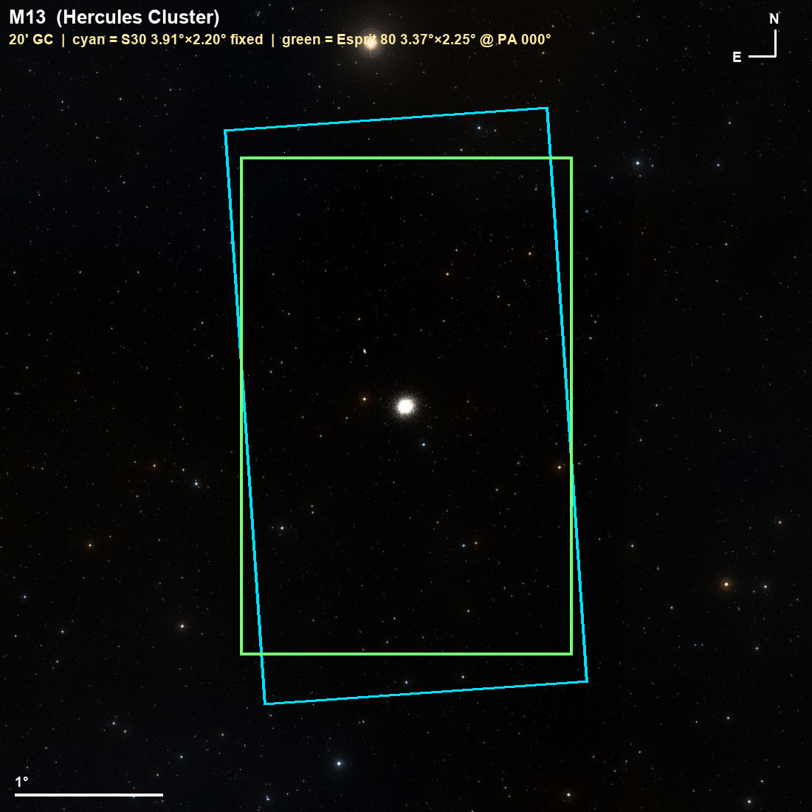

- **Center (J2000):** 250.42°, +36.46°  |  **Size:** 20' GC
- **Window:** EARLY 22:50-00:30 (high at dusk, sinking W)  |  **Alt 23:00/01:00/03:00:** 75°/79°/57°
- **S30 Pro:** IR broadband, 30-60s
- **Esprit 80:** L (or LRGB), 60s — hold the core with GHS, not saturation (PA 000°)
- **Why at a dark site:** resolved stars to the core; a dark sky doubles the outskirts

**Hubble** ([release](https://esahubble.org/images/opo0840a/)):

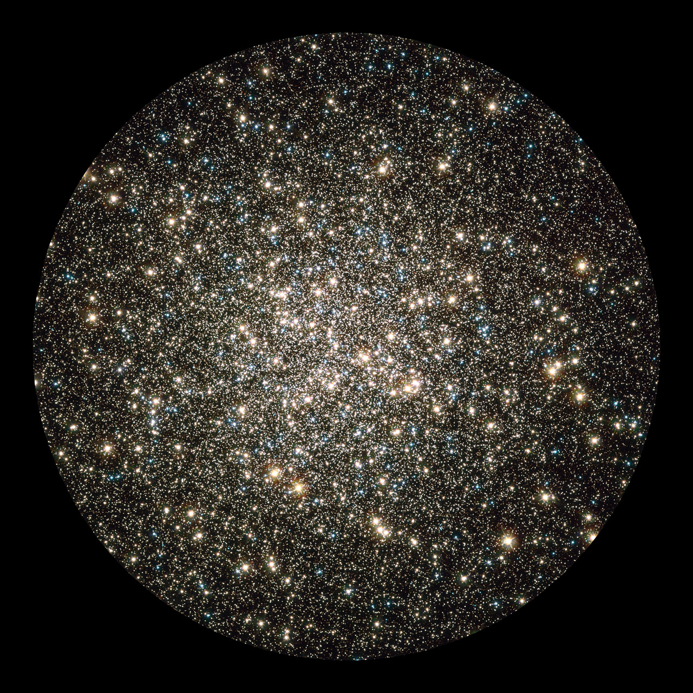

*Credit: NASA, ESA, and the Hubble Heritage Team (STScI/AURA)*

## M101 — Pinwheel Galaxy

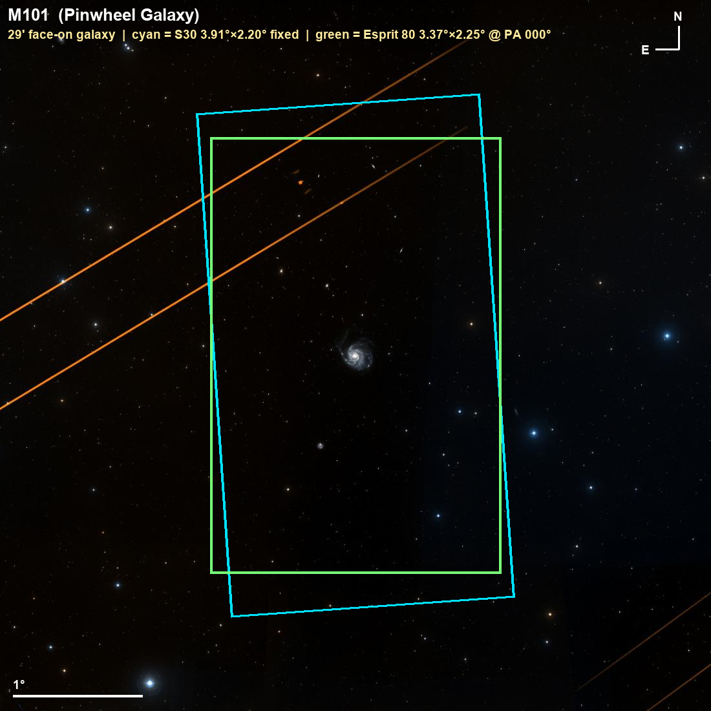

- **Center (J2000):** 210.80°, +54.35°  |  **Size:** 29' face-on galaxy
- **Window:** EARLY 22:50-00:30 (the plan's Esprit early block)  |  **Alt 23:00/01:00/03:00:** 71°/54°/37°
- **S30 Pro:** IR broadband (low SB — dark site only)
- **Esprit 80:** LRGB — the official plan-v2 early alternate (PA 000°)
- **Why at a dark site:** the canonical dark-site-only galaxy: mean SB ~23.9, invisible from JC

**Hubble** ([release](https://esahubble.org/images/heic0602a/)):

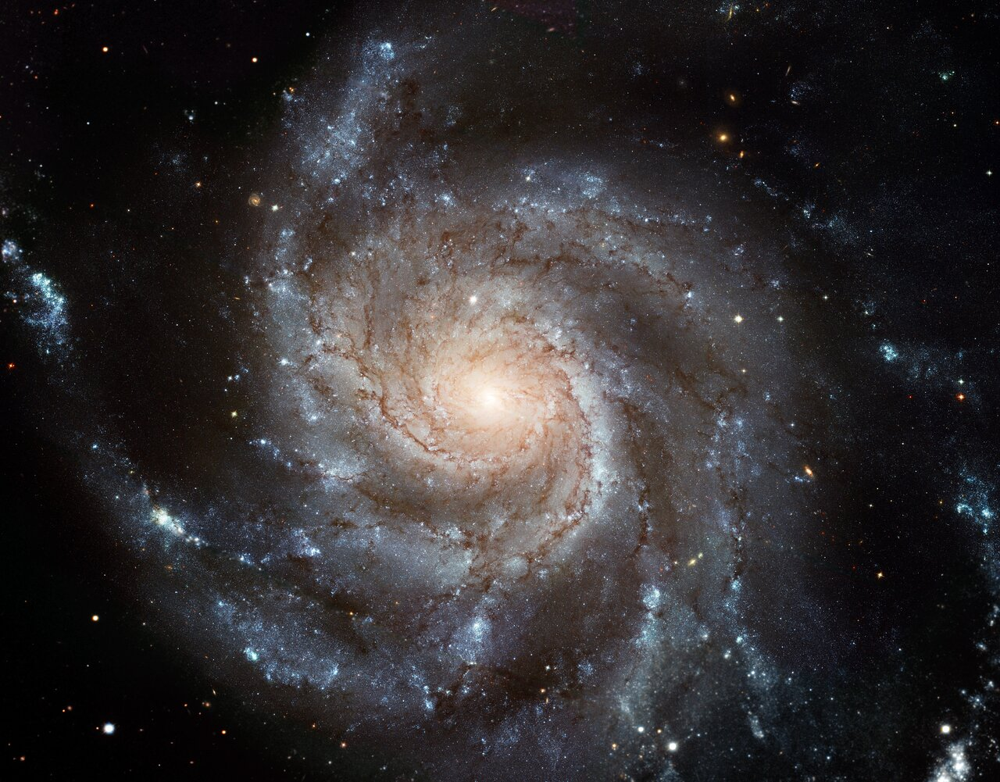

*Credit: NASA, ESA, K. Kuntz (JHU), F. Bresolin (U. Hawaii), J. Trauger (JPL), J. Mould (NOAO), Y.-H. Chu (U. Illinois), and STScI*

## M51 — Whirlpool Galaxy

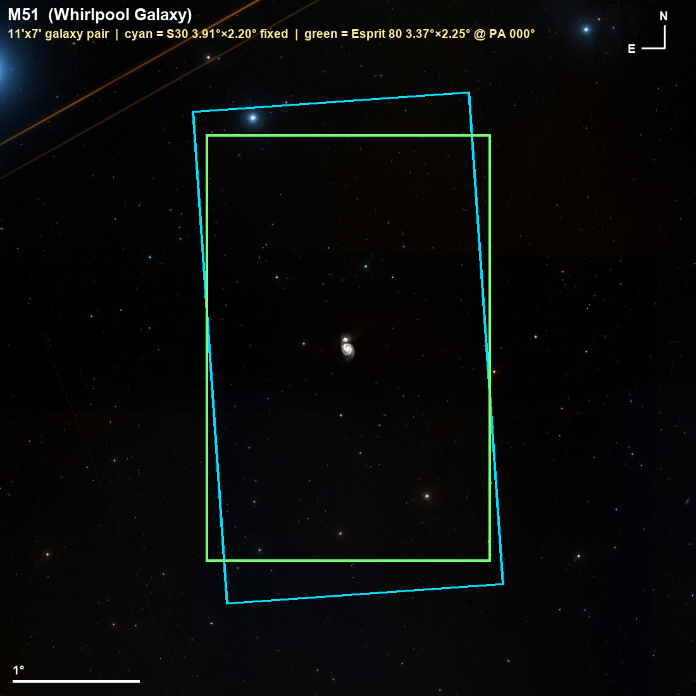

- **Center (J2000):** 202.47°, +47.20°  |  **Size:** 11'x7' galaxy pair
- **Window:** EARLY 22:50-00:00 (sinking NW)  |  **Alt 23:00/01:00/03:00:** 68°/48°/29°
- **S30 Pro:** IR broadband (deep JC data exists — only the tidal halo is new)
- **Esprit 80:** LRGB if M101 is taken (PA 000°)
- **Why at a dark site:** the faint tidal debris around the pair is dark-sky-only

**JWST** ([release](https://esawebb.org/images/potm2308a/)):

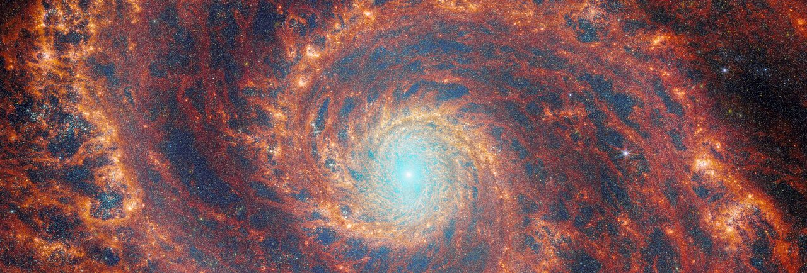

*Credit: ESA/Webb, NASA & CSA, A. Adamo (Stockholm University) and the FEAST JWST team*

**Hubble** ([release](https://esahubble.org/images/heic0506a/)):

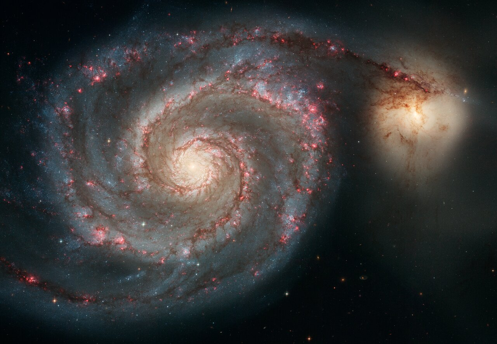

*Credit: NASA, ESA, S. Beckwith (STScI), and the Hubble Heritage Team (STScI/AURA)*

## M57 — Ring Nebula

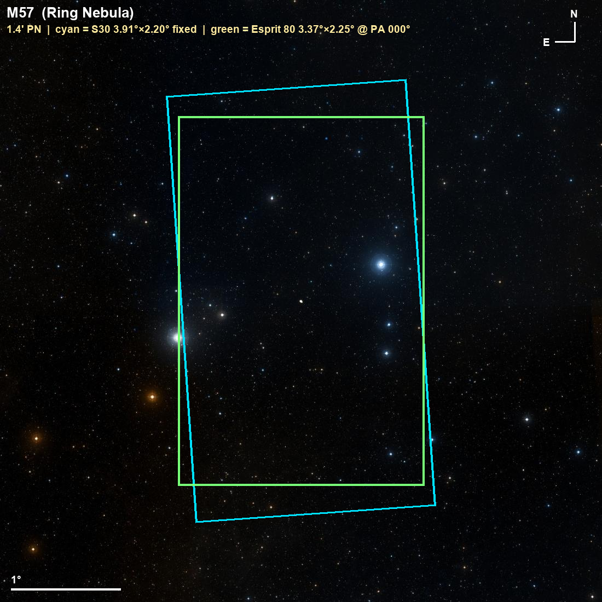

- **Center (J2000):** 283.40°, +33.03°  |  **Size:** 1.4' PN
- **Window:** QUICK GRAB after 23:00 (climbing all night)  |  **Alt 23:00/01:00/03:00:** 49°/71°/78°
- **S30 Pro:** dot at 3.66"/px — skip or 15min novelty
- **Esprit 80:** ~85px at 1.94"/px — quick HOO snack, not a main course (PA 000°)
- **Why at a dark site:** honestly? small on both rigs. The Webb/Hubble frames below are the show

**JWST** ([release](https://esawebb.org/images/weic2320a/)):

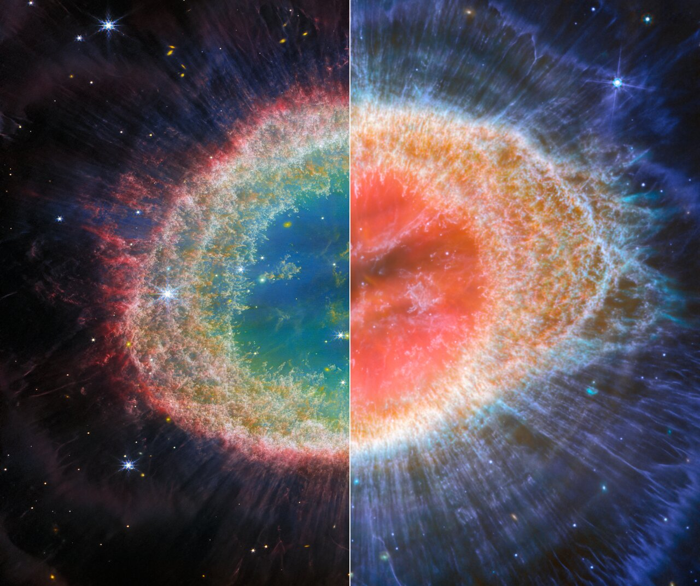

*Credit: ESA/Webb, NASA, CSA, M. Barlow (UCL), N. Cox (ACRI-ST), R. Wesson (Cardiff University)*

**Hubble** ([release](https://esahubble.org/images/heic1310a/)):

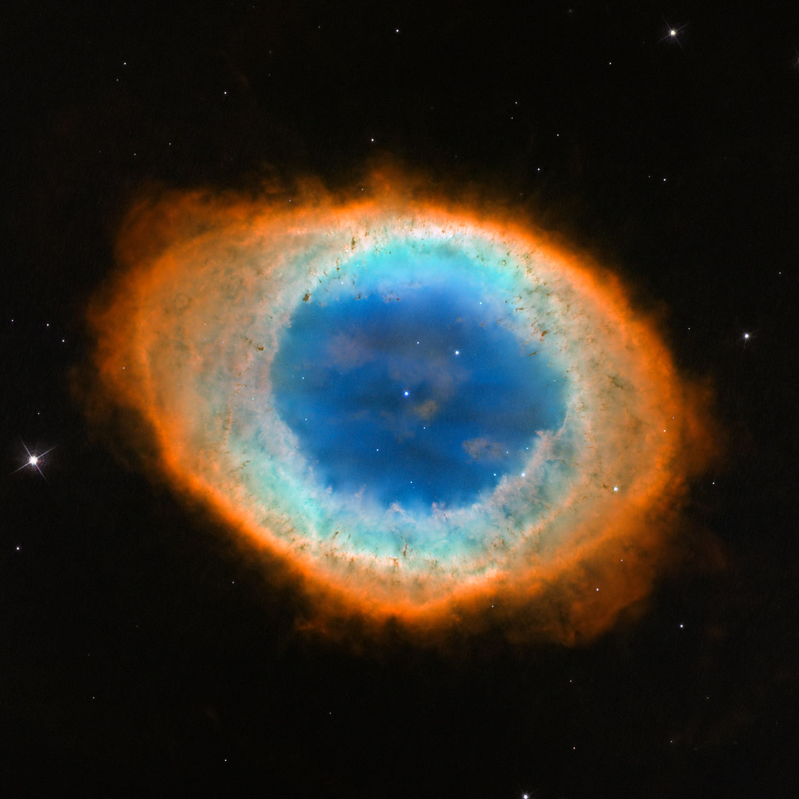

*Credit: NASA, ESA, and the Hubble Heritage Team (STScI/AURA)*

## IC 1396 — Elephant Trunk (full shell)

- **Center (J2000):** 324.78°, +57.50°  |  **Size:** 170'x140' HII
- **Window:** ALL NIGHT (33° at dark -> 65° at 03:00) — S30 PRIMARY  |  **Alt 23:00/01:00/03:00:** 34°/49°/65°
- **S30 Pro:** PRIMARY: LP 60s (test 120s), full moonless window
- **Esprit 80:** tight at PA 0 (rim kiss) — the SHO version is a JC project, save dark time (PA 000°)
- **Why at a dark site:** LP from a dark site digs the dark lanes + rim shocks JC mush flattens

## NGC 7023 — Iris + vdB 141 Ghost

- **Center (J2000):** 317.25°, +68.20°  |  **Size:** frame pairs the Iris with the Ghost 1.4° E
- **Window:** ALL NIGHT (38° -> 61°, no flip) — ESPRIT 80 PRIMARY  |  **Alt 23:00/01:00/03:00:** 41°/52°/61°
- **S30 Pro:** IR broadband: the whole dusty field, small scale
- **Esprit 80:** PRIMARY: LRGB — RGB 22:50-00:50, L 00:50-03:05 (plan v2) (PA 090°)
- **Why at a dark site:** reflection nebula + LDN dust: THE thing Bortle-9 can never show you

**Hubble** ([release](https://esahubble.org/images/heic0915a/)):

*Credit: NASA & ESA*

## NGC 7000 — North America + Pelican

- **Center (J2000):** 314.10°, +44.35°  |  **Size:** combo ~2.2° E-W
- **Window:** ALL NIGHT riser (43° at 00:00 -> 74°+)  |  **Alt 23:00/01:00/03:00:** 33°/53°/74°
- **S30 Pro:** combo in ONE frame — spans ~2.2° E-W = exactly the frame, center carefully
- **Esprit 80:** green box = NA alone (the combo overflows the 80) (PA 000°)
- **Why at a dark site:** LP makes it work even in JC — at a dark site the Ha goes 3-D; good S30 plan-B

## NGC 6960 — Western Veil (Witch's Broom)

- **Center (J2000):** 311.40°, +30.72°  |  **Size:** 70'x8' SNR filament
- **Window:** RISER 00:00+ (53° at 01:00, climbing)  |  **Alt 23:00/01:00/03:00:** 28°/50°/71°
- **S30 Pro:** single frame, LP — or revive the shelved 2-panel full-loop kit
- **Esprit 80:** HOO: ~1.5h Ha + 1.5h OIII fits the window (PA 010°)
- **Why at a dark site:** OIII filaments are urban-LP's first casualty; dark sky doubles the lacework

**Hubble** ([release](https://esahubble.org/images/heic1520a/)):

*Credit: NASA, ESA, and the Hubble Heritage Team (STScI/AURA)*

## NGC 6888 — Crescent Nebula

- **Center (J2000):** 303.00°, +38.35°  |  **Size:** 18'x12' WR bubble
- **Window:** ALL NIGHT (high in Cygnus)  |  **Alt 23:00/01:00/03:00:** 38°/59°/82°
- **S30 Pro:** small — context frame only
- **Esprit 80:** HOO/SHO — you HAVE JC data; dark site adds the faint OIII envelope (PA 060°)
- **Why at a dark site:** the soap-bubble OIII shell around the crescent is the dark-site prize

**Hubble** ([release](https://esahubble.org/images/opo0023a/)):

*Credit: NASA, B. D. Moore and J. J. Hester (Arizona State University)*

## IC 5146 — Cocoon + B168 dark river

- **Center (J2000):** 327.60°, +47.40°  |  **Size:** 12' neb + 1.5° dark lane
- **Window:** RISER 00:30+ (45° at 01:00)  |  **Alt 23:00/01:00/03:00:** 27°/45°/65°
- **S30 Pro:** IR broadband — LP would erase the dark river
- **Esprit 80:** LRGB at PA~105: the river flows along the long axis (PA 105°)
- **Why at a dark site:** B168 is a *dark* nebula — it only exists against a dark-site star field

## Sh2-129 — Flying Bat + OU4 Squid

- **Center (J2000):** 317.95°, +59.95°  |  **Size:** 150'x120' (Squid ~60')
- **Window:** ALL NIGHT (Cepheus, circumpolar)  |  **Alt 23:00/01:00/03:00:** 38°/52°/66°
- **S30 Pro:** LP long stare — SAMPLE it (the real Squid wants 6h+ of OIII)
- **Esprit 80:** OIII-only if feeling brave (PA 000°)
- **Why at a dark site:** OU4 is one of the faintest OIII objects amateurs image — dark site is table stakes

## NGC 6946 — Fireworks Galaxy + NGC 6939

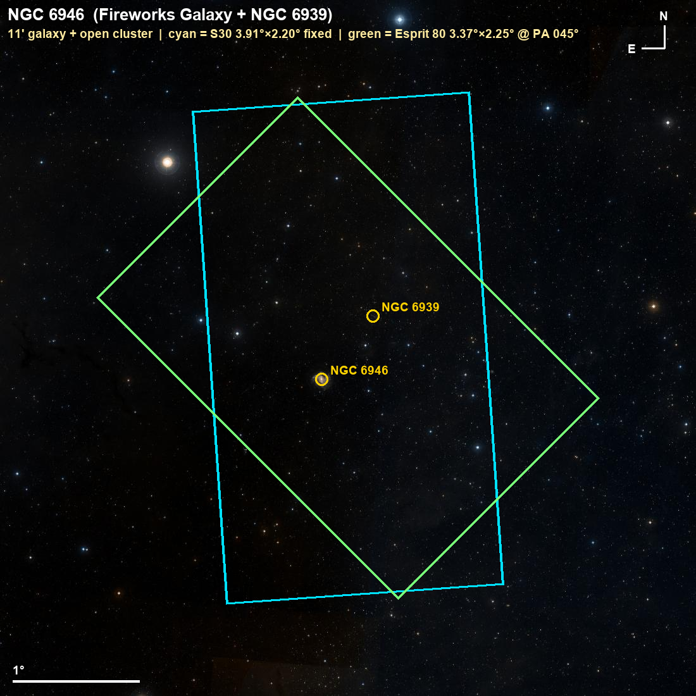

- **Center (J2000):** 308.30°, +60.40°  |  **Size:** 11' galaxy + open cluster
- **Window:** ALL NIGHT (circumpolar)  |  **Alt 23:00/01:00/03:00:** 42°/57°/69°
- **S30 Pro:** IR broadband, both in frame
- **Esprit 80:** LRGB — galaxy + cluster pair composition (PA 045°)
- **Why at a dark site:** low-SB face-on (SB~23) = dark-site-only; 10 SNe in a century

**Hubble** ([release](https://esahubble.org/images/potw2101a/)):

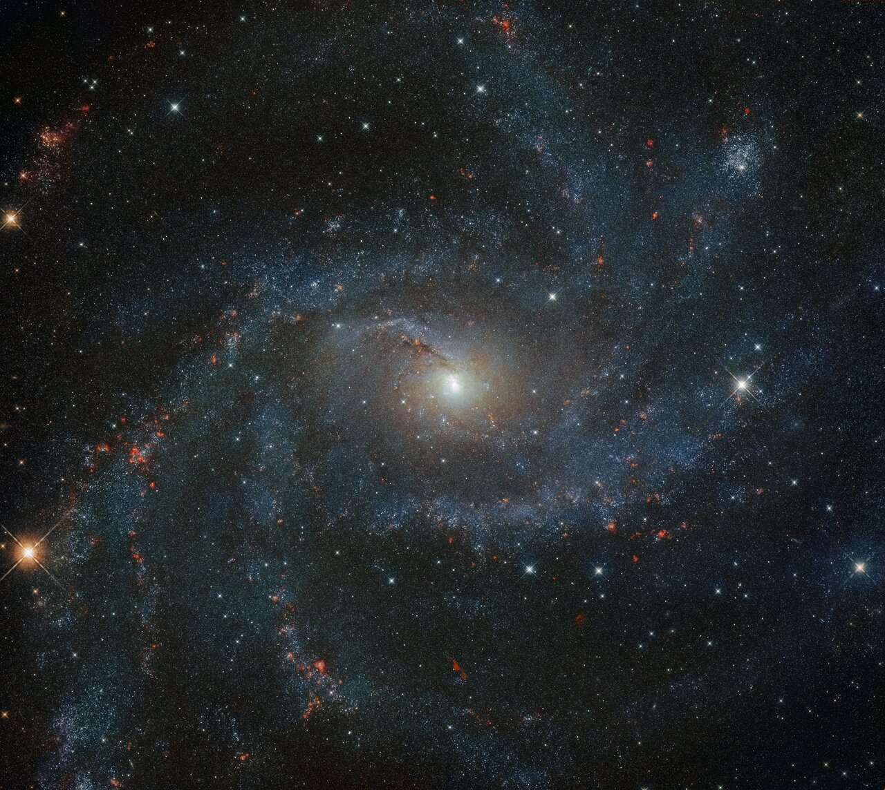

*Credit: ESA/Hubble & NASA*

## M16 + M17 — Eagle + Swan, ONE frame

- **Center (J2000):** 274.95°, -14.97°  |  **Size:** pair spans ~2.9° N-S
- **Window:** SOUTH WINDOW 00:30-02:30 (peaks ~33°) — needs the southern horizon  |  **Alt 23:00/01:00/03:00:** 21°/32°/31°
- **S30 Pro:** the killer frame: pair is N-S = made for the fixed long axis, LP
- **Esprit 80:** fits at PA 0 (2.9° vs 3.37°) if the S30 is on IC 1396 (PA 000°)
- **Why at a dark site:** the Pillars of Creation live inside your frame — see below what Webb sees there

**JWST — the Pillars, inside M16** ([release](https://esawebb.org/images/weic2216b/)):

*Credit: NASA, ESA, CSA, STScI; J. DePasquale, A. Koekemoer, A. Pagan (STScI)*

**Hubble — the Pillars** ([release](https://esahubble.org/images/heic1501a/)):

*Credit: NASA, ESA, and the Hubble Heritage Team (STScI/AURA)*

## M8 + M20 — Lagoon + Trifid

- **Center (J2000):** 270.75°, -23.70°  |  **Size:** pair 1.6° apart
- **Window:** SOUTH WINDOW ~00:30-01:30, VERY low (peaks ~23°) — horizon-permitting, 30-45min  |  **Alt 23:00/01:00/03:00:** 15°/24°/21°
- **S30 Pro:** both in one frame, LP, brief
- **Esprit 80:** skip — airmass eats 1.94"/px resolution (PA 020°)
- **Why at a dark site:** a pure dark-site treat shot through 2.5 airmasses — manage expectations

**Hubble — Lagoon core** ([release](https://esahubble.org/images/heic1808a/)):

*Credit: NASA, ESA, STScI*

## M27 — Dumbbell Nebula

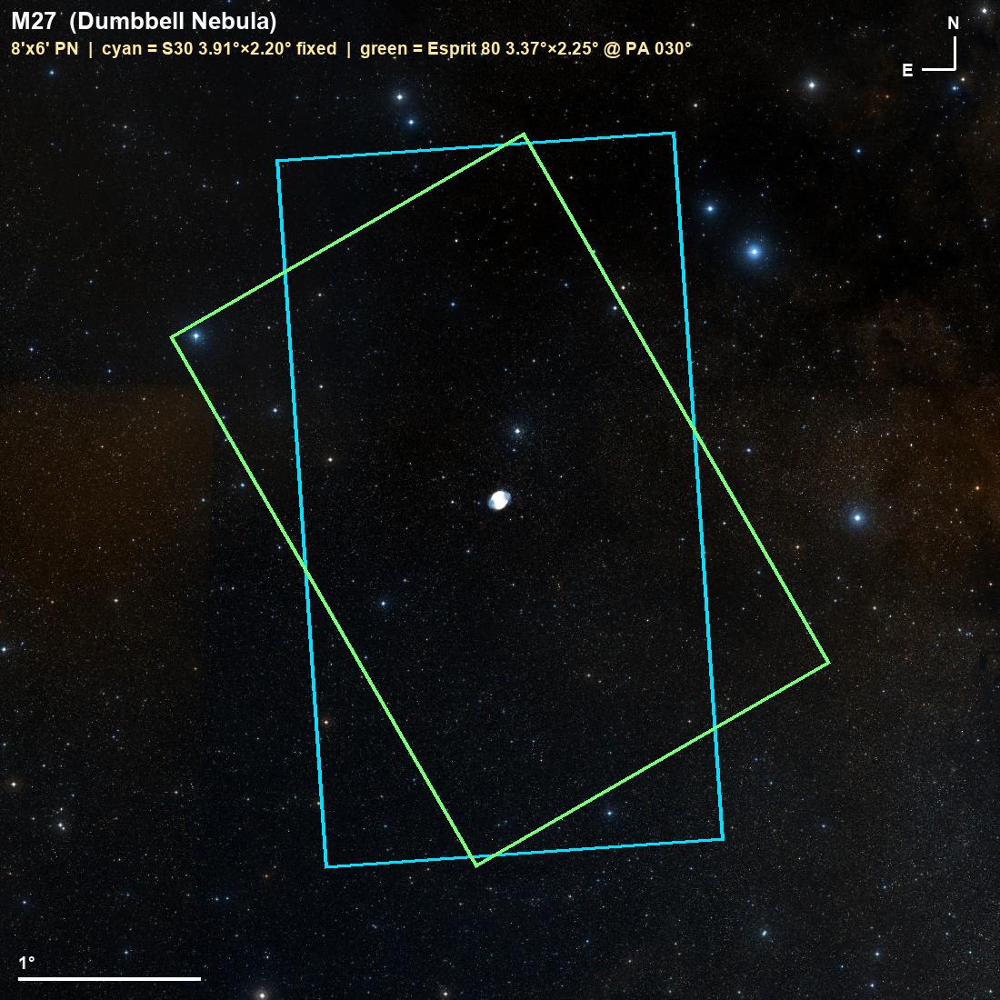

- **Center (J2000):** 299.90°, +22.72°  |  **Size:** 8'x6' PN
- **Window:** LATE 02:00-03:05 (transits ~70° at dawn-end)  |  **Alt 23:00/01:00/03:00:** 32°/54°/70°
- **S30 Pro:** small
- **Esprit 80:** HOO quick hit — 250px across, bright, 30-45min is real data (PA 030°)
- **Why at a dark site:** bright PN cores barely care about sky — but the faint outer shell does

**Hubble** ([release](https://esahubble.org/images/heic0301a/)):

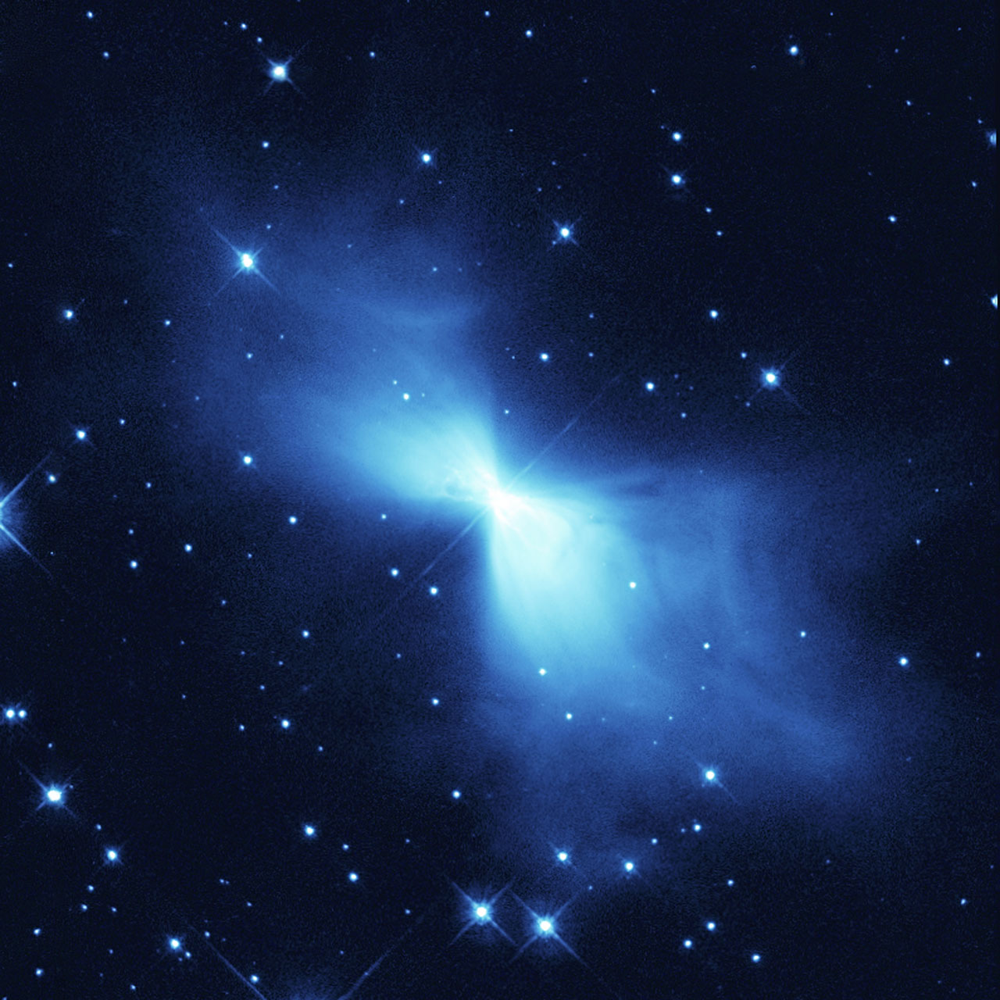

*Credit: NASA and the Hubble Heritage Team (STScI/AURA)*
