# Catskills dark-site trip book — S30 Pro + Esprit 80, one night, one menu

Built for **Sat June 13, 2026** (astro dark 22:50→03:05 EDT, 2% moon below the horizon
all night — see `../plan.md` for the committed primaries). Every chart carries **both**
rig footprints: **cyan = S30 Pro** (3.91°×2.20° measured, fixed long axis ≈N–S),
**green = Esprit 80 ED** (3.37°×2.25°, rotated to the suggested PA). Same sky, two
instruments — pick per target, not per book.

Where a famous **JWST / Hubble** frame of the object exists it's included for scale-awe:
your wide field contains the whole object; Webb's contains a couple of light-years of it.
Space images are NASA/ESA/CSA/STScI releases (CC BY 4.0), credited per image, linked to
their release pages.

| Target | What | Window | 23:00 | 01:00 | 03:00 | S30 Pro | Esprit 80 |
|---|---|---|---|---|---|---|---|
| Markarian's Chain | Virgo core galaxy sweep | EARLY 22:50-00:00 — spring leftover sinking W; hour one or wait till next May | 41° | 19° | -3° | IR broadband — the whole chain + M87 in one frame | LRGB at PA~060: the chain lies along the long axis |
| IC 1396 | Elephant Trunk (full shell) | ALL NIGHT | 34° | 49° | 65° | PRIMARY: LP 60s (test 120s), full moonless window | tight at PA 0 (rim kiss) — the SHO version is a JC project, save dark time |
| NGC 7023 | Iris + vdB 141 Ghost | ALL NIGHT | 41° | 52° | 61° | IR broadband: the whole dusty field, small scale | PRIMARY: LRGB — RGB 22:50-00:50, L 00:50-03:05 (plan v2) |
| NGC 7000 | North America + Pelican | ALL NIGHT riser | 33° | 53° | 74° | combo in ONE frame — spans ~2.2° E-W = exactly the frame, center carefully | green box = NA alone (the combo overflows the 80) |
| Sh2-119 | Clamshell Nebula | ALL NIGHT riser | 30° | 49° | 71° | LP single frame with field to spare | fits with room — HOO |
| NGC 6960 | Western Veil (Witch's Broom) | RISER 00:00+ | 28° | 50° | 71° | single frame, LP — or revive the shelved 2-panel full-loop kit | HOO: ~1.5h Ha + 1.5h OIII fits the window |
| NGC 6888 | Crescent Nebula | ALL NIGHT | 38° | 59° | 82° | small — context frame only | HOO/SHO — you HAVE JC data; dark site adds the faint OIII envelope |
| IC 5146 | Cocoon + B168 dark river | RISER 00:30+ | 27° | 45° | 65° | IR broadband — LP would erase the dark river | LRGB at PA~105: the river flows along the long axis |
| Sh2-129 | Flying Bat + OU4 Squid | ALL NIGHT | 38° | 52° | 66° | LP long stare — SAMPLE it (the real Squid wants 6h+ of OIII) | OIII-only if feeling brave |
| M16 + M17 | Eagle + Swan, ONE frame | SOUTH WINDOW 00:30-02:30 | 21° | 32° | 31° | the killer frame: pair is N-S = made for the fixed long axis, LP | fits at PA 0 (2.9° vs 3.37°) if the S30 is on IC 1396 |
| M24 | Small Sagittarius Star Cloud + B92/93 | SOUTH WINDOW 00:30-02:30 | 18° | 28° | 27° | IR broadband — the cloud + dark nebulae fill the frame | LRGB; the B92/B93 Bok bites resolve at 1.94"/px |
| M8 + M20 | Lagoon + Trifid | SOUTH WINDOW ~00:30-01:30, VERY low | 15° | 24° | 21° | both in one frame, LP, brief | skip — airmass eats 1.94"/px resolution |
| Rho Ophiuchi | Antares + the colorful clouds + M4 | SOUTH WINDOW 23:30-01:30, VERY low | 22° | 21° | 11° | IR broadband — Antares, M4 and the dust columns in one vertical frame | skip — this is a wide-field play through 2.5 airmasses |

## Markarian's Chain — Virgo core galaxy sweep

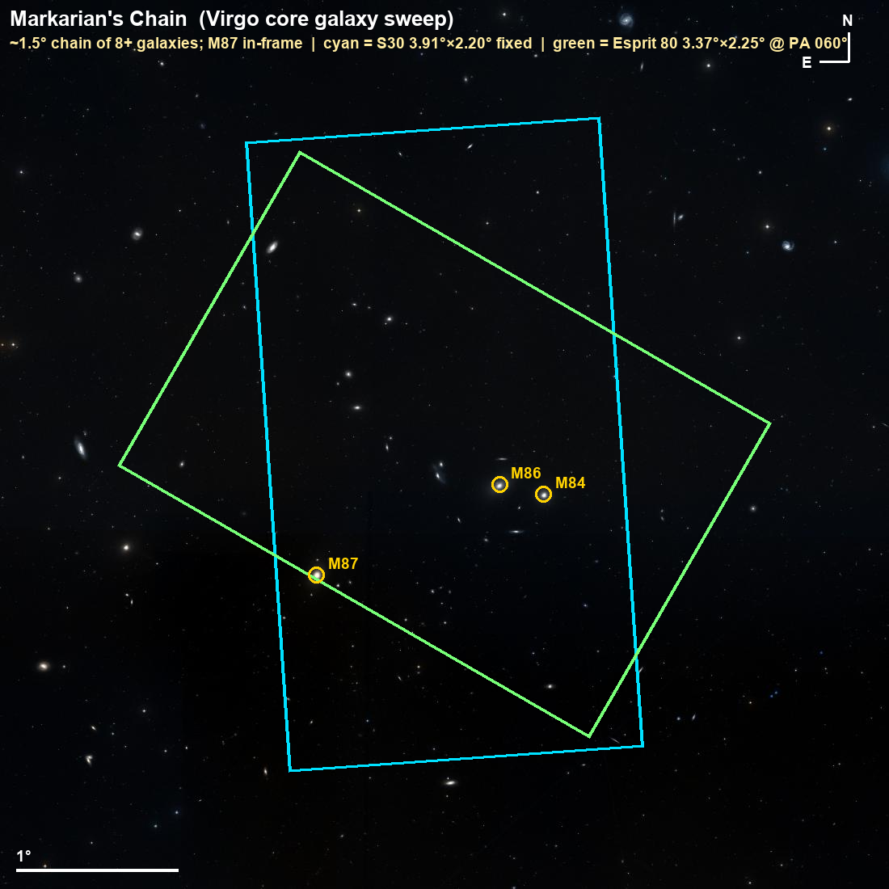

- **Center (J2000):** 186.90°, +13.20°  |  **Size:** ~1.5° chain of 8+ galaxies; M87 in-frame
- **Window:** EARLY 22:50-00:00 — spring leftover sinking W; hour one or wait till next May  |  **Alt 23:00/01:00/03:00:** 41°/19°/-3°
- **S30 Pro:** IR broadband — the whole chain + M87 in one frame
- **Esprit 80:** LRGB at PA~060: the chain lies along the long axis (PA 060°)
- **Why at a dark site:** a galaxy *field* — the ensemble is the picture, and ensemble = surface brightness = dark sky

**Hubble — M87's jet, at your frame edge** ([release](https://esahubble.org/images/opo0020a/)):

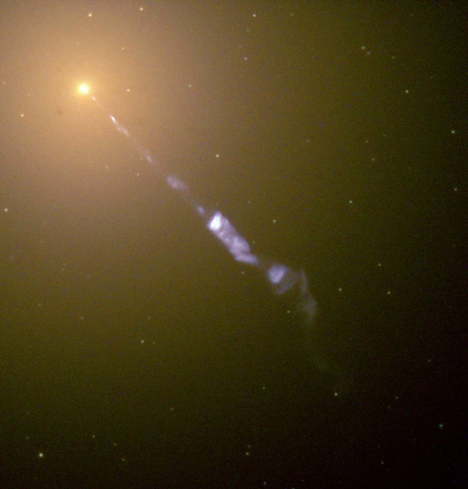

*Credit: NASA and the Hubble Heritage Team (STScI/AURA)*

## IC 1396 — Elephant Trunk (full shell)

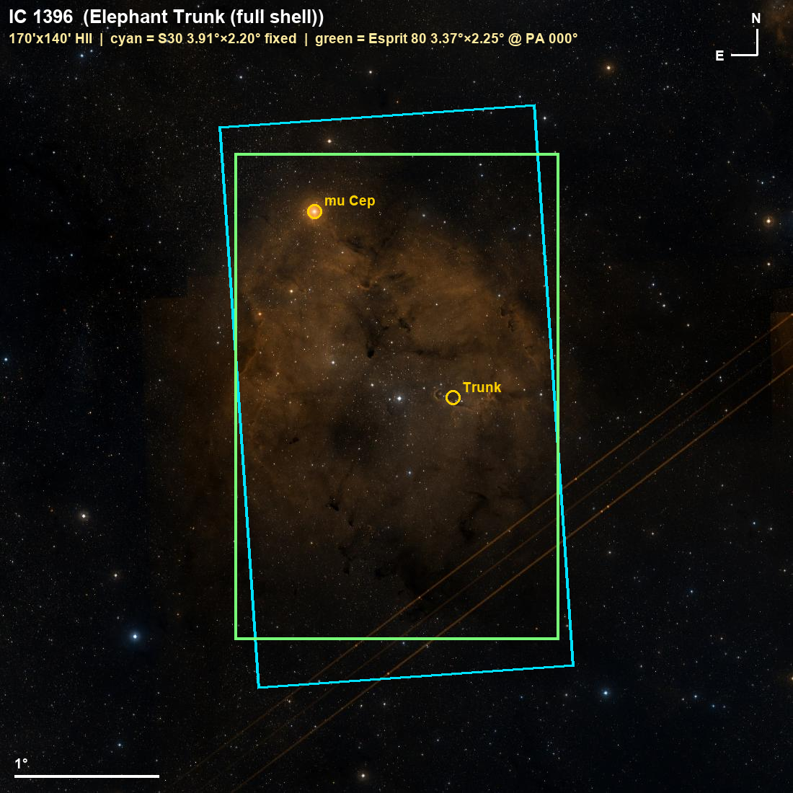

- **Center (J2000):** 324.78°, +57.50°  |  **Size:** 170'x140' HII
- **Window:** ALL NIGHT (33° at dark -> 65° at 03:00) — S30 PRIMARY  |  **Alt 23:00/01:00/03:00:** 34°/49°/65°
- **S30 Pro:** PRIMARY: LP 60s (test 120s), full moonless window
- **Esprit 80:** tight at PA 0 (rim kiss) — the SHO version is a JC project, save dark time (PA 000°)
- **Why at a dark site:** LP from a dark site digs the dark lanes + rim shocks JC mush flattens

## NGC 7023 — Iris + vdB 141 Ghost

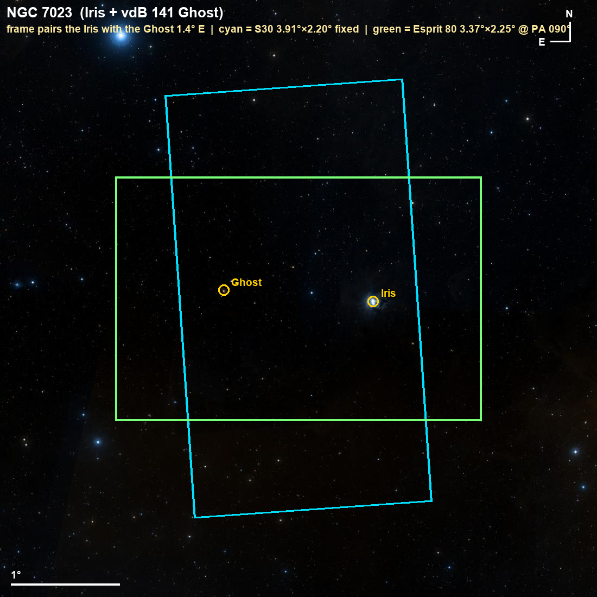

- **Center (J2000):** 317.25°, +68.20°  |  **Size:** frame pairs the Iris with the Ghost 1.4° E
- **Window:** ALL NIGHT (38° -> 61°, no flip) — ESPRIT 80 PRIMARY  |  **Alt 23:00/01:00/03:00:** 41°/52°/61°
- **S30 Pro:** IR broadband: the whole dusty field, small scale
- **Esprit 80:** PRIMARY: LRGB — RGB 22:50-00:50, L 00:50-03:05 (plan v2) (PA 090°)
- **Why at a dark site:** reflection nebula + LDN dust: THE thing Bortle-9 can never show you

**Hubble** ([release](https://esahubble.org/images/heic0915a/)):

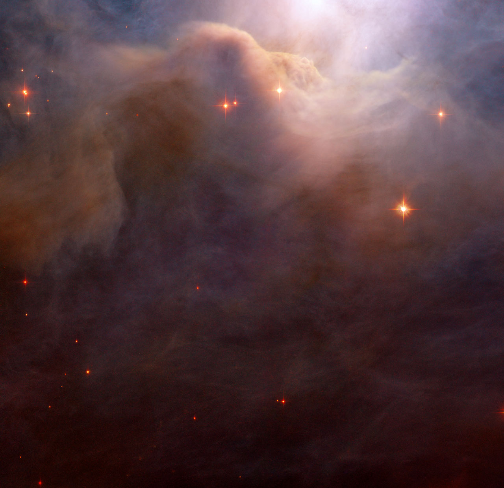

*Credit: NASA & ESA*

## NGC 7000 — North America + Pelican

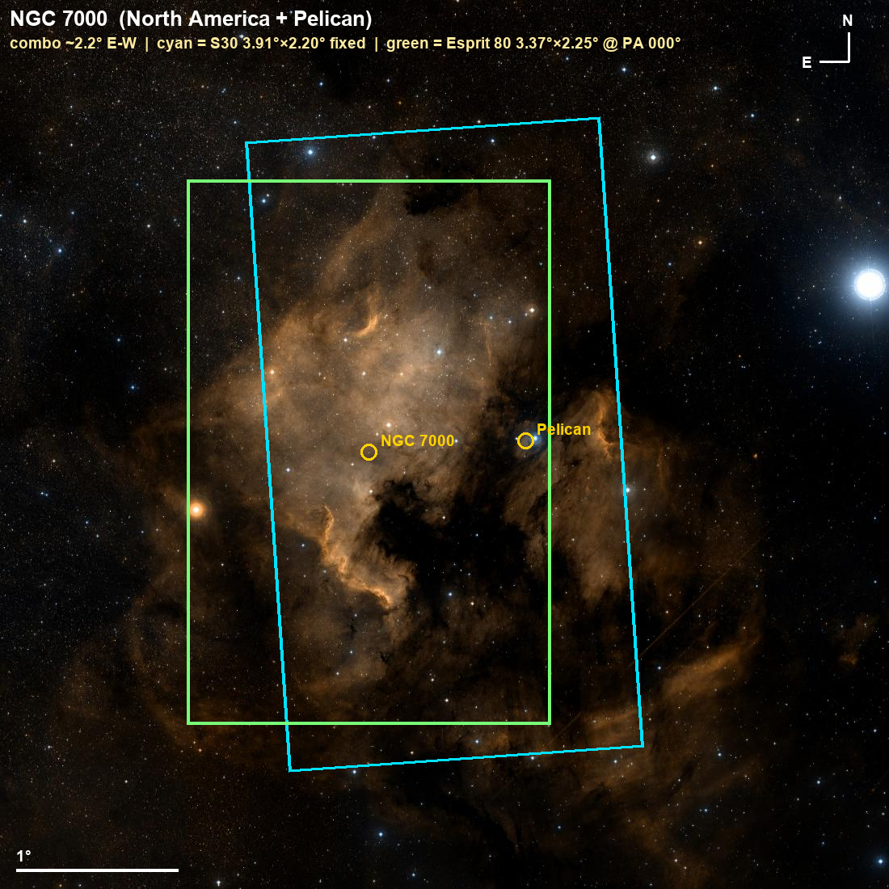

- **Center (J2000):** 314.10°, +44.35°  |  **Size:** combo ~2.2° E-W
- **Window:** ALL NIGHT riser (43° at 00:00 -> 74°+)  |  **Alt 23:00/01:00/03:00:** 33°/53°/74°
- **S30 Pro:** combo in ONE frame — spans ~2.2° E-W = exactly the frame, center carefully
- **Esprit 80:** green box = NA alone (the combo overflows the 80) (PA 000°)
- **Why at a dark site:** LP makes it work even in JC — at a dark site the Ha goes 3-D; good S30 plan-B

## Sh2-119 — Clamshell Nebula

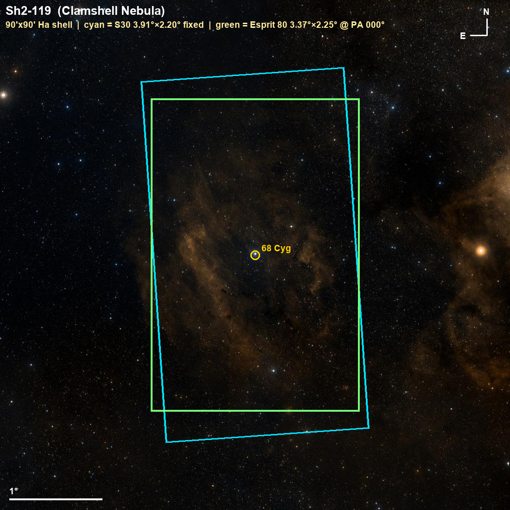

- **Center (J2000):** 319.62°, +43.93°  |  **Size:** 90'x90' Ha shell
- **Window:** ALL NIGHT riser (5° E of NGC 7000, same track)  |  **Alt 23:00/01:00/03:00:** 30°/49°/71°
- **S30 Pro:** LP single frame with field to spare
- **Esprit 80:** fits with room — HOO (PA 000°)
- **Why at a dark site:** a big faint Ha shell almost nobody shoots; LP + dark sky is its entire recipe

## NGC 6960 — Western Veil (Witch's Broom)

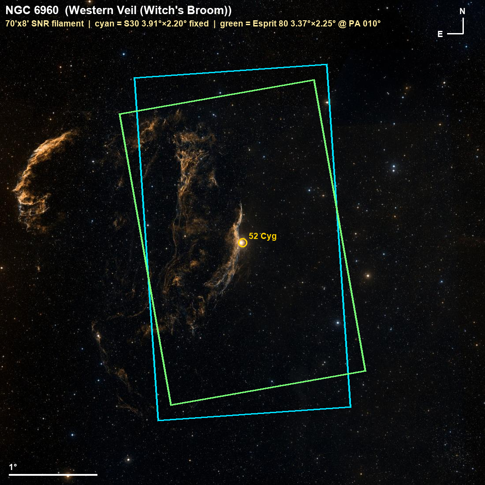

- **Center (J2000):** 311.40°, +30.72°  |  **Size:** 70'x8' SNR filament
- **Window:** RISER 00:00+ (53° at 01:00, climbing)  |  **Alt 23:00/01:00/03:00:** 28°/50°/71°
- **S30 Pro:** single frame, LP — or revive the shelved 2-panel full-loop kit
- **Esprit 80:** HOO: ~1.5h Ha + 1.5h OIII fits the window (PA 010°)
- **Why at a dark site:** OIII filaments are urban-LP's first casualty; dark sky doubles the lacework

**Hubble** ([release](https://esahubble.org/images/heic1520a/)):

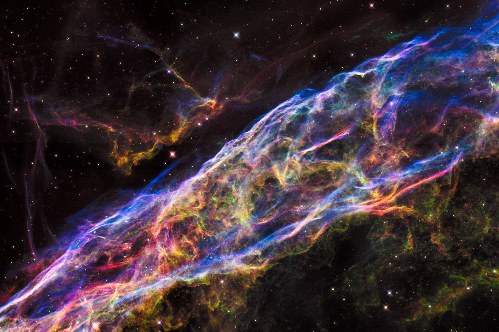

*Credit: NASA, ESA, and the Hubble Heritage Team (STScI/AURA)*

## NGC 6888 — Crescent Nebula

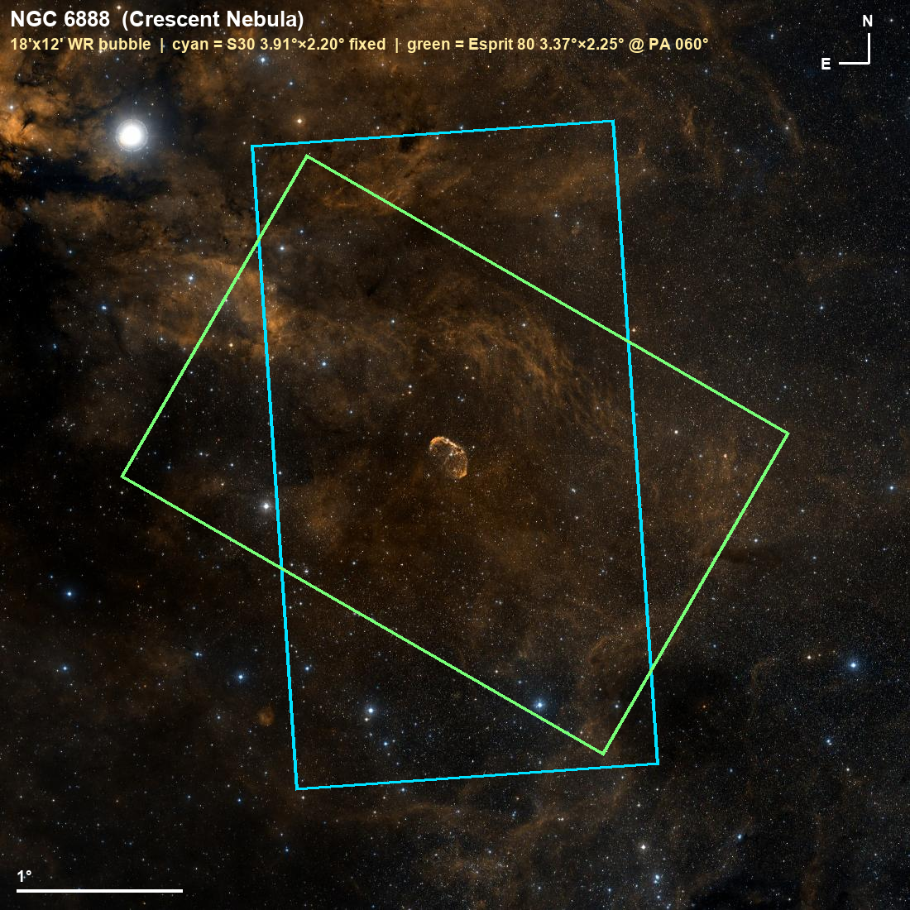

- **Center (J2000):** 303.00°, +38.35°  |  **Size:** 18'x12' WR bubble
- **Window:** ALL NIGHT (high in Cygnus)  |  **Alt 23:00/01:00/03:00:** 38°/59°/82°
- **S30 Pro:** small — context frame only
- **Esprit 80:** HOO/SHO — you HAVE JC data; dark site adds the faint OIII envelope (PA 060°)
- **Why at a dark site:** the soap-bubble OIII shell around the crescent is the dark-site prize

**Hubble** ([release](https://esahubble.org/images/opo0023a/)):

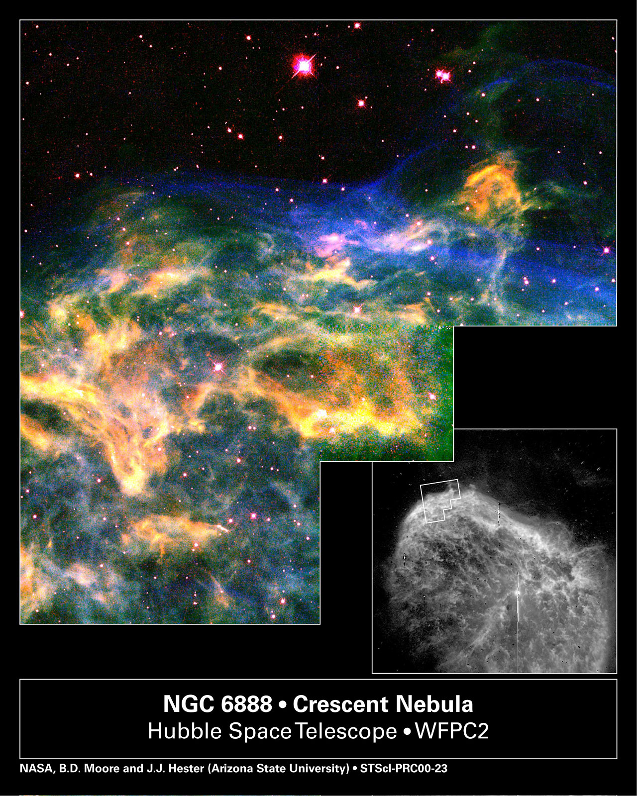

*Credit: NASA, B. D. Moore and J. J. Hester (Arizona State University)*

## IC 5146 — Cocoon + B168 dark river

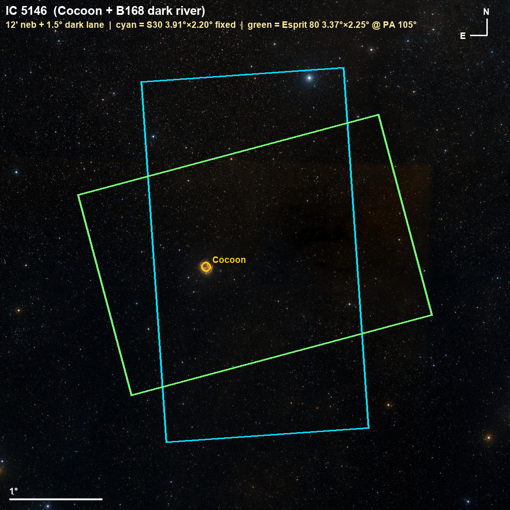

- **Center (J2000):** 327.60°, +47.40°  |  **Size:** 12' neb + 1.5° dark lane
- **Window:** RISER 00:30+ (45° at 01:00)  |  **Alt 23:00/01:00/03:00:** 27°/45°/65°
- **S30 Pro:** IR broadband — LP would erase the dark river
- **Esprit 80:** LRGB at PA~105: the river flows along the long axis (PA 105°)
- **Why at a dark site:** B168 is a *dark* nebula — it only exists against a dark-site star field

## Sh2-129 — Flying Bat + OU4 Squid

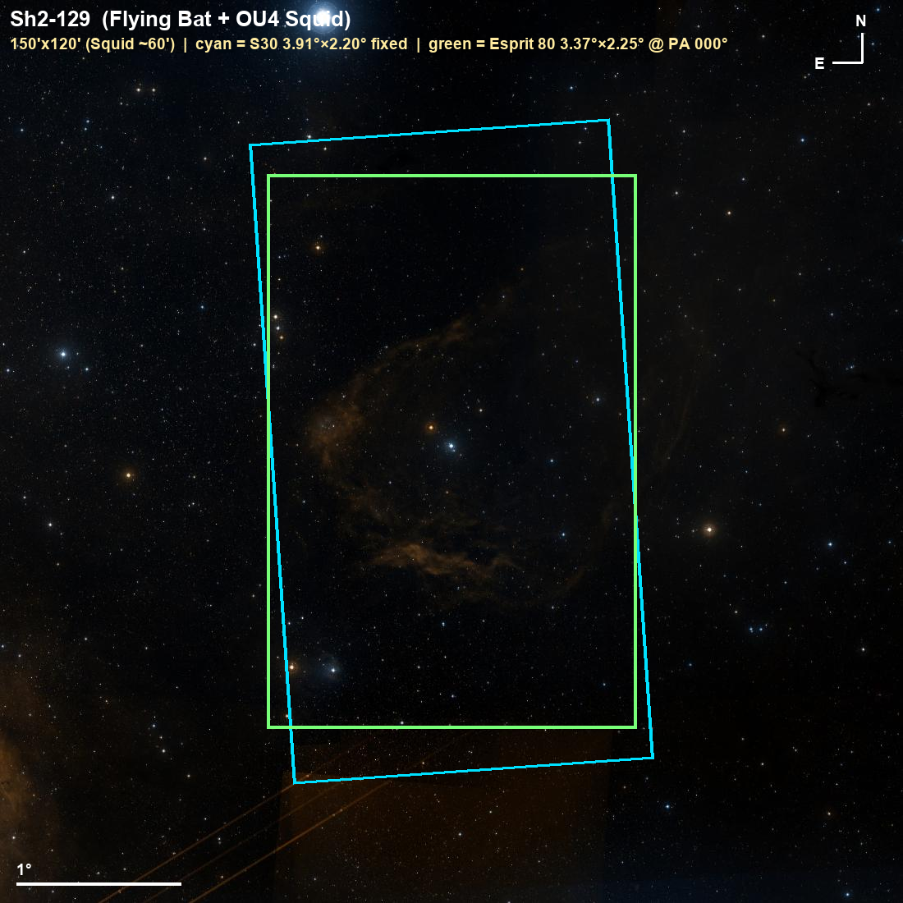

- **Center (J2000):** 317.95°, +59.95°  |  **Size:** 150'x120' (Squid ~60')
- **Window:** ALL NIGHT (Cepheus, circumpolar)  |  **Alt 23:00/01:00/03:00:** 38°/52°/66°
- **S30 Pro:** LP long stare — SAMPLE it (the real Squid wants 6h+ of OIII)
- **Esprit 80:** OIII-only if feeling brave (PA 000°)
- **Why at a dark site:** OU4 is one of the faintest OIII objects amateurs image — dark site is table stakes

## M16 + M17 — Eagle + Swan, ONE frame

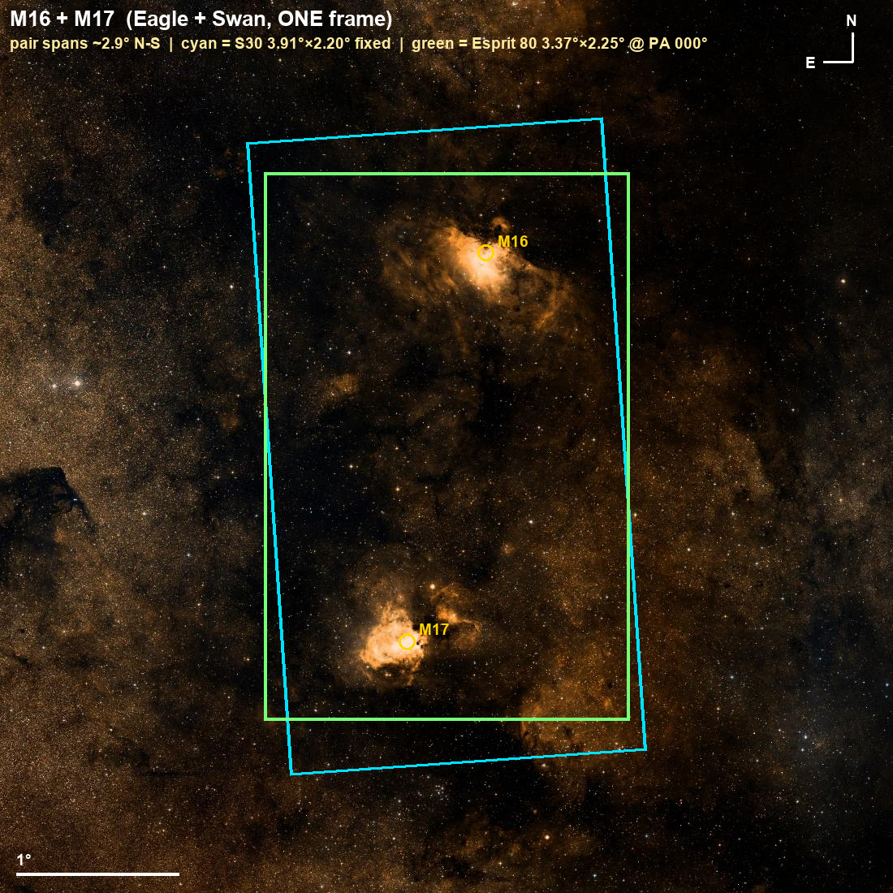

- **Center (J2000):** 274.95°, -14.97°  |  **Size:** pair spans ~2.9° N-S
- **Window:** SOUTH WINDOW 00:30-02:30 (peaks ~33°) — needs the southern horizon  |  **Alt 23:00/01:00/03:00:** 21°/32°/31°
- **S30 Pro:** the killer frame: pair is N-S = made for the fixed long axis, LP
- **Esprit 80:** fits at PA 0 (2.9° vs 3.37°) if the S30 is on IC 1396 (PA 000°)
- **Why at a dark site:** the Pillars of Creation live inside your frame — see below what Webb sees there

**JWST — the Pillars, inside M16** ([release](https://esawebb.org/images/weic2216b/)):

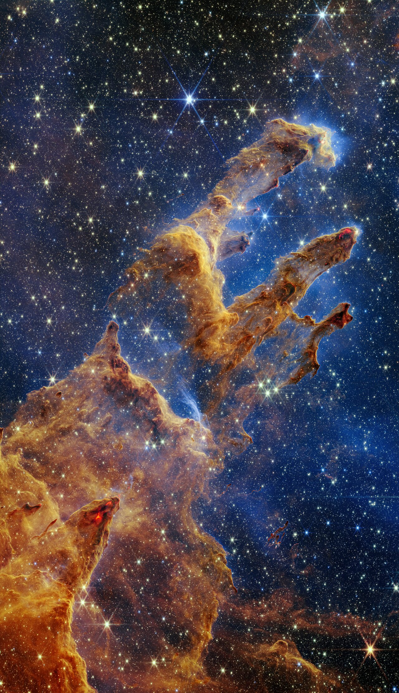

*Credit: NASA, ESA, CSA, STScI; J. DePasquale, A. Koekemoer, A. Pagan (STScI)*

**Hubble — the Pillars** ([release](https://esahubble.org/images/heic1501a/)):

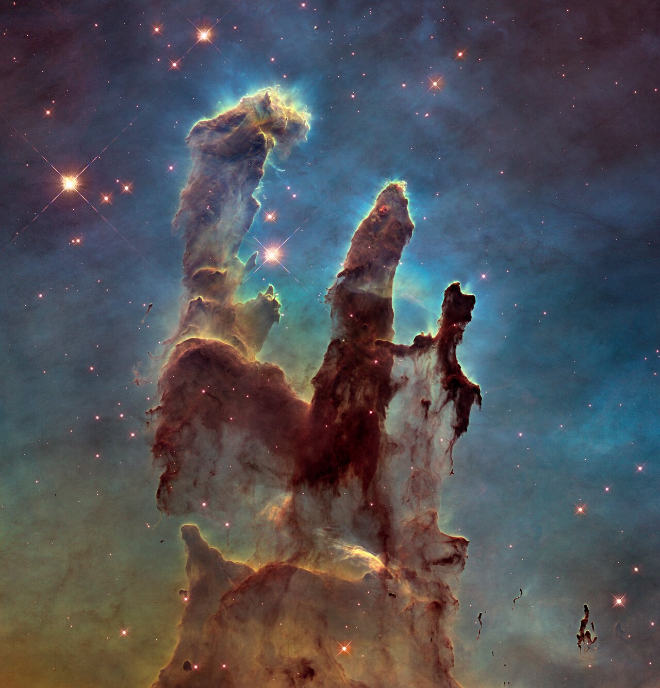

*Credit: NASA, ESA, and the Hubble Heritage Team (STScI/AURA)*

## M24 — Small Sagittarius Star Cloud + B92/93

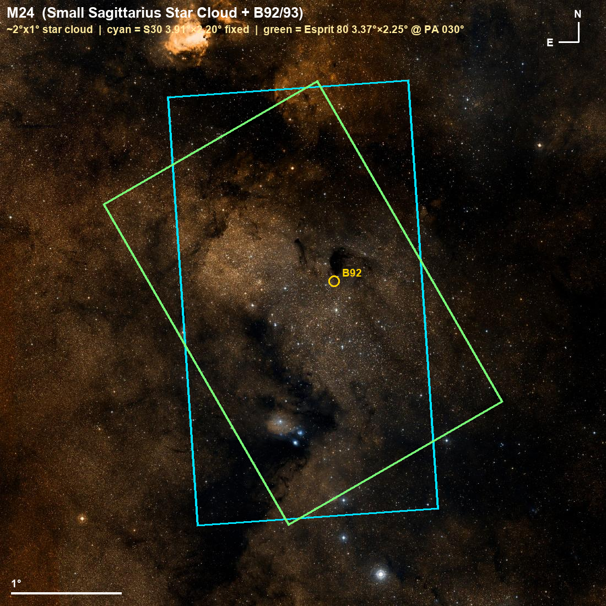

- **Center (J2000):** 274.20°, -18.60°  |  **Size:** ~2°x1° star cloud
- **Window:** SOUTH WINDOW 00:30-02:30 (transits ~29°)  |  **Alt 23:00/01:00/03:00:** 18°/28°/27°
- **S30 Pro:** IR broadband — the cloud + dark nebulae fill the frame
- **Esprit 80:** LRGB; the B92/B93 Bok bites resolve at 1.94"/px (PA 030°)
- **Why at a dark site:** a naked-eye star cloud that only exists over a dark horizon; LP would gut it

## M8 + M20 — Lagoon + Trifid

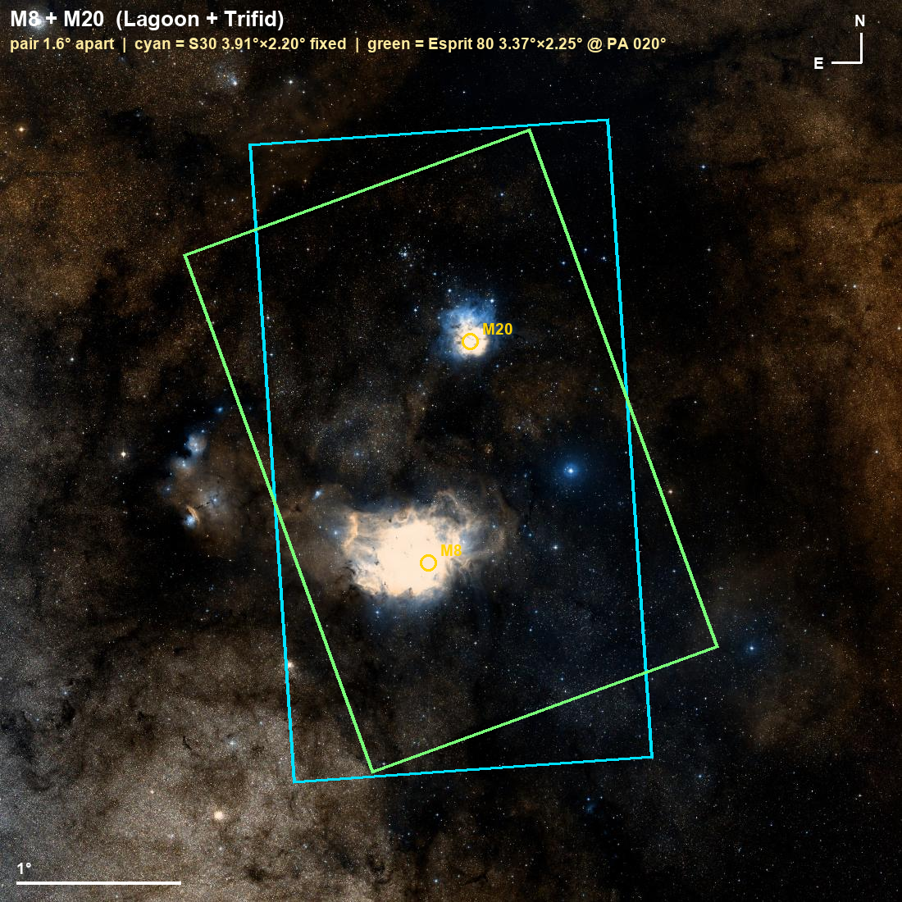

- **Center (J2000):** 270.75°, -23.70°  |  **Size:** pair 1.6° apart
- **Window:** SOUTH WINDOW ~00:30-01:30, VERY low (peaks ~23°) — horizon-permitting, 30-45min  |  **Alt 23:00/01:00/03:00:** 15°/24°/21°
- **S30 Pro:** both in one frame, LP, brief
- **Esprit 80:** skip — airmass eats 1.94"/px resolution (PA 020°)
- **Why at a dark site:** a pure dark-site treat shot through 2.5 airmasses — manage expectations

**Hubble — Lagoon core** ([release](https://esahubble.org/images/heic1808a/)):

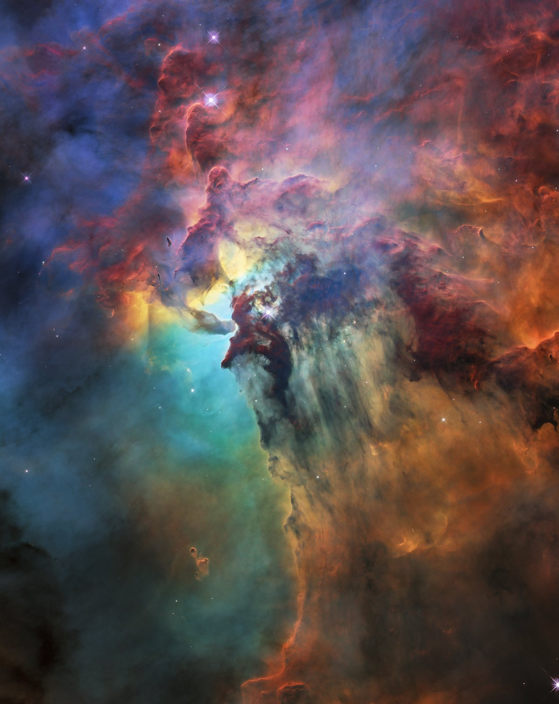

*Credit: NASA, ESA, STScI*

## Rho Ophiuchi — Antares + the colorful clouds + M4

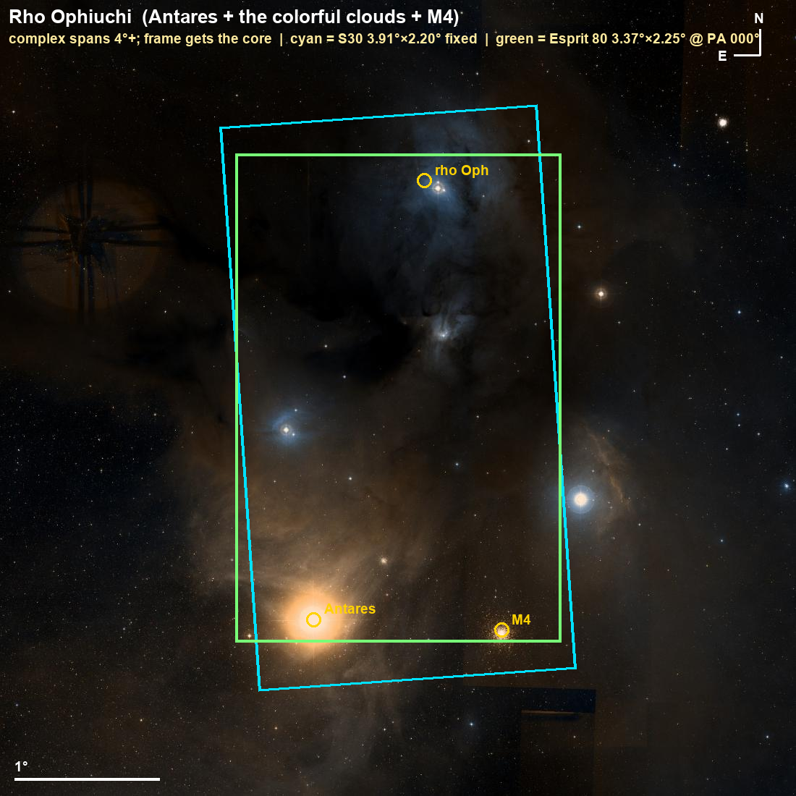

- **Center (J2000):** 246.70°, -24.90°  |  **Size:** complex spans 4°+; frame gets the core
- **Window:** SOUTH WINDOW 23:30-01:30, VERY low (peaks ~23°) — horizon-permitting  |  **Alt 23:00/01:00/03:00:** 22°/21°/11°
- **S30 Pro:** IR broadband — Antares, M4 and the dust columns in one vertical frame
- **Esprit 80:** skip — this is a wide-field play through 2.5 airmasses (PA 000°)
- **Why at a dark site:** THE June dark-site object: yellow/blue/red dust no city sky has ever shown you

**JWST — inside the rho Oph cloud (1st-anniversary image)** ([release](https://esawebb.org/images/weic2316a/)):

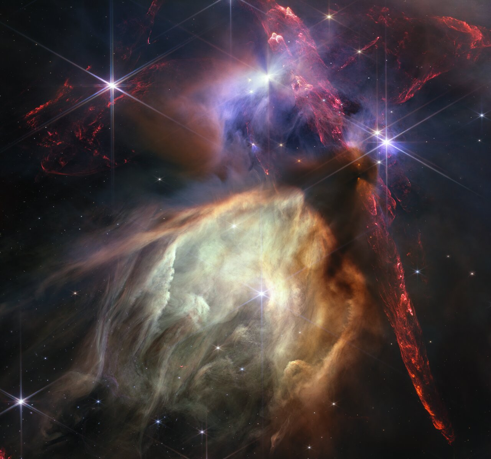

*Credit: NASA, ESA, CSA, STScI, K. Pontoppidan (STScI)*

## Not tonight — seasonal no-gos

- **Pleiades (M45)** — only ~25° from the Sun in mid-June. It's an Oct–Dec evening
  target, and when it returns it's a *broadband reflection* showpiece made for exactly
  these two rigs at a dark site.
- **Horsehead (IC 434/B33)** — Orion is behind the Sun in June; returns Dec–Feb
  (peak Dec in both general emission books).
- **Small showpieces** (Ring, Whirlpool, Pinwheel, Dumbbell, M13, Fireworks) are
  deliberately absent — at 3.66"/px and 1.94"/px they're postage stamps. They're
  840mm targets: the future Esprit 120 list, not the wide-field trip menu.
